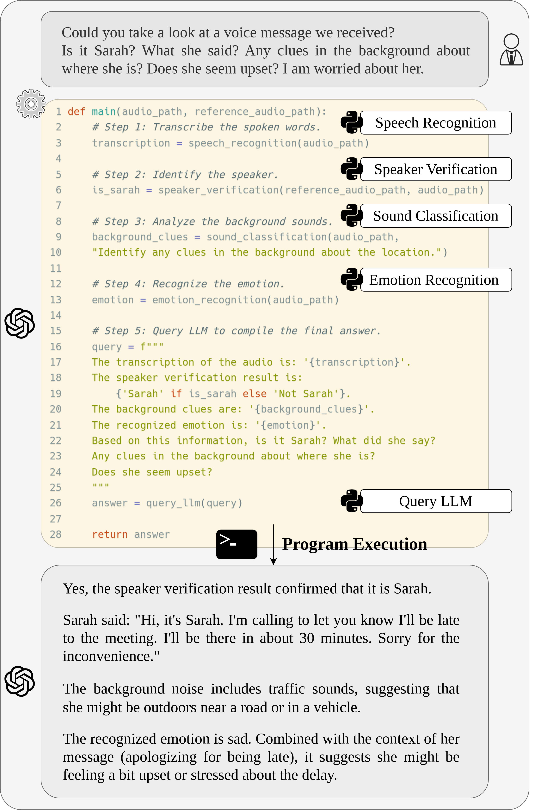

# Speech-Copilot：借助任务分解、模块化及程序生成技术，运用大型语言模型提升语音处理效率

发布时间：2024年07月13日

`Agent` `语音处理` `人工智能`

> Speech-Copilot: Leveraging Large Language Models for Speech Processing via Task Decomposition, Modularization, and Program Generation

# 摘要

> 我们推出的 Speech-Copilot 框架，专为简化语音处理任务而设计，通过模块化方式大幅减少了工具集构建的人力需求。不同于依赖大型音频-语言模型的端到端解决方案，Speech-Copilot 通过精细分析任务指令，将复杂任务拆解为易于管理的子任务，从而构建出针对性的语音处理工具集。该框架的核心是一个灵活的代理系统，它基于大型语言模型，能够通过自动生成程序来执行任务。在 Dynamic-SUPERB 基准测试中，我们的方法表现卓越，证明了其在多种语音处理任务中的高效性。主要创新点包括：1) 创新性地构建了语音处理专用工具集，2) 利用大型语言模型打造了高性能代理，3) 为处理复杂的指令导向语音任务提供了新思路。此外，我们的方法无需额外的训练过程，为语音处理领域提供了一个既灵活又可扩展的解决方案。

> In this work, we introduce Speech-Copilot, a modular framework for instruction-oriented speech-processing tasks that minimizes human effort in toolset construction. Unlike end-to-end methods using large audio-language models, Speech-Copilot builds speech processing-specific toolsets by analyzing pre-collected task instructions and breaking tasks into manageable sub-tasks. It features a flexible agent based on large language models that performs tasks through program generation. Our approach achieves state-of-the-art performance on the Dynamic-SUPERB benchmark, demonstrating its effectiveness across diverse speech-processing tasks. Key contributions include: 1) developing an innovative framework for speech processing-specific toolset construction, 2) establishing a high-performing agent based on large language models, and 3) offering a new perspective on addressing challenging instruction-oriented speech-processing tasks. Without additional training processes required by end-to-end approaches, our method provides a flexible and extendable solution for a wide range of speech-processing applications.

[Arxiv](https://arxiv.org/abs/2407.09886)