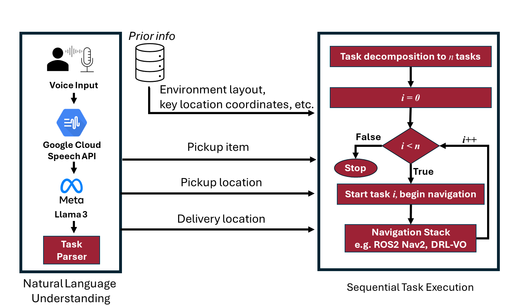
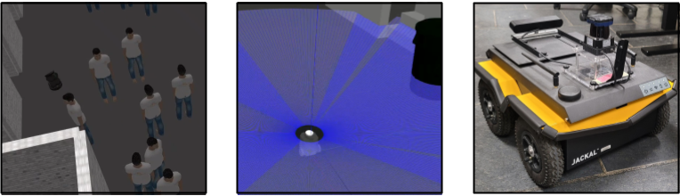
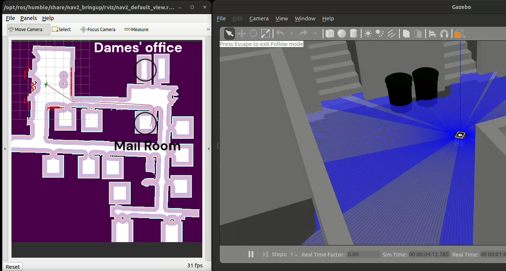
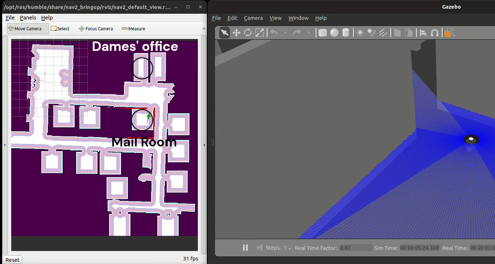
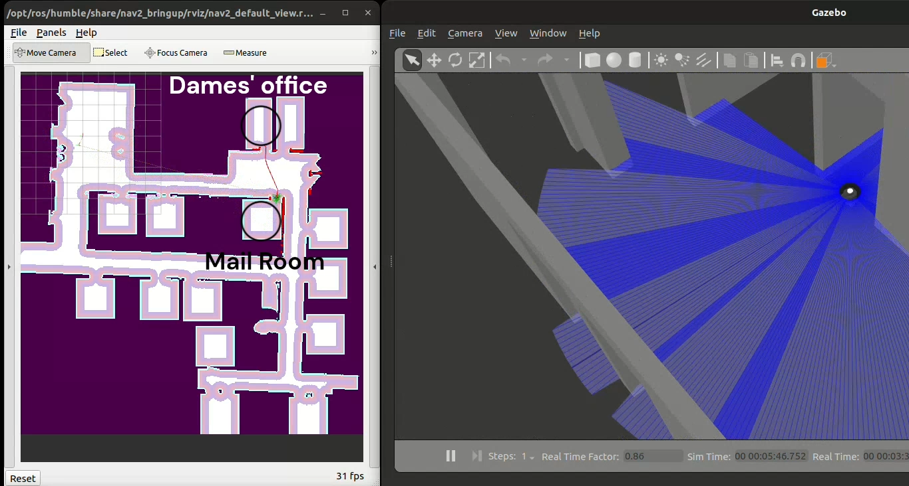
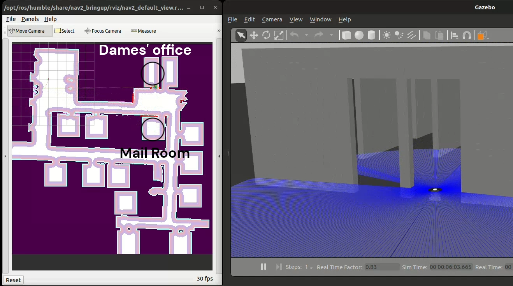

# 利用 Llama3 大型语言模型实现自主导航的语音引导顺序规划

发布时间：2024年07月13日

`Agent` `机器人技术` `社交互动`

> Speech-Guided Sequential Planning for Autonomous Navigation using Large Language Model Meta AI 3 (Llama3)

# 摘要

> 社交机器人领域致力于让机器人更自然地与人类互动。借助GPTs和Llamas等先进LLMs，机器人已能更好地理解自然语言。本文提出一个语音引导的自主导航系统，结合Llama3和ROS，通过解析语音命令并转化为顺序动作，实现高效的任务执行。该系统在物体取送等场景中尤为关键。我们通过DRL-VO策略，使机器人在复杂社交环境中自主导航。模拟实验和硬件测试均证实了系统的实用性，尤其在需要机器人灵活互动的实际应用中展现出巨大潜力。

> In social robotics, a pivotal focus is enabling robots to engage with humans in a more natural and seamless manner. The emergence of advanced large language models (LLMs) such as Generative Pre-trained Transformers (GPTs) and autoregressive models like Large Language Model Meta AI (Llamas) has driven significant advancements in integrating natural language understanding capabilities into social robots. This paper presents a system for speech-guided sequential planning in autonomous navigation, utilizing Llama3 and the Robot Operating System~(ROS). The proposed system involves using Llama3 to interpret voice commands, extracting essential details through parsing, and decoding these commands into sequential actions for tasks. Such sequential planning is essential in various domains, particularly in the pickup and delivery of an object. Once a sequential navigation task is evaluated, we employ DRL-VO, a learning-based control policy that allows a robot to autonomously navigate through social spaces with static infrastructure and (crowds of) people. We demonstrate the effectiveness of the system in simulation experiment using Turtlebot 2 in ROS1 and Turtlebot 3 in ROS2. We conduct hardware trials using a Clearpath Robotics Jackal UGV, highlighting its potential for real-world deployment in scenarios requiring flexible and interactive robotic behaviors.

[Arxiv](https://arxiv.org/abs/2407.09890)