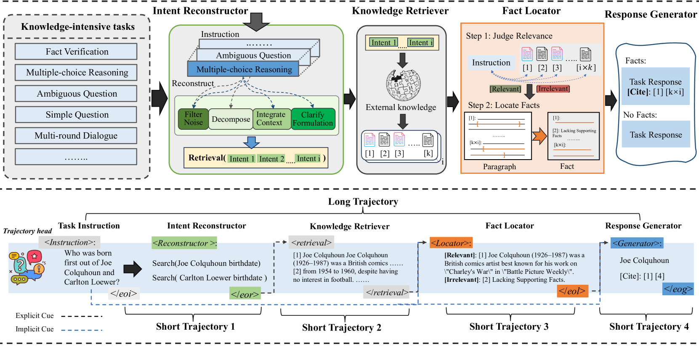
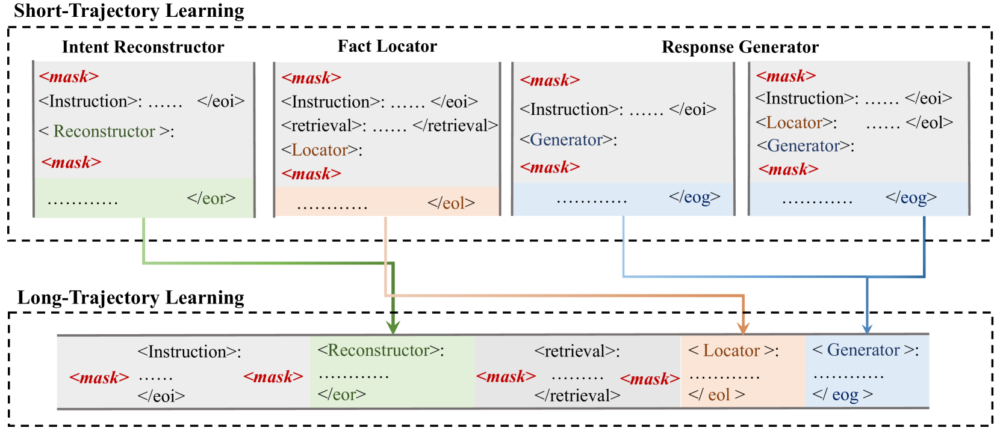
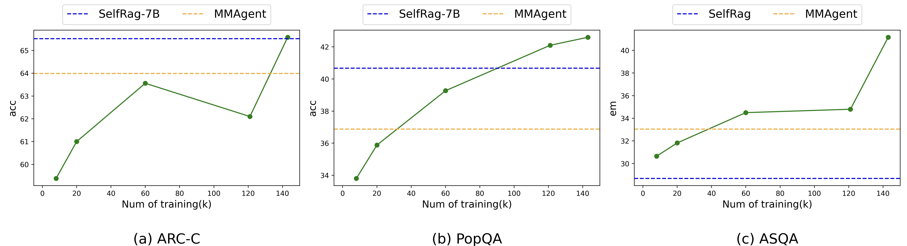

# 知识密集型任务中的协同多智能体框架与轨迹学习

发布时间：2024年07月13日

`Agent` `人工智能`

> Synergistic Multi-Agent Framework with Trajectory Learning for Knowledge-Intensive Tasks

# 摘要

> 大型语言模型 (LLM) 的最新进展在多种自然语言处理任务中取得了重大突破。然而，在知识密集型场景中生成事实一致的响应仍面临挑战，如幻觉现象、长尾知识获取困难及内存扩展限制。为此，本文引入了 SMART，一个创新的多智能体框架，通过整合外部知识提升 LLM 生成内容的可解释性与事实一致性。SMART 框架包含四个专业智能体，各自负责特定子任务，共同应对复杂知识密集型挑战。我们提出的多智能体协同训练模式——长轨迹与短轨迹学习，不仅确保了智能体间的协同效应，还维持了每个智能体的精细操作。经过 5 项任务的广泛实验验证，SMART 展现出超越传统方法的卓越性能。

> Recent advancements in Large Language Models (LLMs) have led to significant breakthroughs in various natural language processing tasks. However, generating factually consistent responses in knowledge-intensive scenarios remains a challenge due to issues such as hallucination, difficulty in acquiring long-tailed knowledge, and limited memory expansion. This paper introduces SMART, a novel multi-agent framework that leverages external knowledge to enhance the interpretability and factual consistency of LLM-generated responses. SMART comprises four specialized agents, each performing a specific sub-trajectory action to navigate complex knowledge-intensive tasks. We propose a multi-agent co-training paradigm, Long- and Short-Trajectory Learning, which ensures synergistic collaboration among agents while maintaining fine-grained execution by each agent. Extensive experiments on 5 tasks demonstrate SMART's superior performance compared to previous widely adopted methods.

[Arxiv](https://arxiv.org/abs/2407.09893)