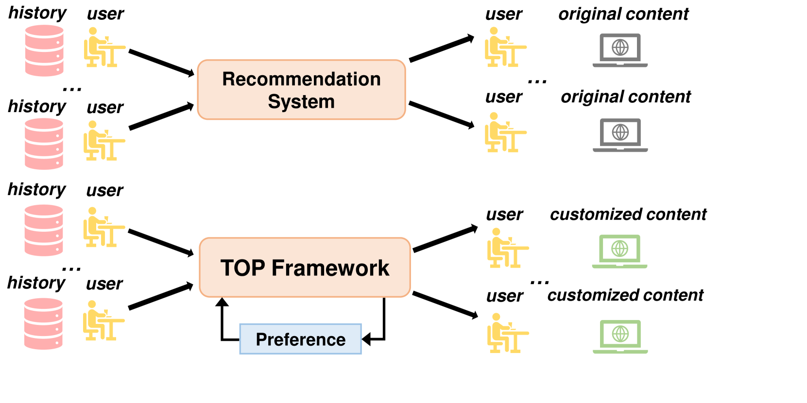
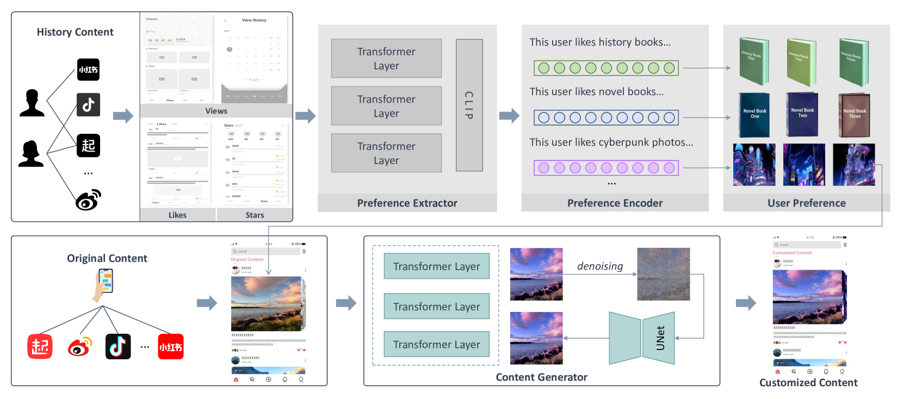
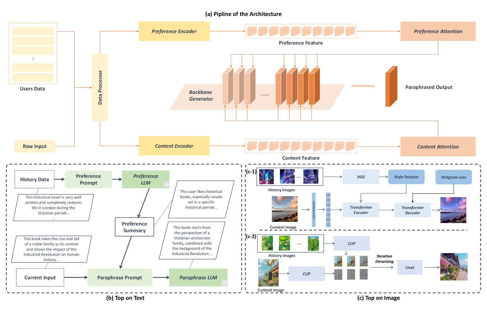
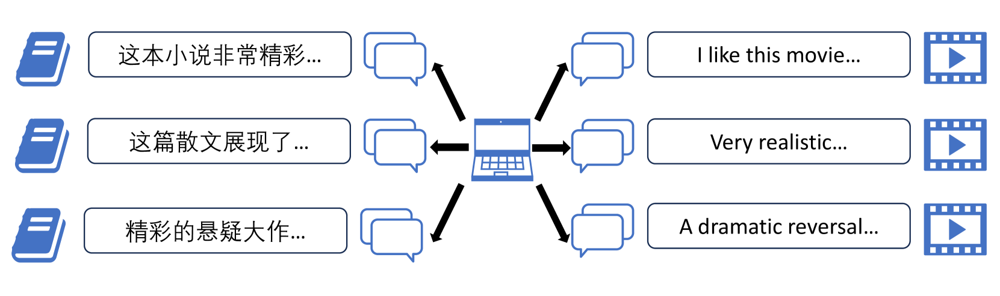

# TOP：一项针对目标受众的内容释义新任务

发布时间：2024年07月13日

`LLM应用` `数字营销` `内容创作`

> TOP:A New Target-Audience Oriented Content Paraphrase Task

# 摘要

> 推荐系统常向用户推荐现有内容，但动态调整推荐逻辑以适应用户兴趣偏好，可能吸引更多用户。为此，我们提出“目标受众导向内容改述”任务，旨在生成更贴合用户偏好的定制内容。本文详细介绍了任务定义、框架及数据集创建方法，并利用LLMs和LVMs实现TOP框架，提供基准结果。

> Recommendation systems usually recommend the existing contents to different users. However, in comparison to static recommendation methods, a recommendation logic that dynamically adjusts based on user interest preferences may potentially attract a larger user base. Thus, we consider paraphrasing existing content based on the interests of the users to modify the content to better align with the preferences of users. In this paper, we propose a new task named Target-Audience Oriented Content Paraphrase aims to generate more customized contents for the target audience. We introduce the task definition and the corresponding framework for the proposed task and the creation of the corresponding datasets. We utilize the Large Language Models (LLMs) and Large Vision Models (LVMs) to accomplish the base implementation of the TOP framework and provide the referential baseline results for the proposed task.

[Arxiv](https://arxiv.org/abs/2407.09992)