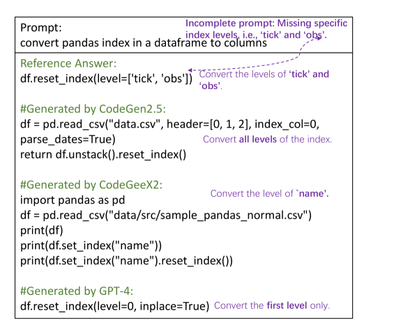

# 探究神经代码生成模型的不足之处

发布时间：2024年07月13日

`LLM应用` `软件开发` `人工智能`

> Uncovering Weaknesses in Neural Code Generation

# 摘要

> 代码生成技术在预训练大型语言模型（PLMs）的推动下取得了长足进步。然而，关于基准测试和生成代码的弱点分类尚不完善，这可能导致研究焦点偏移。为此，我们评估了五个顶尖PLMs，包括三个大型模型（CodeGen2.5、CodeGeeX2、GPT-4 Turbo）和两个小型模型（UnixCoder、CodeT5 base），在CoNaLa、HumanEval Plus和DS-1000数据集上进行测试。我们通过匹配和执行指标评估代码质量，并进行了主题分析，识别出九种弱点类型。研究发现：1. 不准确的提示在CoNaLa中导致大型模型失败率高达26.84%，小型模型更甚，达40%；2. 关键语义缺失在各基准测试中普遍存在，如CoNaLa中65.78%的任务、HumanEval Plus中66.09%、DS-1000中80.51%；3. 所有模型在API使用上都面临挑战，尤其是面对模糊或复杂的提示。这些发现旨在引导研究方向，同时我们的注释也为深入分析提供了针对性的基准子集。

> Code generation, the task of producing source code from prompts, has seen significant advancements with the advent of pre-trained large language models (PLMs). Despite these achievements, there lacks a comprehensive taxonomy of weaknesses about the benchmark and the generated code, which risks the community's focus on known issues at the cost of under-explored areas.
  Our systematic study aims to fill this gap by evaluating five state-of-the-art PLMs: three larger models, CodeGen2.5 with 7 billion parameters, CodeGeeX2 with 6 billion parameters, GPT-4 Turbo, and two smaller ones, UnixCoder with 110 million parameters and CodeT5 base with 220 million parameters, across three popular datasets, CoNaLa, HumanEval Plus, and DS-1000. We assess the quality of generated code using match-based and execution-based metrics, then conduct thematic analysis to develop a taxonomy of nine types of weaknesses.
  We dissected weakness distributions in both larger and smaller models, applying an extensive methodology that encompasses model-specific as well as collective analysis (union and intersection) across models. Our research uncovers three salient findings: 1. In the CoNaLa dataset, inaccurate prompts are a notable problem, causing all large models to fail in 26.84% of cases, with even higher failure rates of 40% for smaller models; 2. Missing pivotal semantics is a pervasive issue across benchmarks, with one or more large models omitting key semantics in 65.78% of CoNaLa tasks, and similarly high occurrences in HumanEval Plus (66.09%) and DS-1000 (80.51%); 3. All models struggle with proper API usage, a challenge amplified by vague or complex prompts.
  Our findings aim to steer researchers towards addressing specific weaknesses and challenges in code generation. Furthermore, our annotations can offer a targeted benchmark subset for detailed analysis.

[Arxiv](https://arxiv.org/abs/2407.09793)