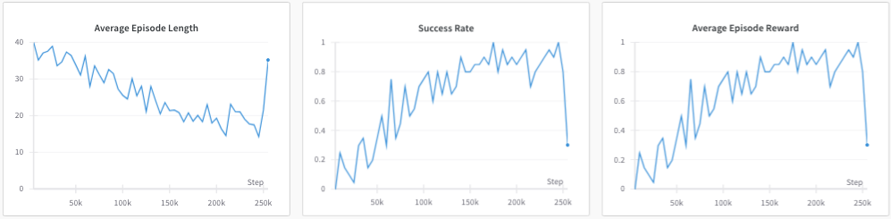

# 视觉提示引导的强化学习

发布时间：2024年07月14日

`Agent` `机器人` `人工智能`

> Affordance-Guided Reinforcement Learning via Visual Prompting

# 摘要

> 配备强化学习的机器人能够仅通过奖励信号学习多种技能，但为通用操作任务获取稳定且丰富的奖励信号仍具挑战。现有学习方法依赖大量数据，如成功与失败的示范，以构建特定任务的奖励函数。近期，大型多模态基础模型在机器人领域的应用日益增多，这些模型能进行物理环境下的视觉推理，并生成各类操作任务的初步机器人动作。受此启发，我们探索了视觉-语言模型（VLM）塑造的奖励机制。顶尖的VLM在零-shot环境下通过关键点进行affordances推理的能力突出，我们借此为机器人学习设计密集奖励。在自然语言描述的实际操作任务中，这些奖励显著提升了自主强化学习的效率，使任务在2万次在线微调中顺利完成。同时，该方法对预训练中示范数量的减少表现出强健性，在3.5万次在线微调中保持同等性能。

> Robots equipped with reinforcement learning (RL) have the potential to learn a wide range of skills solely from a reward signal. However, obtaining a robust and dense reward signal for general manipulation tasks remains a challenge. Existing learning-based approaches require significant data, such as demonstrations or examples of success and failure, to learn task-specific reward functions. Recently, there is also a growing adoption of large multi-modal foundation models for robotics. These models can perform visual reasoning in physical contexts and generate coarse robot motions for various manipulation tasks. Motivated by this range of capability, in this work, we propose and study rewards shaped by vision-language models (VLMs). State-of-the-art VLMs have demonstrated an impressive ability to reason about affordances through keypoints in zero-shot, and we leverage this to define dense rewards for robotic learning. On a real-world manipulation task specified by natural language description, we find that these rewards improve the sample efficiency of autonomous RL and enable successful completion of the task in 20K online finetuning steps. Additionally, we demonstrate the robustness of the approach to reductions in the number of in-domain demonstrations used for pretraining, reaching comparable performance in 35K online finetuning steps.

[Arxiv](https://arxiv.org/abs/2407.10341)