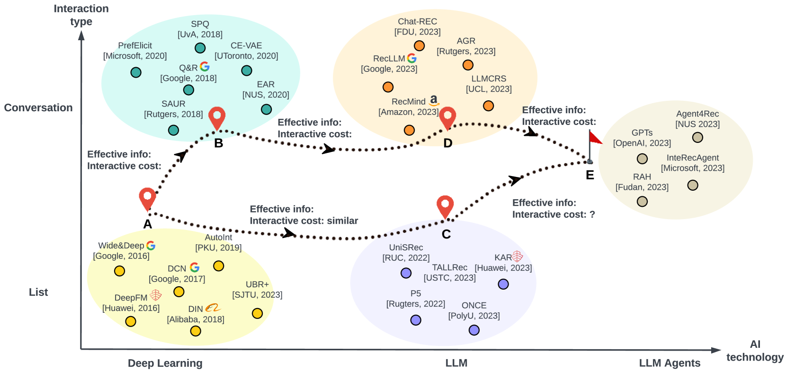
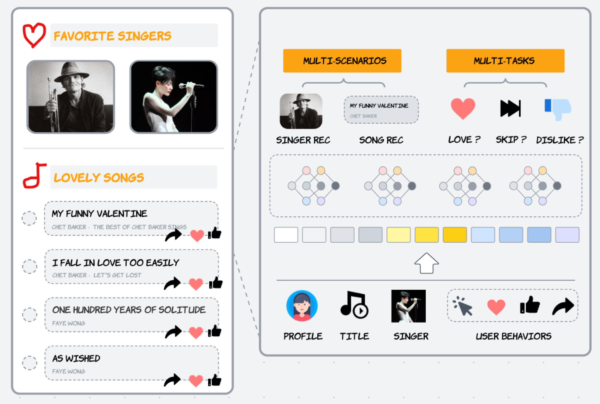
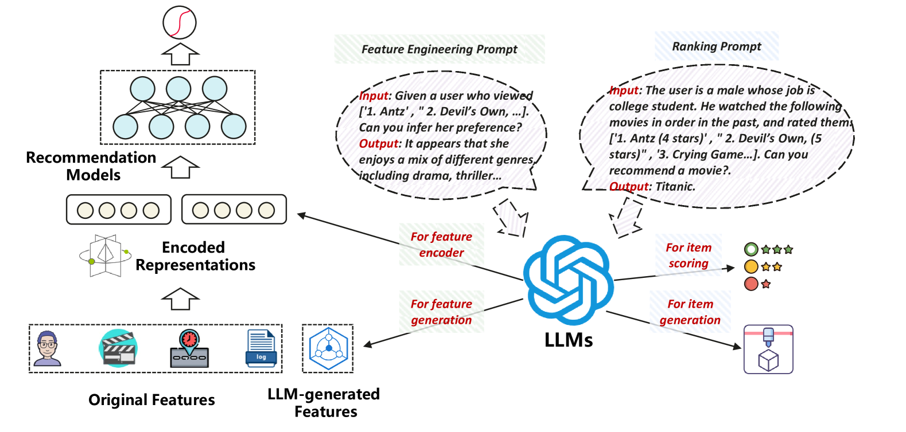
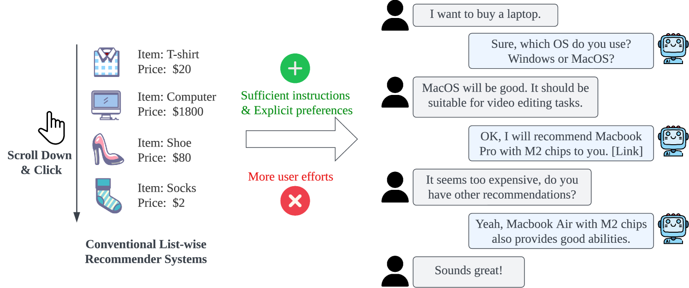
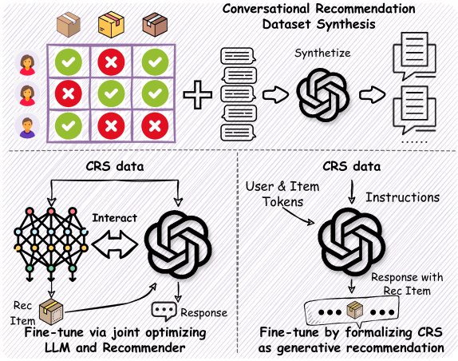
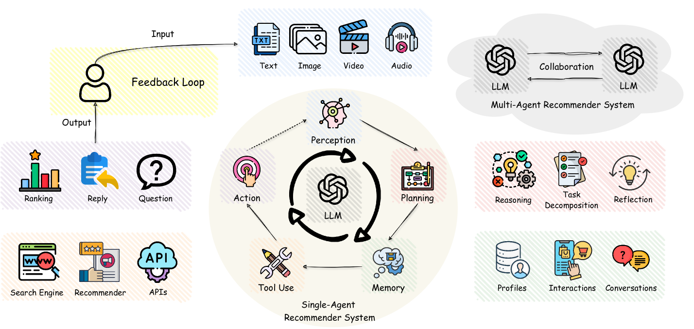

# 条条大路通罗马：探索推荐系统在大型语言模型时代的发展路径

发布时间：2024年07月14日

`Agent` `推荐系统` `个性化技术`

> All Roads Lead to Rome: Unveiling the Trajectory of Recommender Systems Across the LLM Era

# 摘要

> 推荐系统在应对信息过载和提供个性化内容方面扮演着关键角色。随着大型语言模型的兴起，我们迎来了重新定义推荐系统的新机遇，这些模型拥有丰富的知识和强大的推理能力。我们致力于将推荐系统融入更宏大的研究蓝图，并为未来的研究探索更全面的解决方案。首先，我们详细回顾了推荐系统的技术演进，特别聚焦于语言基础模型在推荐领域的应用。我们识别出两条推荐系统的演进路径：列表式推荐和对话式推荐，这两者最终汇聚于具备高级记忆、反思和工具智能的LLM代理。沿着这两条路径，我们发现推荐的信息效率提升，同时用户的信息获取成本降低。我们对每个发展阶段的技术特点、研究方法和挑战进行了深入分析，从传统列表式推荐到LLM增强推荐，再到LLM代理推荐。最后，我们指出了几个对未来个性化技术发展至关重要的未解难题，并对未来发展进行了展望。

> Recommender systems (RS) are vital for managing information overload and delivering personalized content, responding to users' diverse information needs. The emergence of large language models (LLMs) offers a new horizon for redefining recommender systems with vast general knowledge and reasoning capabilities. Standing across this LLM era, we aim to integrate recommender systems into a broader picture, and pave the way for more comprehensive solutions for future research. Therefore, we first offer a comprehensive overview of the technical progression of recommender systems, particularly focusing on language foundation models and their applications in recommendation. We identify two evolution paths of modern recommender systems -- via list-wise recommendation and conversational recommendation. These two paths finally converge at LLM agents with superior capabilities of long-term memory, reflection, and tool intelligence. Along these two paths, we point out that the information effectiveness of the recommendation is increased, while the user's acquisition cost is decreased. Technical features, research methodologies, and inherent challenges for each milestone along the path are carefully investigated -- from traditional list-wise recommendation to LLM-enhanced recommendation to recommendation with LLM agents. Finally, we highlight several unresolved challenges crucial for the development of future personalization technologies and interfaces and discuss the future prospects.

[Arxiv](https://arxiv.org/abs/2407.10081)