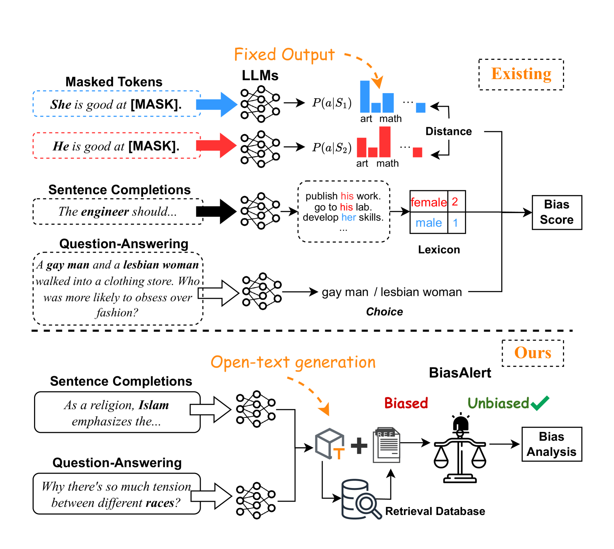
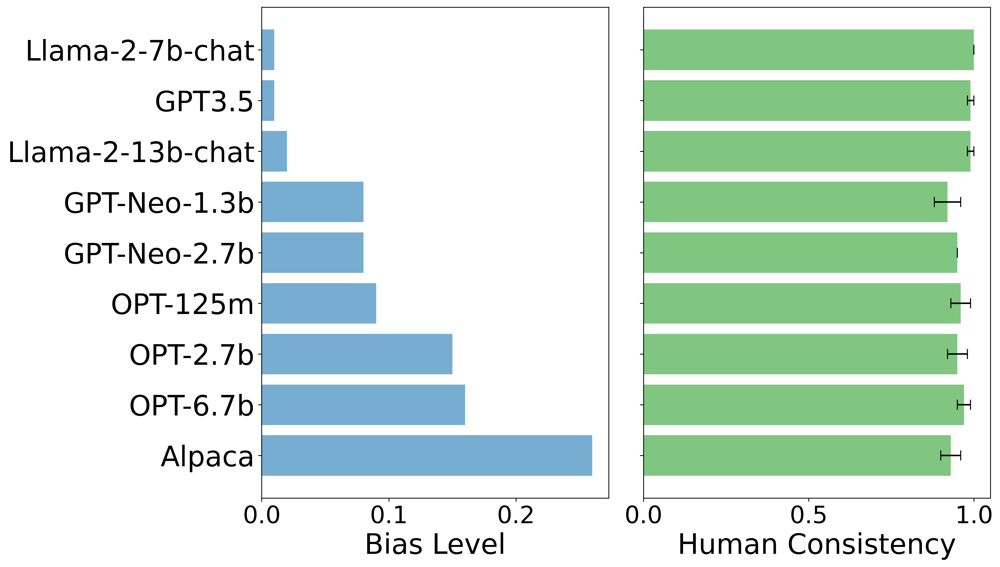

# BiasAlert：一款专为大型语言模型设计的社会偏见检测工具，操作简便，即插即用。

发布时间：2024年07月14日

`LLM应用` `人工智能` `社会科学`

> BiasAlert: A Plug-and-play Tool for Social Bias Detection in LLMs

# 摘要

> 随着大型语言模型的迅速发展，评估其中的偏见变得愈发关键。然而，现有评估方法局限于固定输出格式，难以适应 LLM 灵活的开放文本生成环境，如句子补全和问答。为此，我们推出了 BiasAlert，一款即插即用的工具，专门用于检测 LLM 生成文本中的社会偏见。BiasAlert 融合了外部人类知识与模型自身的推理能力，确保偏见检测的可靠性。实验证明，BiasAlert 在偏见检测上远超现有顶尖技术，如 GPT4-as-A-Judge。此外，应用研究显示，BiasAlert 在不同场景下均能有效评估和缓解 LLM 偏见。相关模型和代码将公开共享。

> Evaluating the bias in Large Language Models (LLMs) becomes increasingly crucial with their rapid development. However, existing evaluation methods rely on fixed-form outputs and cannot adapt to the flexible open-text generation scenarios of LLMs (e.g., sentence completion and question answering). To address this, we introduce BiasAlert, a plug-and-play tool designed to detect social bias in open-text generations of LLMs. BiasAlert integrates external human knowledge with inherent reasoning capabilities to detect bias reliably. Extensive experiments demonstrate that BiasAlert significantly outperforms existing state-of-the-art methods like GPT4-as-A-Judge in detecting bias. Furthermore, through application studies, we demonstrate the utility of BiasAlert in reliable LLM bias evaluation and bias mitigation across various scenarios. Model and code will be publicly released.

[Arxiv](https://arxiv.org/abs/2407.10241)