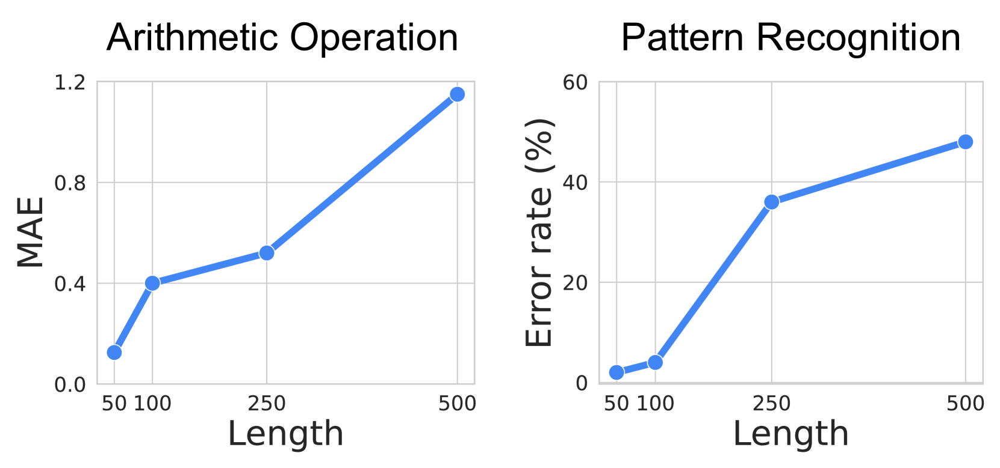
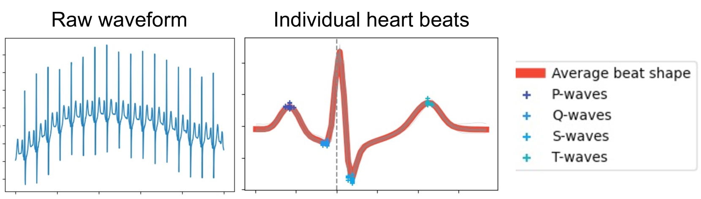
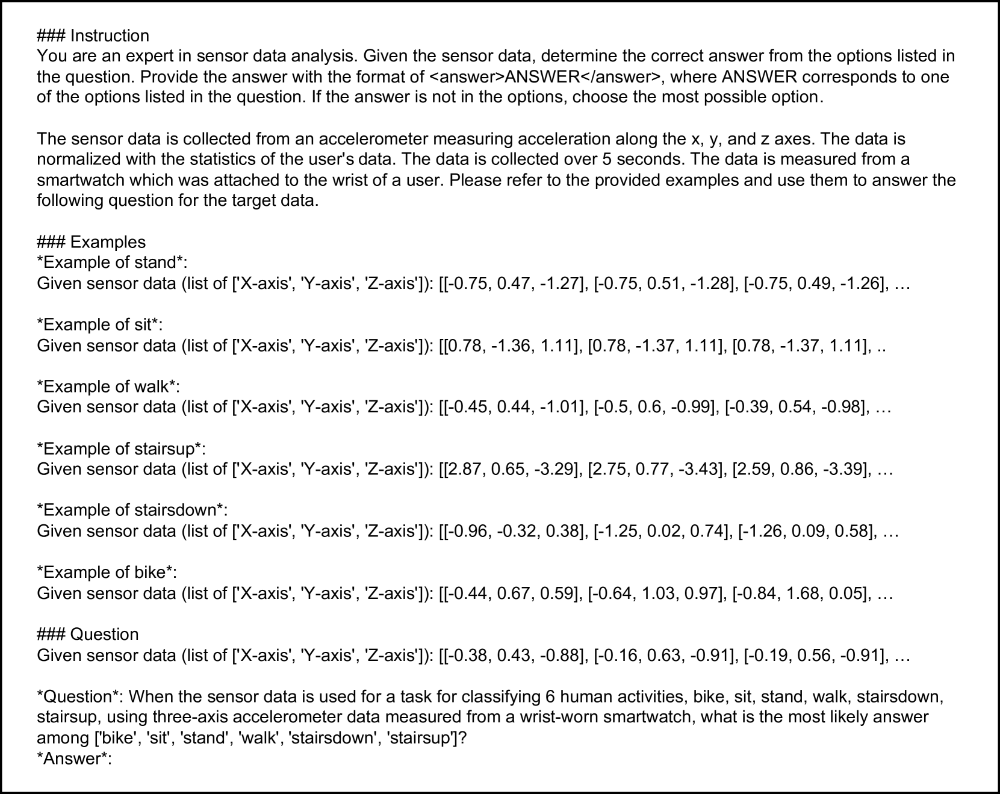

# 以我之眼：借助视觉提示，通过传感器数据为多模态大型语言模型提供坚实基础

发布时间：2024年07月14日

`LLM应用` `自动化` `传感器技术`

> By My Eyes: Grounding Multimodal Large Language Models with Sensor Data via Visual Prompting

# 摘要

> 尽管大型语言模型在多领域表现出色，但在处理长传感器数据序列时，传统文本提示方法的性能显著下降，限制了其在普遍感知应用中的应用。为此，我们创新性地提出了基于多模态 LLM 的视觉提示方法，通过设计视觉提示，有效结合可视化传感器数据与任务描述，提升了处理效率。同时，我们开发的可视化生成器，能够自动优化特定任务的可视化效果，无需预先掌握专业知识。实验结果显示，与传统文本提示相比，我们的方法在九项感知任务中平均准确率提升10%，且成本降低15.8倍，充分展现了视觉提示在多模态 LLM 中的高效与经济优势。

> Large language models (LLMs) have demonstrated exceptional abilities across various domains. However, utilizing LLMs for ubiquitous sensing applications remains challenging as existing text-prompt methods show significant performance degradation when handling long sensor data sequences. We propose a visual prompting approach for sensor data using multimodal LLMs (MLLMs). We design a visual prompt that directs MLLMs to utilize visualized sensor data alongside the target sensory task descriptions. Additionally, we introduce a visualization generator that automates the creation of optimal visualizations tailored to a given sensory task, eliminating the need for prior task-specific knowledge. We evaluated our approach on nine sensory tasks involving four sensing modalities, achieving an average of 10% higher accuracy than text-based prompts and reducing token costs by 15.8x. Our findings highlight the effectiveness and cost-efficiency of visual prompts with MLLMs for various sensory tasks.

[Arxiv](https://arxiv.org/abs/2407.10385)