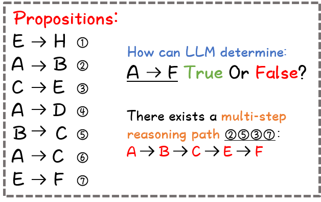
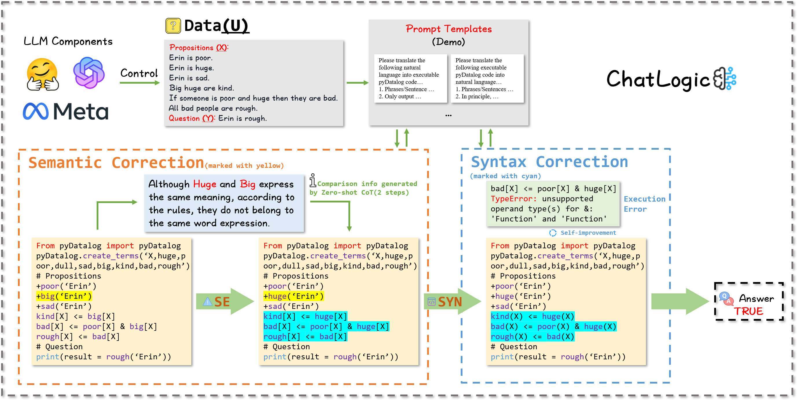
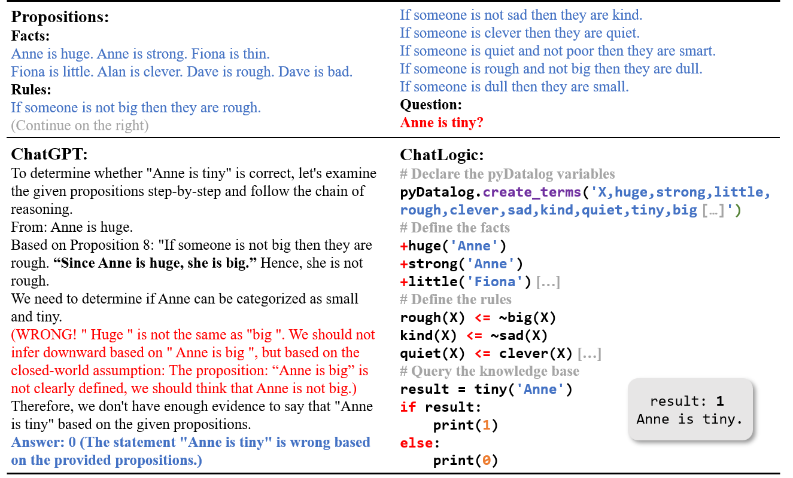

# ChatLogic：融合逻辑编程与大型语言模型，助力多步骤推理

发布时间：2024年07月14日

`LLM应用` `人工智能` `软件开发`

> ChatLogic: Integrating Logic Programming with Large Language Models for Multi-Step Reasoning

# 摘要

> ChatGPT和GPT-4等大型语言模型在多项生成任务中表现卓越，但长期记忆的局限性常导致其在长时间交互中易受攻击和偏见影响。为此，我们推出了ChatLogic框架，专为提升LLM在复杂推理任务中的表现而设计。该框架通过融合逻辑编程，使语言模型成为系统核心，有效参与每一操作环节。我们创新地将逻辑问题转化为符号推理，充分利用模型的情境感知与模仿能力，并通过符号记忆强化推理过程。实证结果表明，ChatLogic大幅增强了LLM的连续推理能力。相关代码与数据已公开于\url{https://github.com/Strong-AI-Lab/ChatLogic}。

> Large language models (LLMs) such as ChatGPT and GPT-4 have demonstrated impressive capabilities in various generative tasks. However, their performance is often hampered by limitations in accessing and leveraging long-term memory, leading to specific vulnerabilities and biases, especially during long interactions. This paper introduces ChatLogic, an innovative framework specifically targeted at LLM reasoning tasks that can enhance the performance of LLMs in multi-step deductive reasoning tasks by integrating logic programming. In ChatLogic, the language model plays a central role, acting as a controller and participating in every system operation stage. We propose a novel method of converting logic problems into symbolic integration with an inference engine. This approach leverages large language models' situational understanding and imitation skills and uses symbolic memory to enhance multi-step deductive reasoning capabilities. Our results show that the ChatLogic framework significantly improves the multi-step reasoning capabilities of LLMs. The source code and data are available at \url{https://github.com/Strong-AI-Lab/ChatLogic}

[Arxiv](https://arxiv.org/abs/2407.10162)