# 跨语言多跳知识编辑：基准测试、深入分析与基于对比学习的简易方法

发布时间：2024年07月14日

`LLM应用` `人工智能` `语言技术`

> Cross-Lingual Multi-Hop Knowledge Editing - Benchmarks, Analysis and a Simple Contrastive Learning based Approach

# 摘要

> 大型语言模型需不断适应新知识，而知识编辑技术旨在通过最小改动高效更新模型知识。尽管新信息可能来自全球任何语言，但多数研究仍聚焦于英语单语知识编辑。为此，我们提出跨语言多跳知识编辑范式，创建了CROLIN-MQUAKE基准，以评估跨语言环境下知识编辑技术的性能。分析显示，跨语言与英语中心设置间存在显著性能差距。基于此，我们开发了CLEVER-CKE系统，采用检索、验证、生成框架，通过语言感知和硬负例对比目标，显著提升了跨语言和细粒度事实检索验证过程。实验表明，CLEVER-CKE在多个LLM、语言和数据集上，性能提升高达30%。

> Large language models are often expected to constantly adapt to new sources of knowledge and knowledge editing techniques aim to efficiently patch the outdated model knowledge, with minimal modification. Most prior works focus on monolingual knowledge editing in English, even though new information can emerge in any language from any part of the world. We propose the Cross-Lingual Multi-Hop Knowledge Editing paradigm, for measuring and analyzing the performance of various SoTA knowledge editing techniques in a cross-lingual setup. Specifically, we create a parallel cross-lingual benchmark, CROLIN-MQUAKE for measuring the knowledge editing capabilities. Our extensive analysis over various knowledge editing techniques uncover significant gaps in performance between the cross-lingual and English-centric setting. Following this, we propose a significantly improved system for cross-lingual multi-hop knowledge editing, CLEVER-CKE. CLEVER-CKE is based on a retrieve, verify and generate knowledge editing framework, where a retriever is formulated to recall edited facts and support an LLM to adhere to knowledge edits. We develop language-aware and hard-negative based contrastive objectives for improving the cross-lingual and fine-grained fact retrieval and verification process used in this framework. Extensive experiments on three LLMs, eight languages, and two datasets show CLEVER-CKE's significant gains of up to 30% over prior methods.

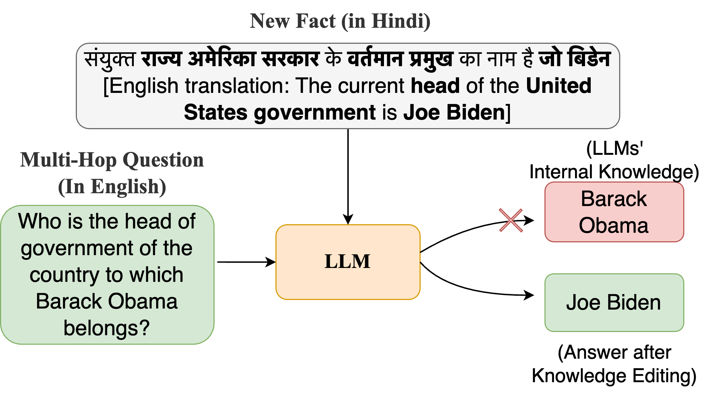

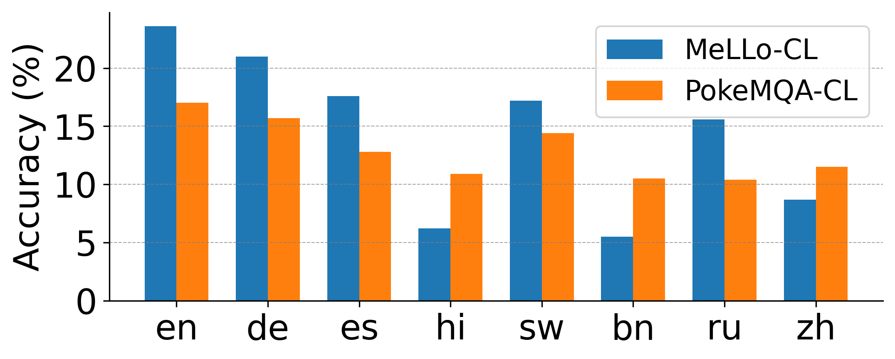

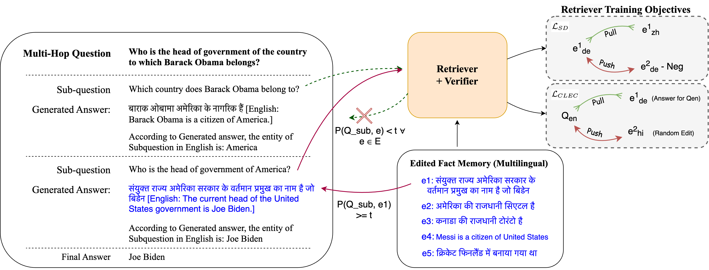

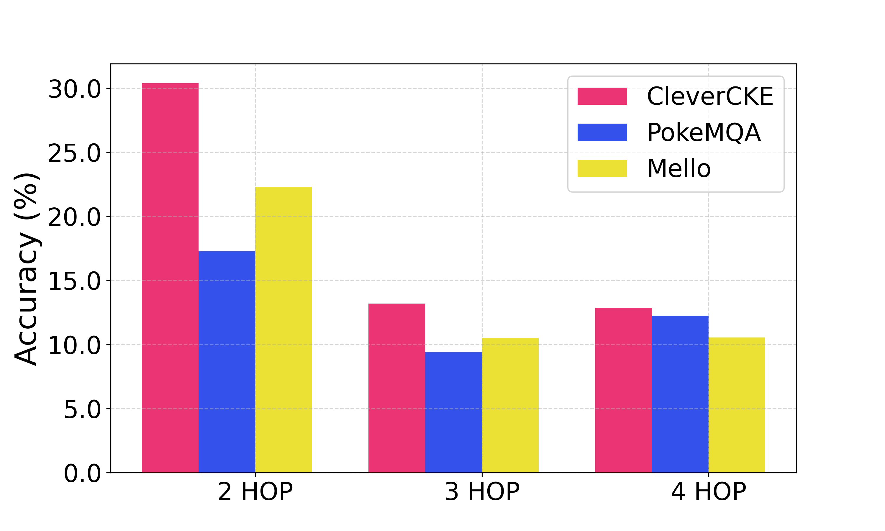

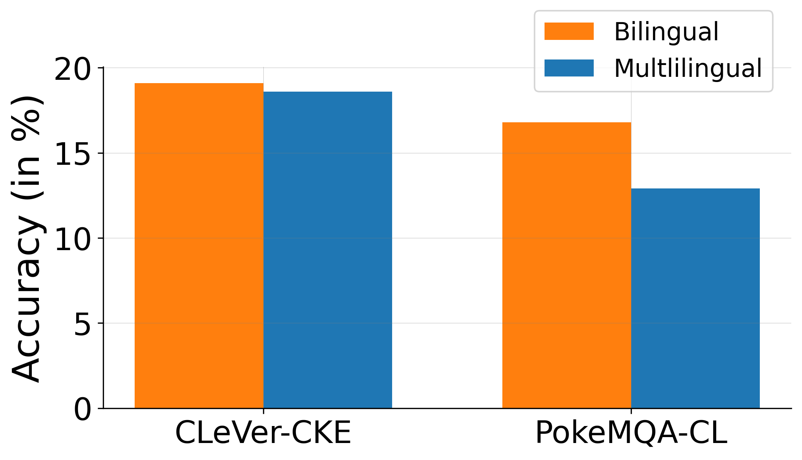

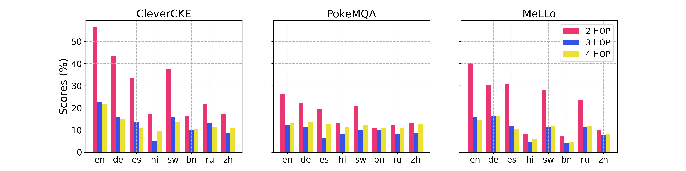

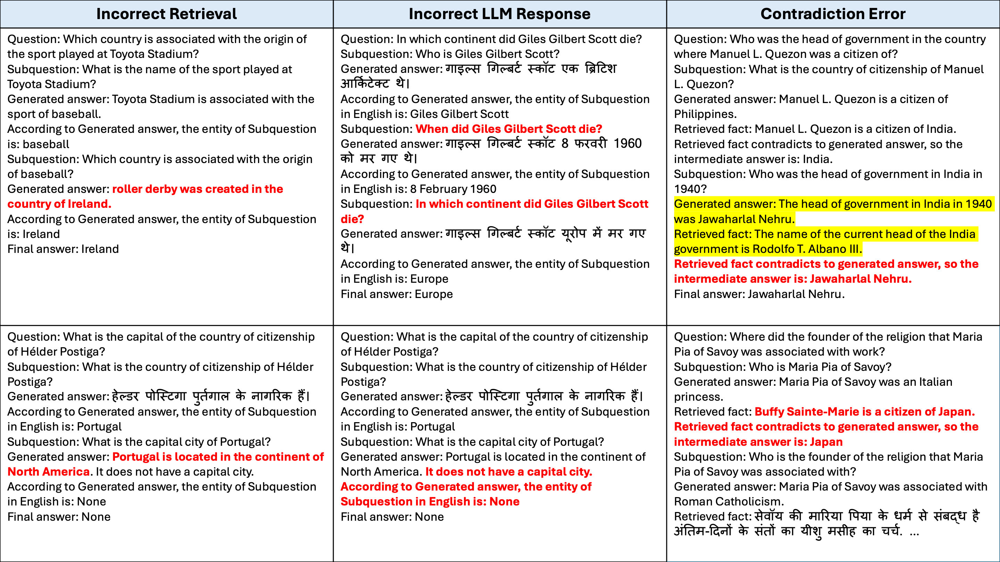

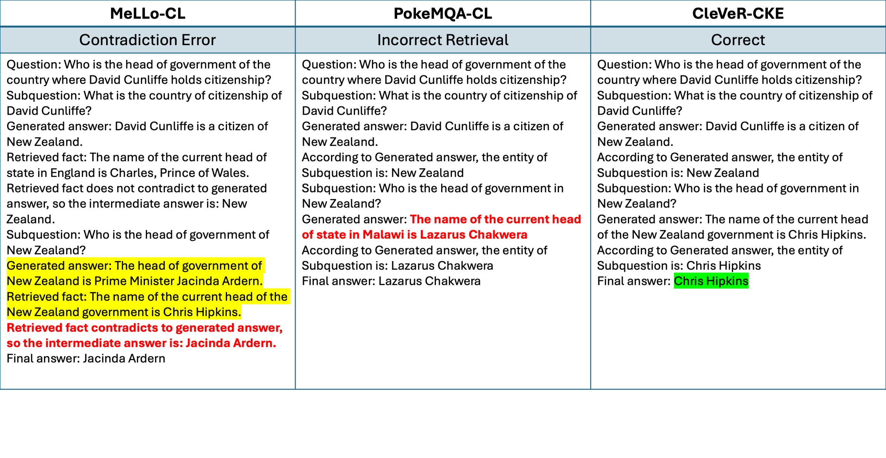

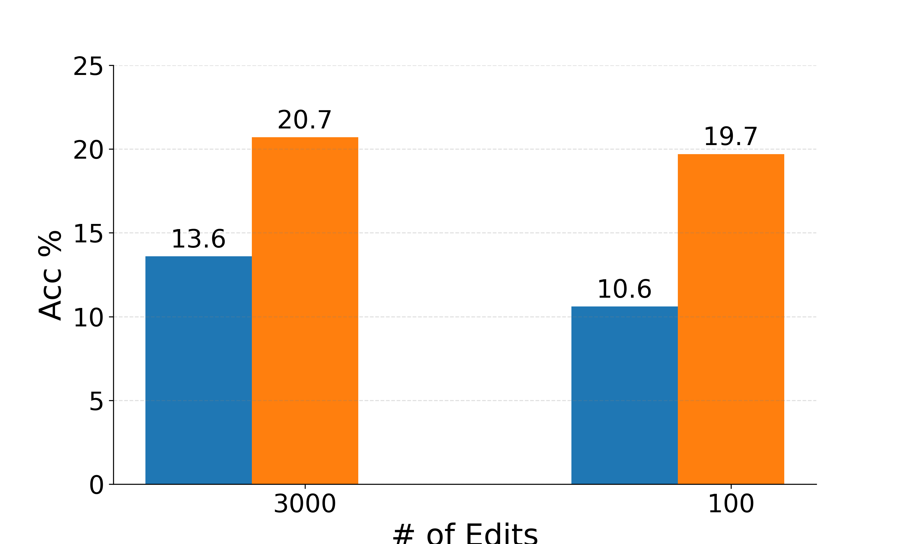

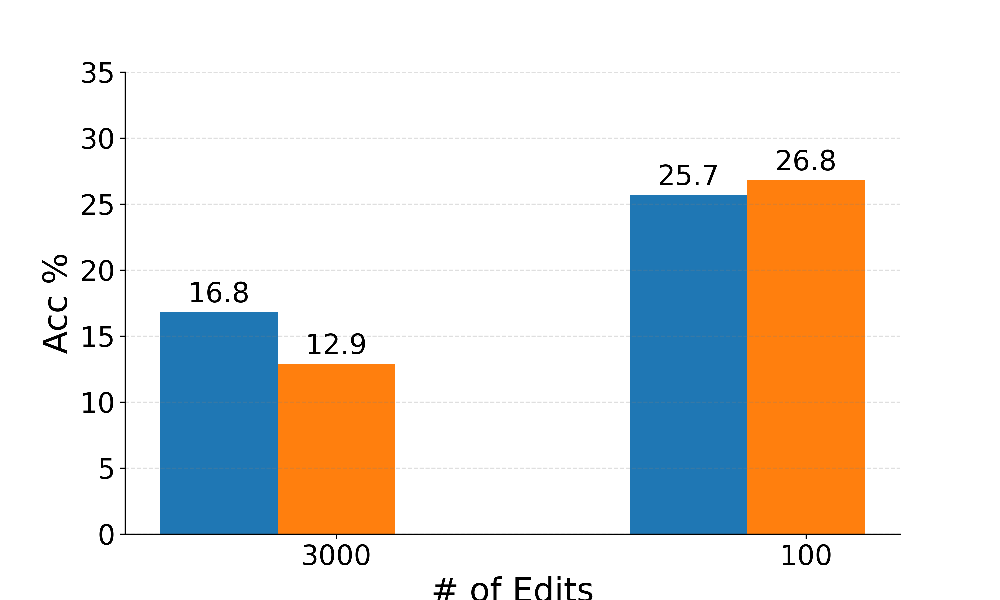

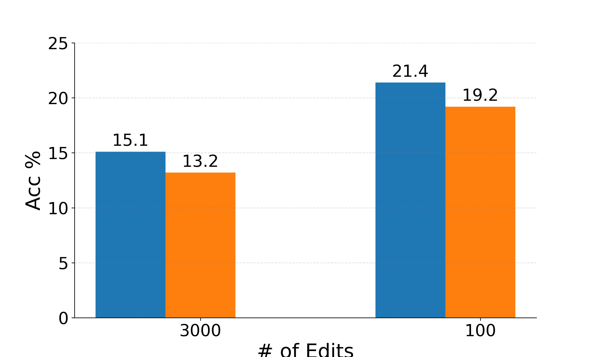

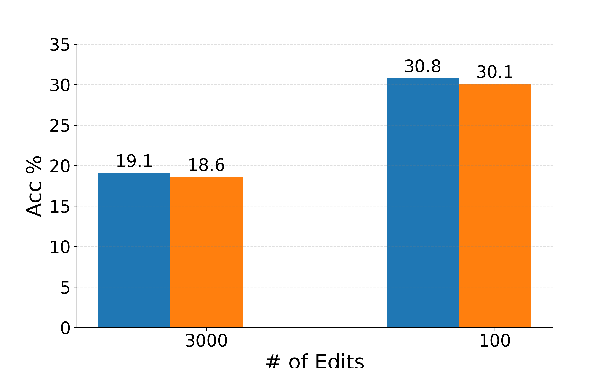

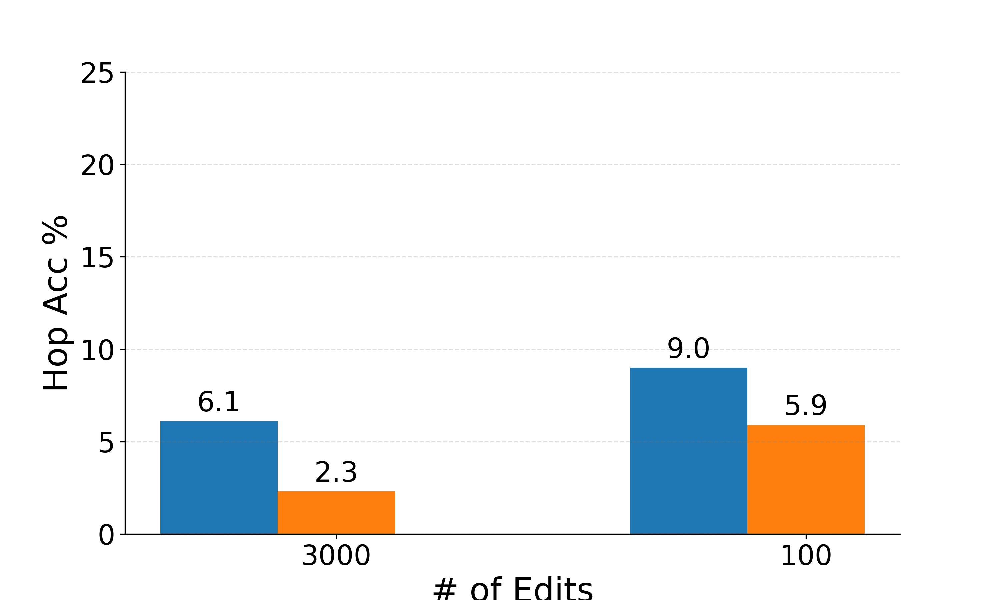

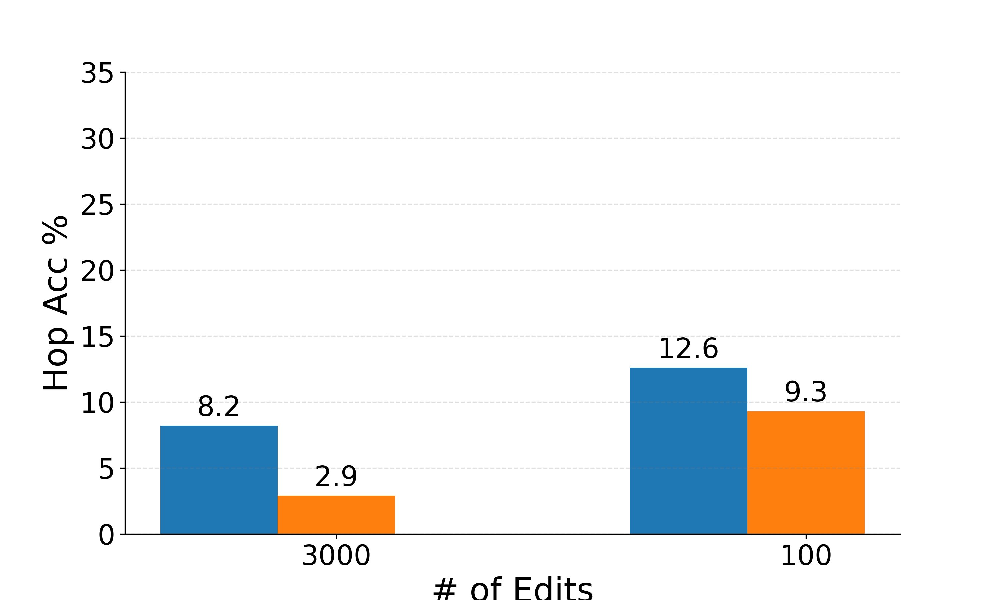

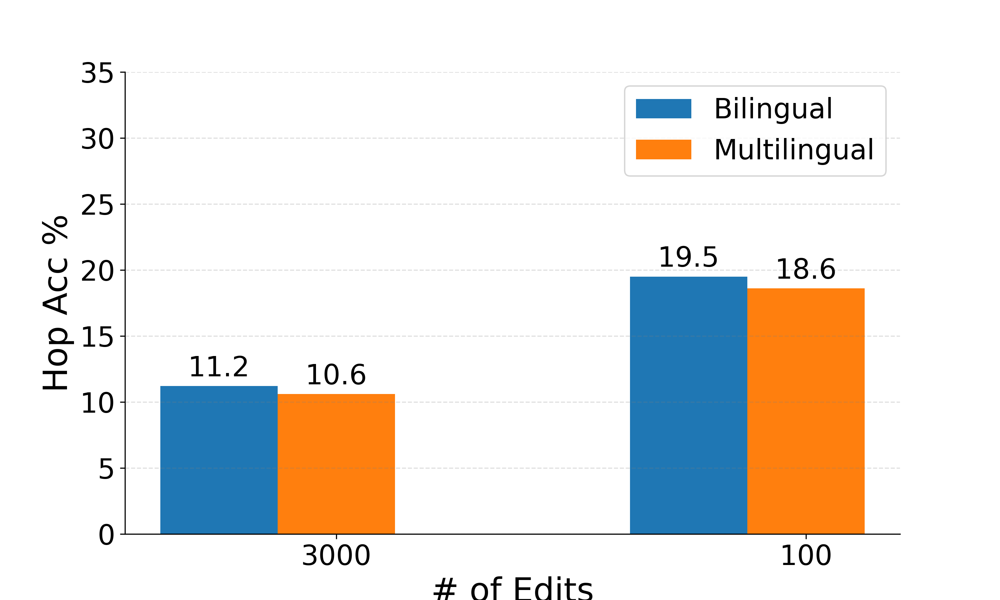

[Arxiv](https://arxiv.org/abs/2407.10275)