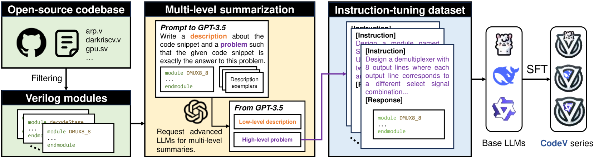
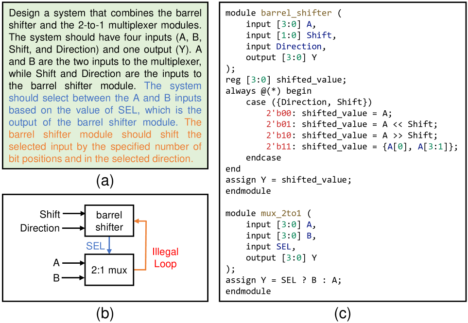
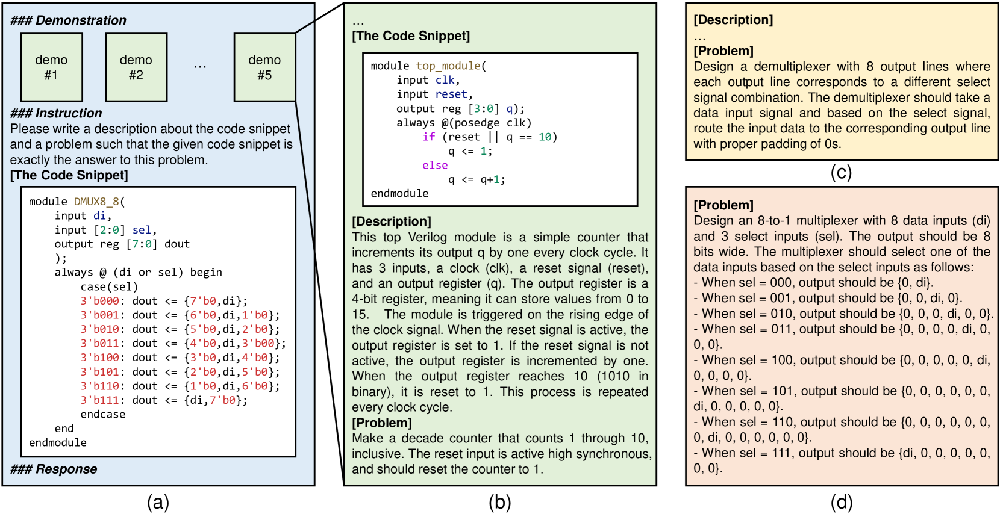
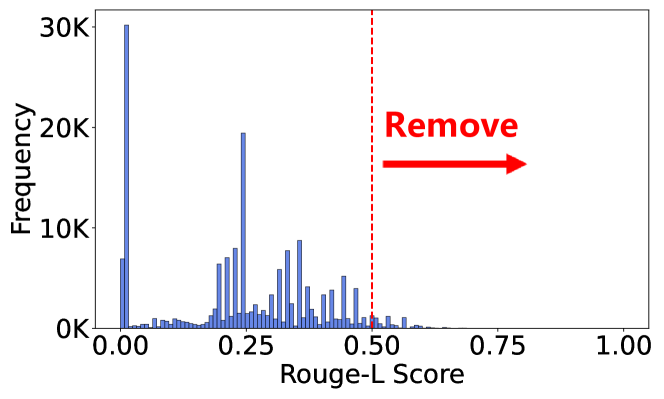
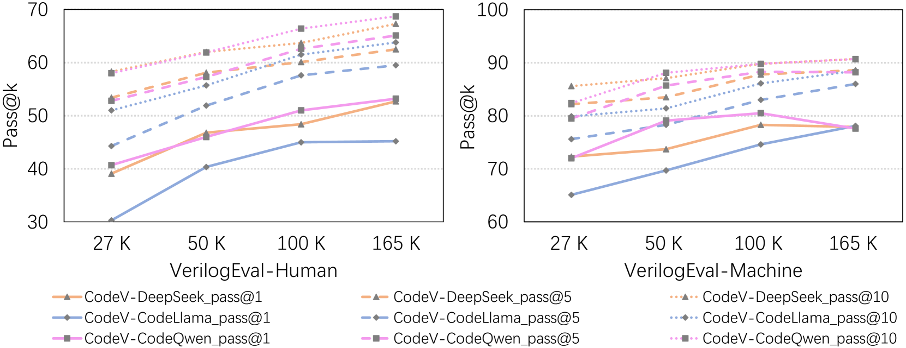
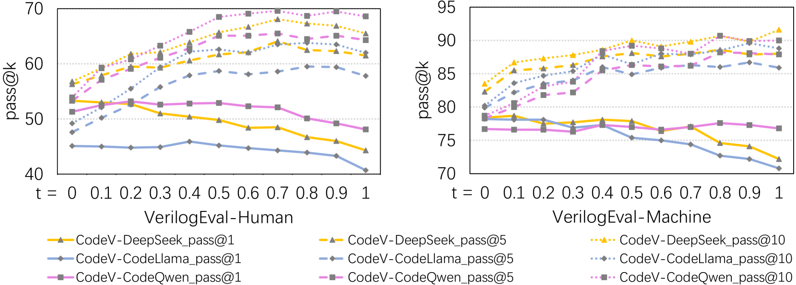
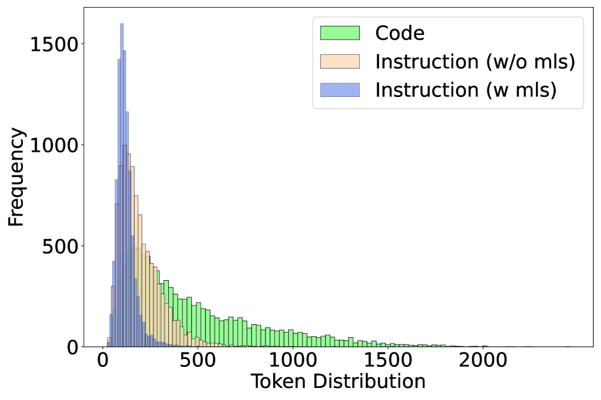
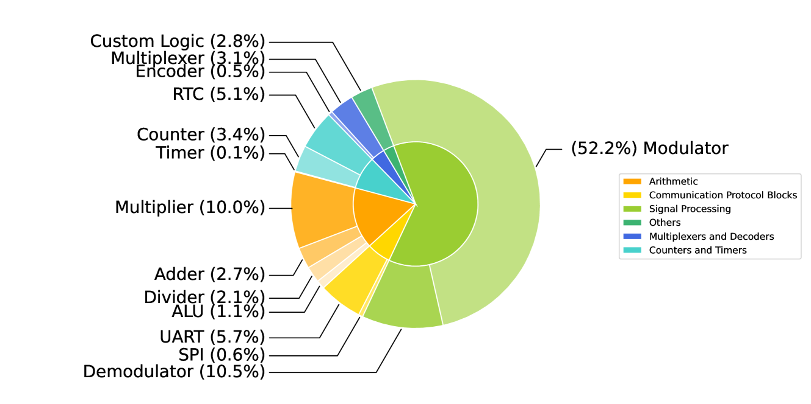

# 借助多级摘要技术，提升 LLMs 在 Verilog 生成方面的能力

发布时间：2024年07月14日

`LLM应用` `半导体` `自动化设计`

> Empowering LLMs for Verilog Generation through Multi-Level Summarization

# 摘要

> 随着处理器设计复杂性和成本的增加，对自动化设计工具的需求激增。尽管指令调优的LLMs在生成Python等编程语言代码方面表现卓越，但在Verilog这类硬件描述语言上却因缺乏高质量数据而表现不佳。我们发现，现实世界中的Verilog代码质量更高，且LLMs如GPT-3.5更擅长总结而非生成Verilog代码。为此，我们推出了CodeV，一系列开源的Verilog生成LLMs，通过多级总结直接从Verilog代码生成自然语言描述。实验表明，CodeV在性能上显著超越了以往的开源和商业SOTA，分别提升了14.4%、11.3%和22.1%。

> The increasing complexity and high costs associated with modern processor design have led to a surge in demand for processor design automation. Instruction-tuned large language models (LLMs) have demonstrated remarkable performance in automatically generating code for general-purpose programming languages like Python. However, these methods fail on hardware description languages (HDLs) like Verilog due to the scarcity of high-quality instruction tuning data, as even advanced LLMs like GPT-3.5 exhibit limited performance on Verilog generation. Regarding this issue, we observe that (1) Verilog code collected from the real world has higher quality than those generated by LLMs. (2) LLMs like GPT-3.5 excel in summarizing Verilog code rather than generating it. Based on these observations, this paper introduces CodeV, a series of open-source instruction-tuned Verilog generation LLMs. Instead of generating descriptions first and then getting the corresponding code from advanced LLMs, we prompt the LLM with Verilog code and let the LLM generate the corresponding natural language description by multi-level summarization. Experimental results show that CodeV relatively surpasses the previous open-source SOTA by 14.4% (BetterV in VerilogEval) and 11.3% (RTLCoder in RTLLM) respectively, and also relatively outperforms previous commercial SOTA GPT-4 by 22.1% in VerilogEval.

[Arxiv](https://arxiv.org/abs/2407.10424)