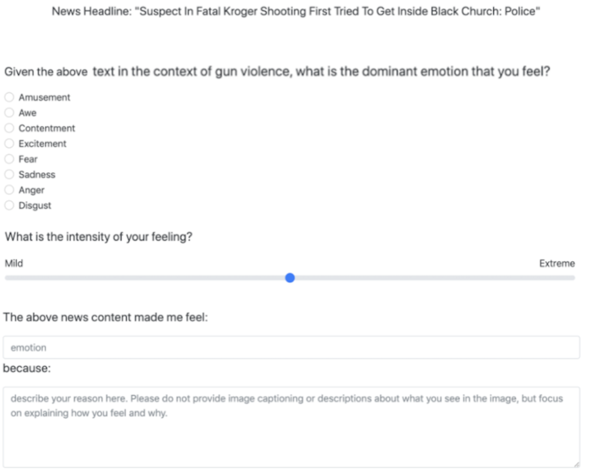
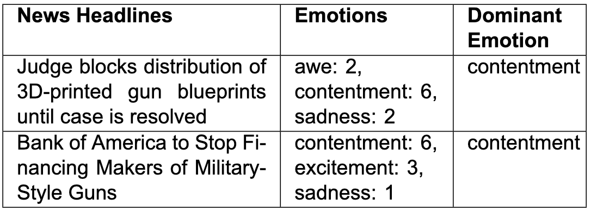
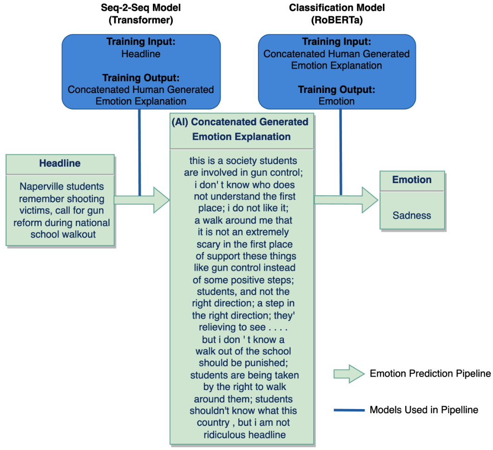
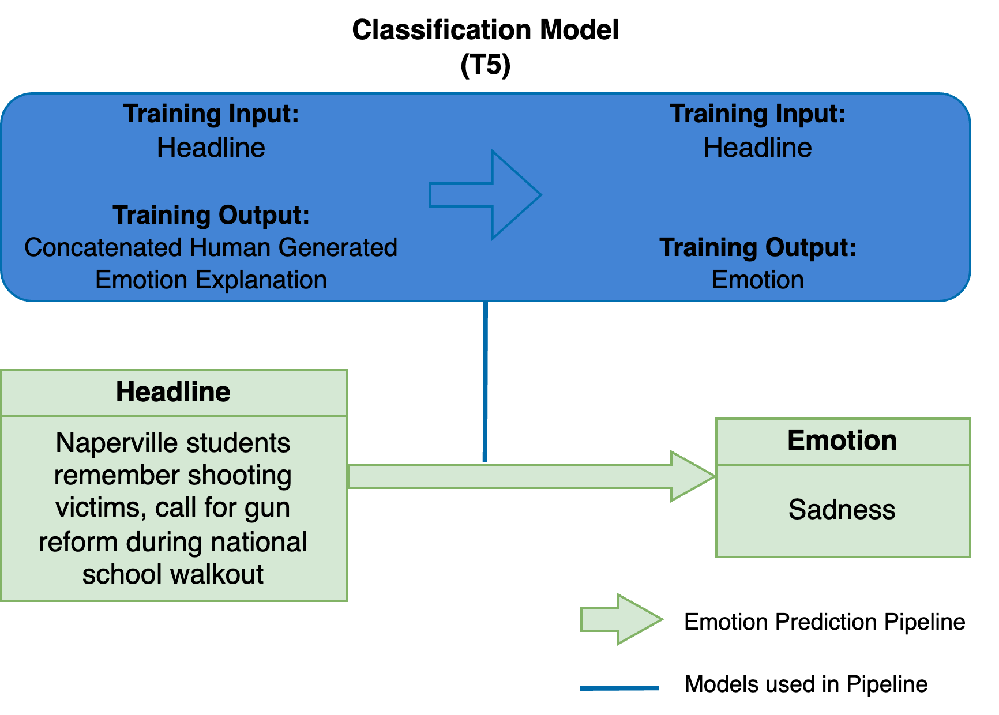
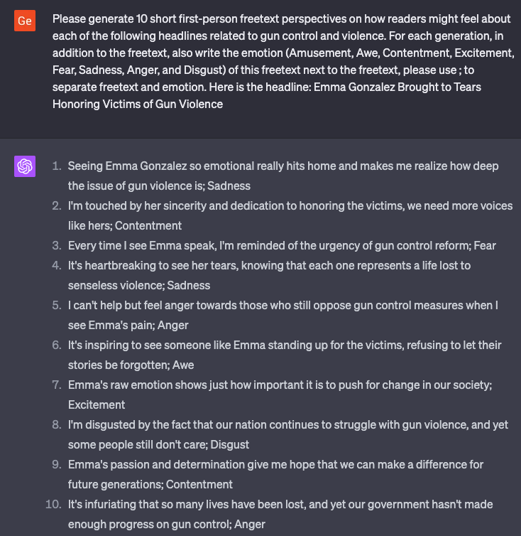
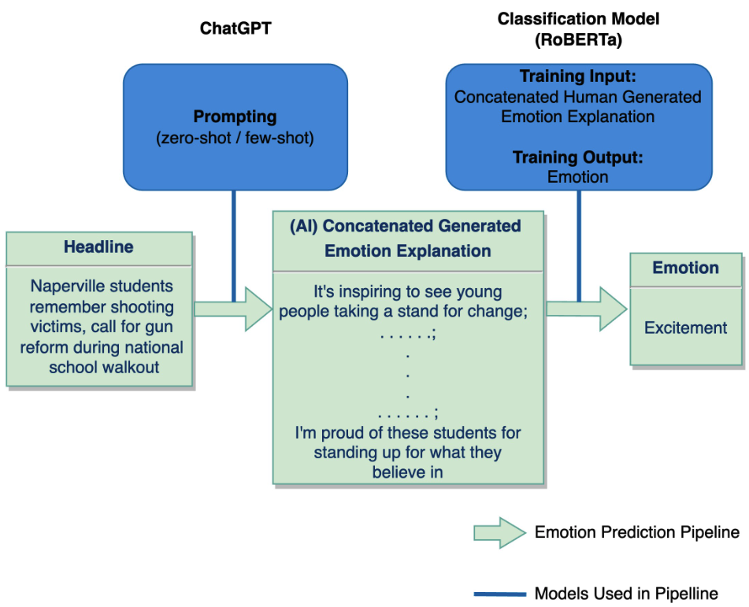
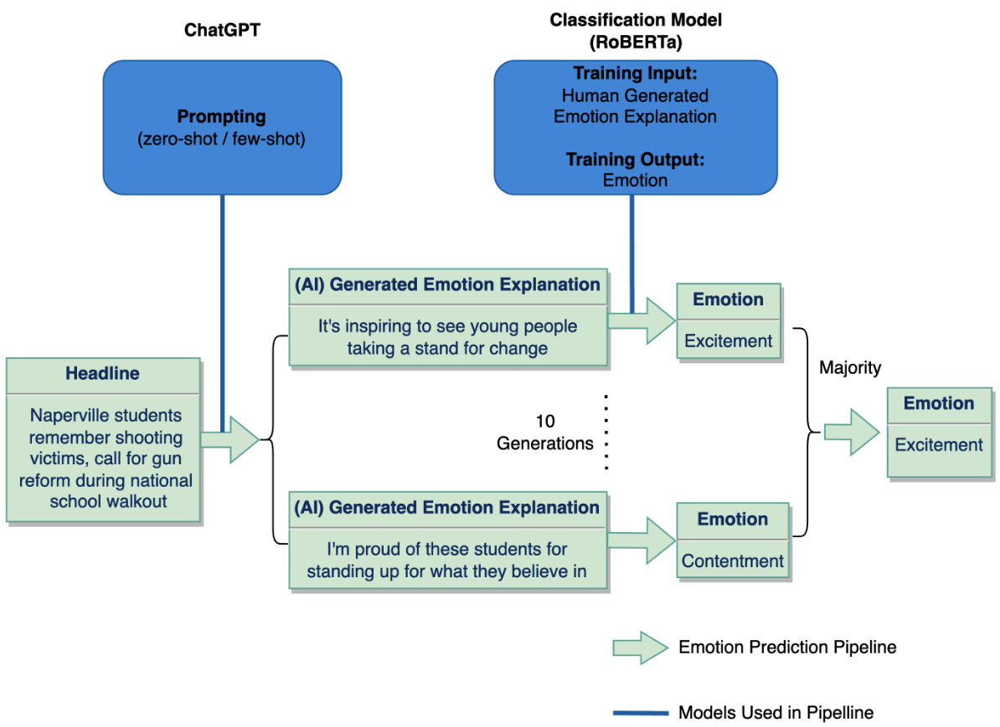
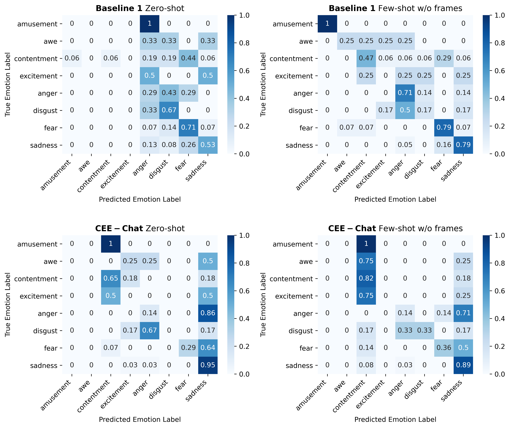

# 提升新闻标题情感预测：ChatGPT 与 Seq2Seq 模型在自由文本生成中的新视角

发布时间：2024年07月14日

`LLM应用` `情感分析`

> Enhancing Emotion Prediction in News Headlines: Insights from ChatGPT and Seq2Seq Models for Free-Text Generation

# 摘要

> 预测新闻标题引发的情感颇具挑战，因受制于人们多样的解读与背景。过往研究多直接从标题分类情感。我们另辟蹊径，利用读者自由文本的情感解释，揭示阅读标题后的内心感受。通过BU-NEmo+数据集，我们发现这些解释与标题主导情感高度相关，且蕴含更丰富的情感语境，更适合作为情感分类模型的输入。为此，我们训练了序列到序列的transformer模型，并借助ChatGPT（GPT-4）生成情感解释，进而用于情感分类。同时，我们还尝试先训练T5模型生成解释，再微调进行情感分类。经McNemar检验，结合GPT生成的解释的方法在情感分类上显著优于仅用标题的方法（P值<0.05），凸显了在标题情感预测中引入自由文本解释的重要性。

> Predicting emotions elicited by news headlines can be challenging as the task is largely influenced by the varying nature of people's interpretations and backgrounds. Previous works have explored classifying discrete emotions directly from news headlines. We provide a different approach to tackling this problem by utilizing people's explanations of their emotion, written in free-text, on how they feel after reading a news headline. Using the dataset BU-NEmo+ (Gao et al., 2022), we found that for emotion classification, the free-text explanations have a strong correlation with the dominant emotion elicited by the headlines. The free-text explanations also contain more sentimental context than the news headlines alone and can serve as a better input to emotion classification models. Therefore, in this work we explored generating emotion explanations from headlines by training a sequence-to-sequence transformer model and by using pretrained large language model, ChatGPT (GPT-4). We then used the generated emotion explanations for emotion classification. In addition, we also experimented with training the pretrained T5 model for the intermediate task of explanation generation before fine-tuning it for emotion classification. Using McNemar's significance test, methods that incorporate GPT-generated free-text emotion explanations demonstrated significant improvement (P-value < 0.05) in emotion classification from headlines, compared to methods that only use headlines. This underscores the value of using intermediate free-text explanations for emotion prediction tasks with headlines.

[Arxiv](https://arxiv.org/abs/2407.10091)