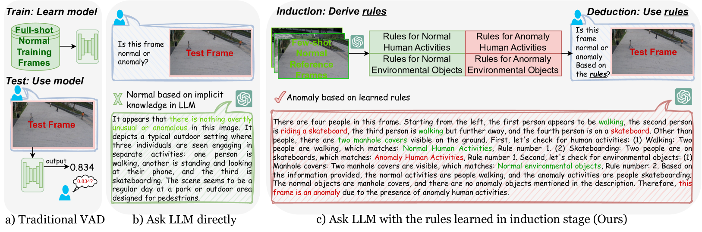
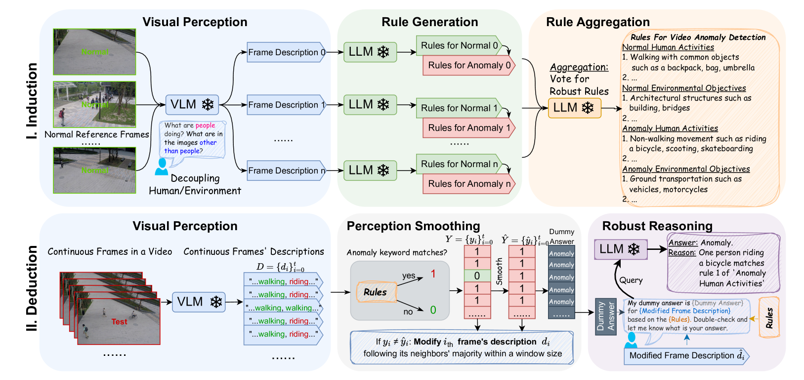
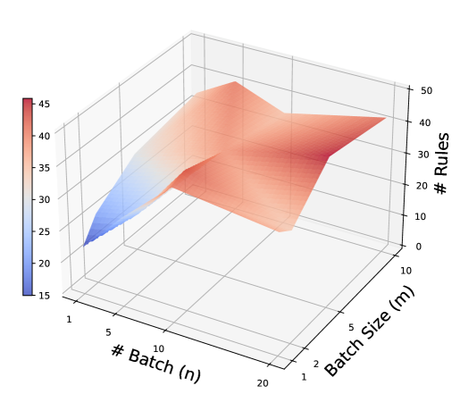
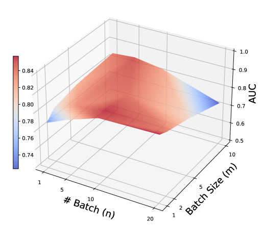
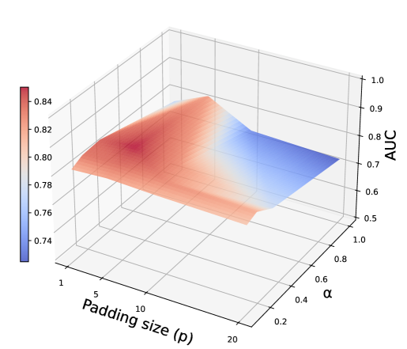

# 遵循规则：运用大型语言模型进行视频异常检测的推理方法

发布时间：2024年07月14日

`LLM应用` `安全监控` `自动驾驶`

> Follow the Rules: Reasoning for Video Anomaly Detection with Large Language Models

# 摘要

> 视频异常检测 (VAD) 对安全监控和自动驾驶等应用至关重要，但现有方法在解释检测结果方面存在不足，影响了公众信任。本文采用推理框架处理 VAD，尽管大型语言模型 (LLM) 推理能力强大，但其直接应用于 VAD 效果不佳，因其预训练知识侧重通用上下文，难以适应具体场景。为此，我们提出 AnomalyRuler，一个基于规则的推理框架，结合 LLM 进行 VAD。该框架包括归纳和演绎两个阶段：首先，LLM 通过少量正常样本归纳出检测规则；随后，根据这些规则在测试视频中识别异常帧。此外，通过规则聚合、感知平滑和鲁棒推理策略，进一步提升了 AnomalyRuler 的鲁棒性。作为首个针对单类 VAD 任务的推理方法，AnomalyRuler 仅需少量正常样本提示，无需完整训练，能快速适应不同场景。实验证明，AnomalyRuler 在多个 VAD 基准上表现卓越，兼具高检测性能和强推理能力。

> Video Anomaly Detection (VAD) is crucial for applications such as security surveillance and autonomous driving. However, existing VAD methods provide little rationale behind detection, hindering public trust in real-world deployments. In this paper, we approach VAD with a reasoning framework. Although Large Language Models (LLMs) have shown revolutionary reasoning ability, we find that their direct use falls short of VAD. Specifically, the implicit knowledge pre-trained in LLMs focuses on general context and thus may not apply to every specific real-world VAD scenario, leading to inflexibility and inaccuracy. To address this, we propose AnomalyRuler, a novel rule-based reasoning framework for VAD with LLMs. AnomalyRuler comprises two main stages: induction and deduction. In the induction stage, the LLM is fed with few-shot normal reference samples and then summarizes these normal patterns to induce a set of rules for detecting anomalies. The deduction stage follows the induced rules to spot anomalous frames in test videos. Additionally, we design rule aggregation, perception smoothing, and robust reasoning strategies to further enhance AnomalyRuler's robustness. AnomalyRuler is the first reasoning approach for the one-class VAD task, which requires only few-normal-shot prompting without the need for full-shot training, thereby enabling fast adaption to various VAD scenarios. Comprehensive experiments across four VAD benchmarks demonstrate AnomalyRuler's state-of-the-art detection performance and reasoning ability.

[Arxiv](https://arxiv.org/abs/2407.10299)