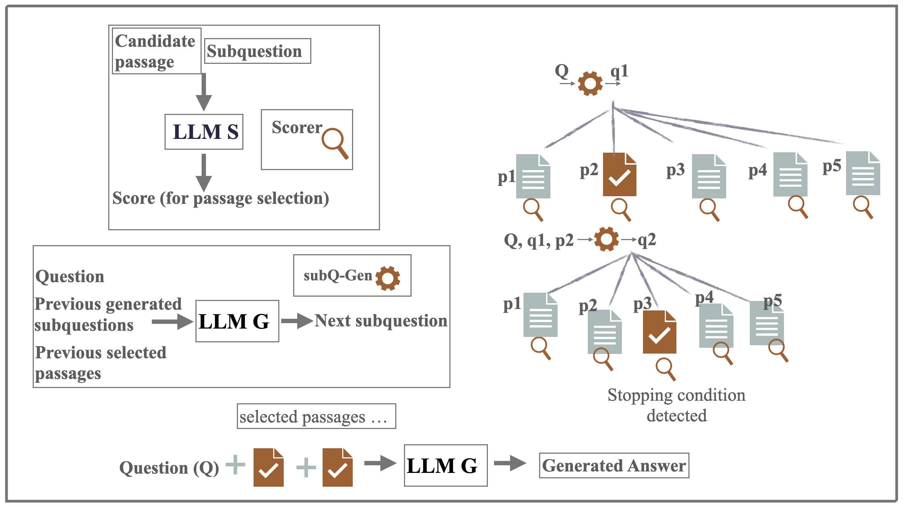
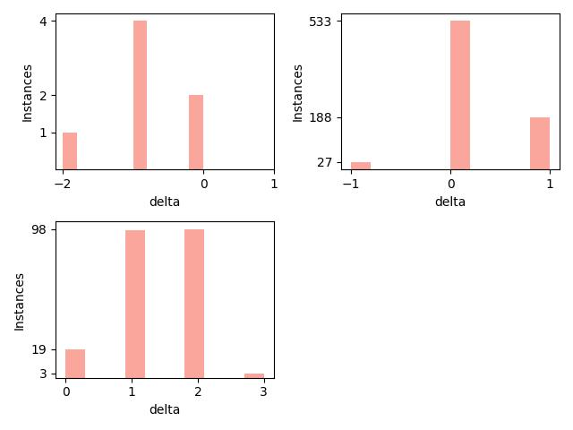
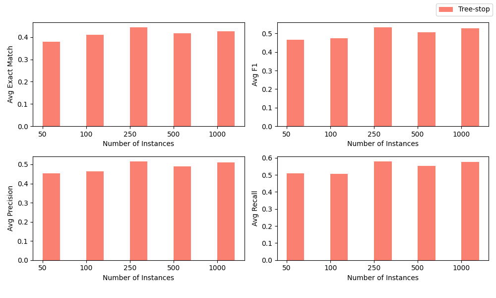
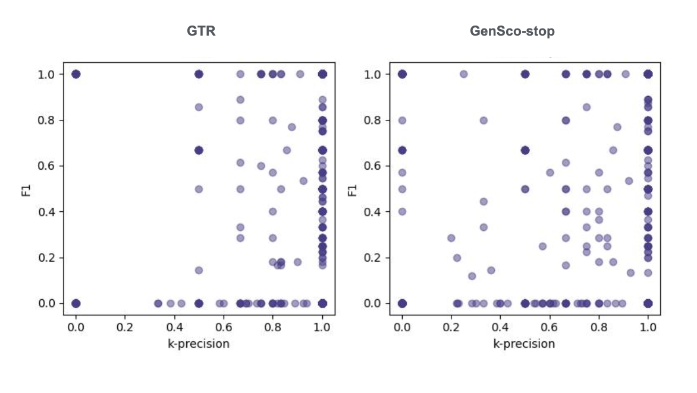

# GenSco：问题分解基础上的段落对齐，能否提升问答效果？

发布时间：2024年07月14日

`RAG` `问答系统` `人工智能`

> GenSco: Can Question Decomposition based Passage Alignment improve Question Answering?

# 摘要

> 在问答任务中，使用大型语言模型进行检索增强生成时，提供相关上下文至关重要。然而，生成过程中常出现不准确或幻觉，主要原因包括上下文不足或分散注意力，以及模型无法有效推理事实。本文探讨了通过精心选择的段落序列提供对齐上下文是否能提升多跳问答的答案生成质量。我们提出了一种新方法 "GenSco"，该方法基于对问题的预测分解来选择段落。框架包含两个LLM：生成器LLM用于问题分解和答案生成，辅助开源LLM作为评分器，指导段落选择。生成器仅调用一次，实现了高效且经济的答案生成。在三个多跳问答数据集上的评估显示，与最佳基线相比，我们在MuSiQue和2WikiMultiHop上分别取得了15.1和5.9点的精确匹配分数提升。

> Retrieval augmented generation (RAG) with large language models (LLMs) for Question Answering (QA) entails furnishing relevant context within the prompt to facilitate the LLM in answer generation. During the generation, inaccuracies or hallucinations frequently occur due to two primary factors: inadequate or distracting context in the prompts, and the inability of LLMs to effectively reason through the facts. In this paper, we investigate whether providing aligned context via a carefully selected passage sequence leads to better answer generation by the LLM for multi-hop QA. We introduce, "GenSco", a novel approach of selecting passages based on the predicted decomposition of the multi-hop questions}. The framework consists of two distinct LLMs: (i) Generator LLM, which is used for question decomposition and final answer generation; (ii) an auxiliary open-sourced LLM, used as the scorer, to semantically guide the Generator for passage selection. The generator is invoked only once for the answer generation, resulting in a cost-effective and efficient approach. We evaluate on three broadly established multi-hop question answering datasets: 2WikiMultiHop, Adversarial HotPotQA and MuSiQue and achieve an absolute gain of $15.1$ and $5.9$ points in Exact Match score with respect to the best performing baselines over MuSiQue and 2WikiMultiHop respectively.

[Arxiv](https://arxiv.org/abs/2407.10245)