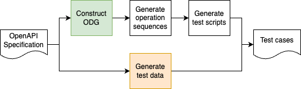
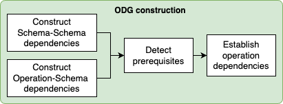
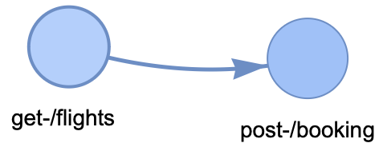
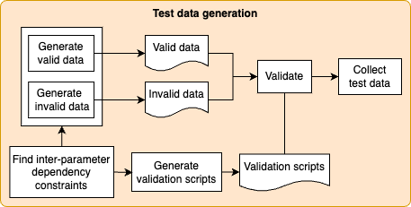

# KAT：结合大型语言模型，实现依赖性感知的自动化API测试

发布时间：2024年07月14日

`LLM应用` `软件开发` `测试工具`

> KAT: Dependency-aware Automated API Testing with Large Language Models

# 摘要

> 随着API测试需求的增长，软件公司寻求更高效的测试工具。传统的API测试工具虽能处理特定依赖，但受限于手动操作或启发式算法的局限性。本文介绍的KAT（Katalon API测试），采用AI驱动，结合GPT大型语言模型和先进提示技术，自动生成RESTful API的测试用例。我们的策略涵盖从OpenAPI规范构建依赖图到生成各类测试脚本和数据的全过程。实证研究显示，KAT在提升测试覆盖率、发现更多未记录状态码及减少误报方面表现优异，证明了大型语言模型在API测试中的应用价值。

> API testing has increasing demands for software companies. Prior API testing tools were aware of certain types of dependencies that needed to be concise between operations and parameters. However, their approaches, which are mostly done manually or using heuristic-based algorithms, have limitations due to the complexity of these dependencies. In this paper, we present KAT (Katalon API Testing), a novel AI-driven approach that leverages the large language model GPT in conjunction with advanced prompting techniques to autonomously generate test cases to validate RESTful APIs. Our comprehensive strategy encompasses various processes to construct an operation dependency graph from an OpenAPI specification and to generate test scripts, constraint validation scripts, test cases, and test data. Our evaluation of KAT using 12 real-world RESTful services shows that it can improve test coverage, detect more undocumented status codes, and reduce false positives in these services in comparison with a state-of-the-art automated test generation tool. These results indicate the effectiveness of using the large language model for generating test scripts and data for API testing.

[Arxiv](https://arxiv.org/abs/2407.10227)