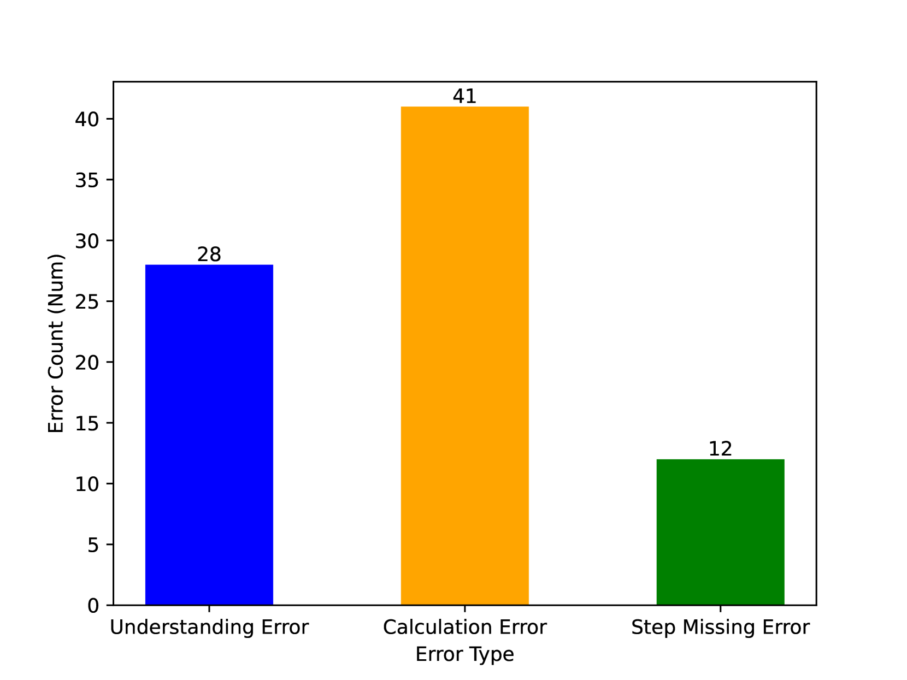
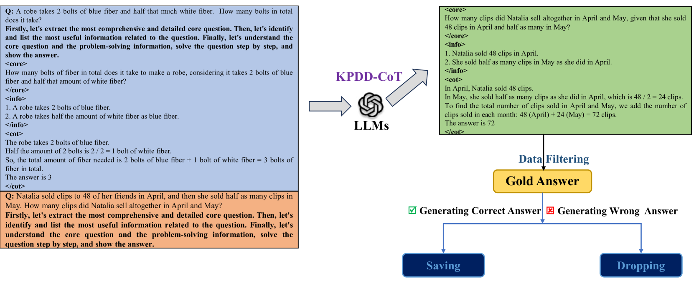
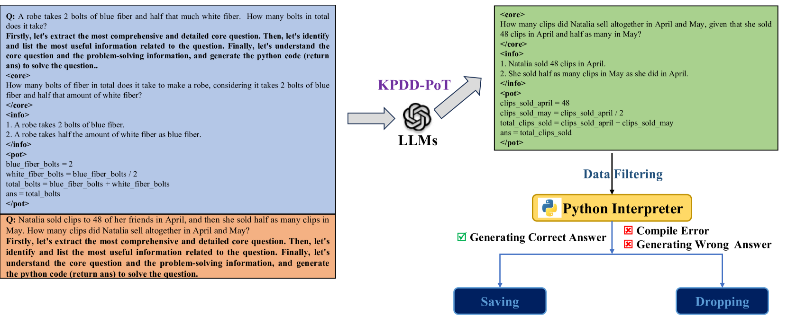
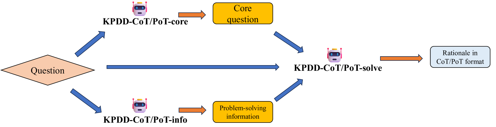
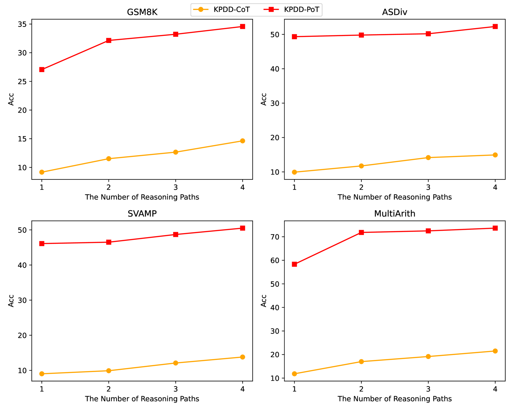
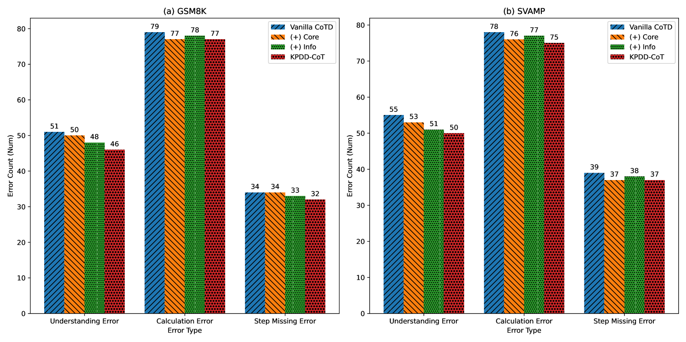

# 大型语言模型的关键点驱动数学推理蒸馏

发布时间：2024年07月14日

`LLM应用` `人工智能`

> Key-Point-Driven Mathematical Reasoning Distillation of Large Language Model

# 摘要

> 大型语言模型 (LLM) 因其庞大的参数和广泛的数据训练，在数学推理任务中表现卓越。然而，高计算需求限制了其部署。为此，我们将 LLM 的数学推理提炼至小型语言模型 (SLM)，虽解决了部分问题，但 SLM 在计算和语义理解上仍有不足。为此，我们提出关键点驱动的数学推理提炼 (KPDD)，通过分解问题解决过程为三个阶段，显著提升 SLM 的推理性能。实验表明，KPDD-CoT 大幅提升推理能力，而 KPDD-PoT 则在数学推理任务中达到顶尖水平。这一方法有效减少了误解错误，推动了高效且强大的 SLM 的实际应用。

> Large Language Models (LLMs) have demonstrated exceptional proficiency in mathematical reasoning tasks due to their extensive parameter counts and training on vast datasets. Despite these capabilities, deploying LLMs is hindered by their computational demands. Distilling LLM mathematical reasoning into Smaller Language Models (SLMs) has emerged as a solution to this challenge, although these smaller models often suffer from errors in calculation and semantic understanding. Prior work has proposed Program-of-Thought Distillation (PoTD) to avoid calculation error. To further address semantic understanding errors, we propose Key-Point-Driven Mathematical Reasoning Distillation (KPDD). KPDD enhances the reasoning performance of SLMs by breaking down the problem-solving process into three stages: Core Question Extraction, Problem-Solving Information Extraction, and Step-by-Step Solution. This method is further divided into KPDD-CoT, which generates Chain-of-Thought rationales, and KPDD-PoT, which creates Program-of-Thought rationales. The experiment results show that KPDD-CoT significantly improves reasoning abilities, while KPDD-PoT achieves state-of-the-art performance in mathematical reasoning tasks. Our approach effectively mitigates misunderstanding errors, advancing the deployment of efficient and capable SLMs.

[Arxiv](https://arxiv.org/abs/2407.10167)