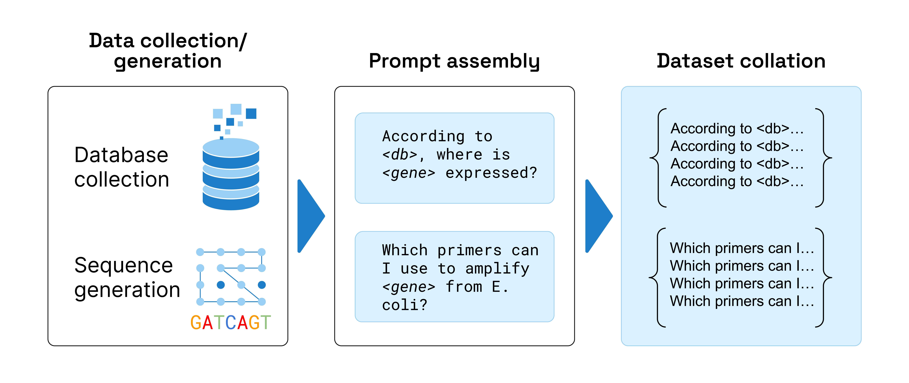
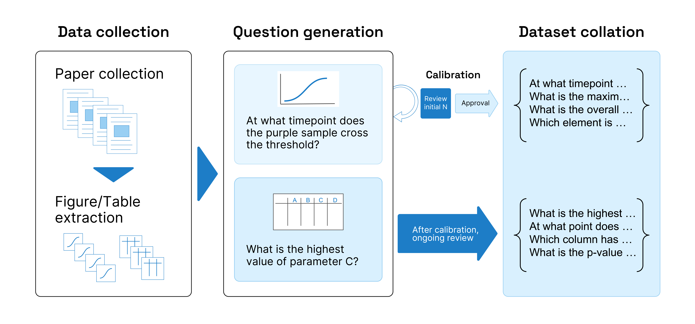
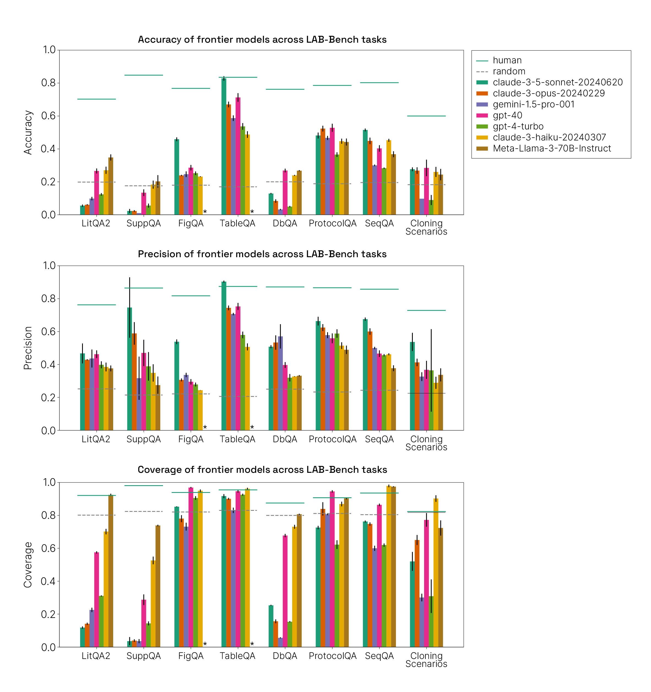
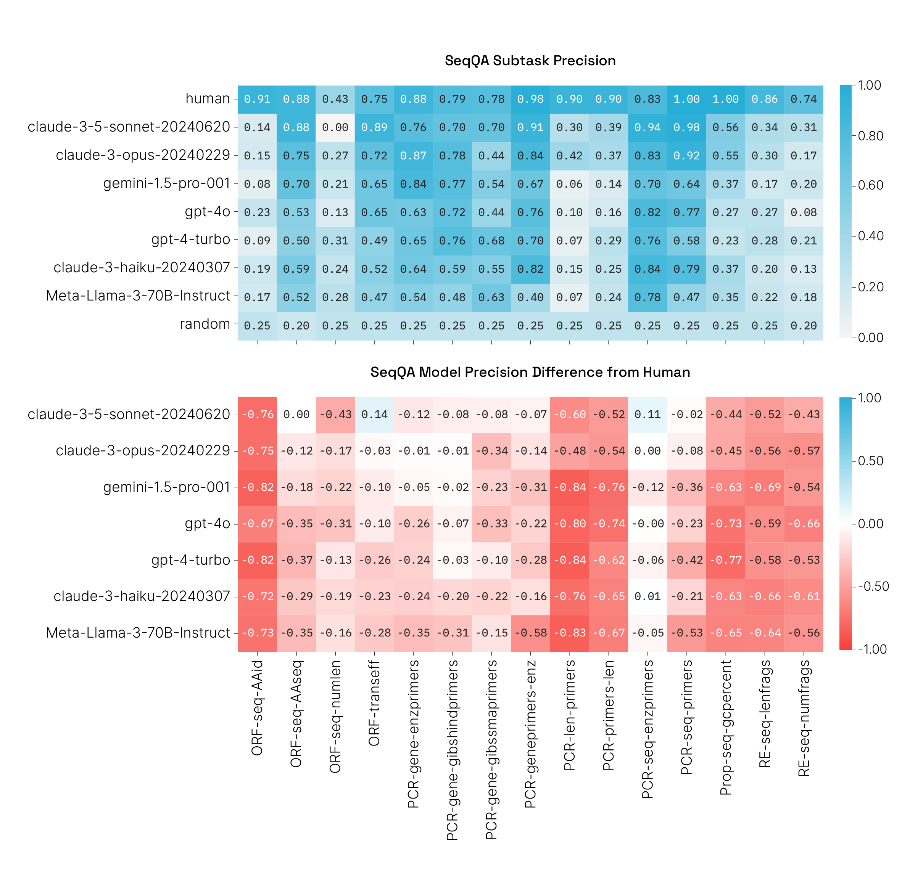
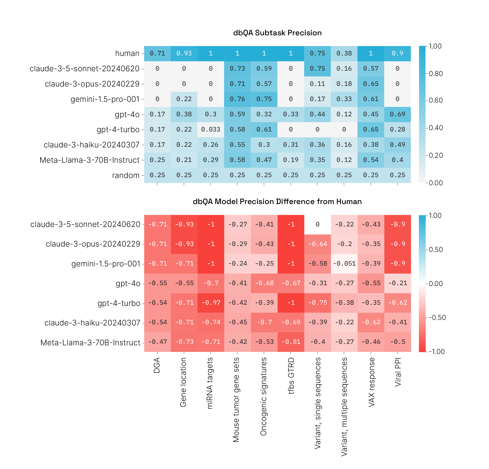
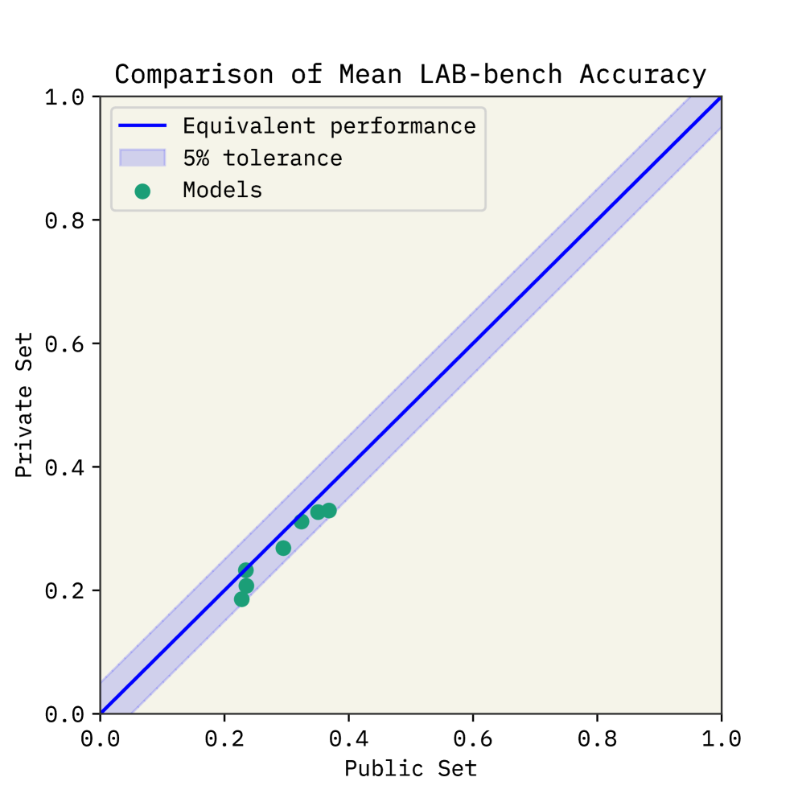
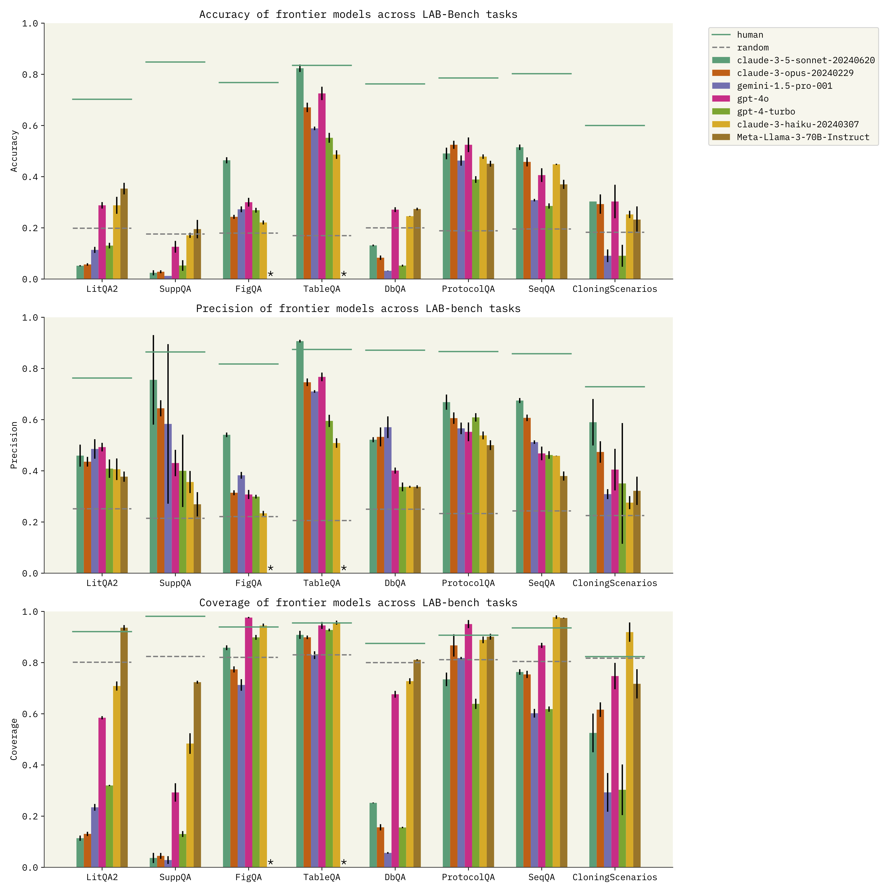

# LAB-Bench：评估语言模型在生物学研究领域的实力

发布时间：2024年07月14日

`Agent` `生物学`

> LAB-Bench: Measuring Capabilities of Language Models for Biology Research

# 摘要

> 前沿大型语言模型（LLMs）及其增强系统被普遍认为能迅速推动跨学科科学发现。尽管现有众多基准测试LLM在教科书式科学问题上的表现，但针对科学研究实际需求，如文献检索、实验设计及数据分析等任务的评估工具却寥寥无几。为此，我们推出了语言代理生物学基准（LAB-Bench），一个涵盖2,400多道选择题的全面数据集，旨在检验AI在生物学研究中的实际应用能力，包括文献理解、图表解析、数据库操作及DNA与蛋白质序列处理等。与传统科学基准不同，我们期待能在LAB-Bench高难度任务中表现卓越的AI，成为科研人员在文献检索和分子克隆等领域的得力助手。我们已对数个前沿语言模型进行了初步评估，并将其表现与生物学专家进行对比。LAB-Bench将持续更新扩充，有望成为推动自动化科研系统发展的关键工具。LAB-Bench的公共子集已开放使用，详情请访问：https://huggingface.co/datasets/futurehouse/lab-bench。

> There is widespread optimism that frontier Large Language Models (LLMs) and LLM-augmented systems have the potential to rapidly accelerate scientific discovery across disciplines. Today, many benchmarks exist to measure LLM knowledge and reasoning on textbook-style science questions, but few if any benchmarks are designed to evaluate language model performance on practical tasks required for scientific research, such as literature search, protocol planning, and data analysis. As a step toward building such benchmarks, we introduce the Language Agent Biology Benchmark (LAB-Bench), a broad dataset of over 2,400 multiple choice questions for evaluating AI systems on a range of practical biology research capabilities, including recall and reasoning over literature, interpretation of figures, access and navigation of databases, and comprehension and manipulation of DNA and protein sequences. Importantly, in contrast to previous scientific benchmarks, we expect that an AI system that can achieve consistently high scores on the more difficult LAB-Bench tasks would serve as a useful assistant for researchers in areas such as literature search and molecular cloning. As an initial assessment of the emergent scientific task capabilities of frontier language models, we measure performance of several against our benchmark and report results compared to human expert biology researchers. We will continue to update and expand LAB-Bench over time, and expect it to serve as a useful tool in the development of automated research systems going forward. A public subset of LAB-Bench is available for use at the following URL: https://huggingface.co/datasets/futurehouse/lab-bench

[Arxiv](https://arxiv.org/abs/2407.10362)