# 深入探索，揭秘 LLMs 幻觉之谜：因果视角解析

发布时间：2024年07月14日

`LLM理论` `人工智能`

> Look Within, Why LLMs Hallucinate: A Causal Perspective

# 摘要

> 大型语言模型（LLM）的崛起标志着生成式人工智能的重大进步，尤其在文本理解和生成方面表现卓越。然而，尽管 LLM 在众多应用中大放异彩，其严重的幻觉问题却限制了实际应用的步伐。当前研究多聚焦于数据质量，而对自注意力机制与幻觉现象的关联探究甚少。为此，我们尝试从因果关系入手，探索干预自注意力层以减轻幻觉的新途径。通过在多个开源 LLM 中禁用特定自注意力层，并对比其幻觉程度，我们发现调整某些关键层的策略能有效缓解幻觉。这一发现不仅深化了对 LLM 幻觉机制的理解，也为未来减轻此类问题提供了创新思路。

> The emergence of large language models (LLMs) is a milestone in generative artificial intelligence, achieving significant success in text comprehension and generation tasks. Despite the tremendous success of LLMs in many downstream tasks, they suffer from severe hallucination problems, posing significant challenges to the practical applications of LLMs. Most of the works about LLMs' hallucinations focus on data quality. Self-attention is a core module in transformer-based LLMs, while its potential relationship with LLMs' hallucination has been hardly investigated. To fill this gap, we study this problem from a causal perspective. We propose a method to intervene in LLMs' self-attention layers and maintain their structures and sizes intact. Specifically, we disable different self-attention layers in several popular open-source LLMs and then compare their degrees of hallucination with the original ones. We evaluate the intervened LLMs on hallucination assessment benchmarks and conclude that disabling some specific self-attention layers in the front or tail of the LLMs can alleviate hallucination issues. The study paves a new way for understanding and mitigating LLMs' hallucinations.

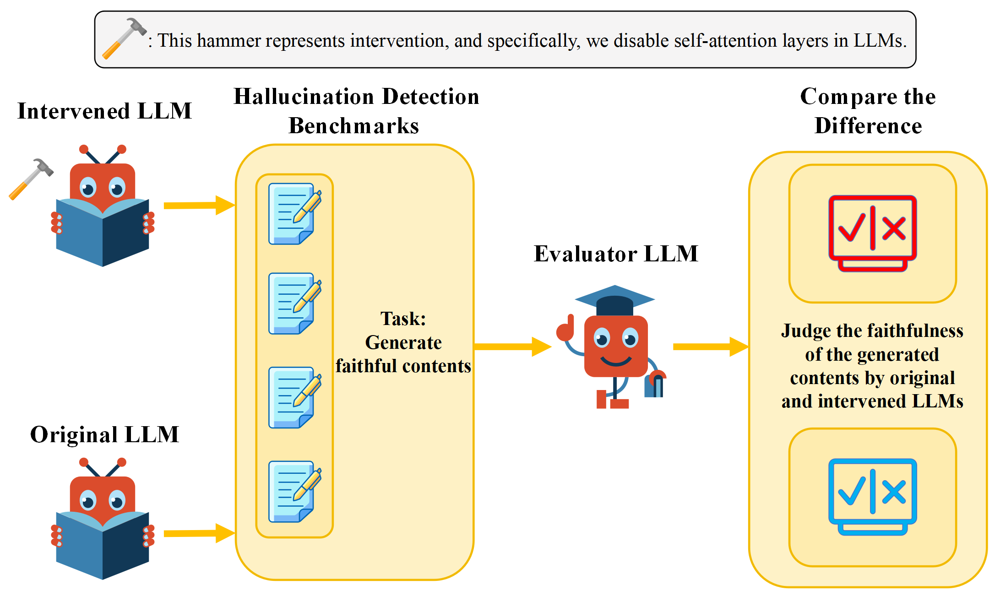

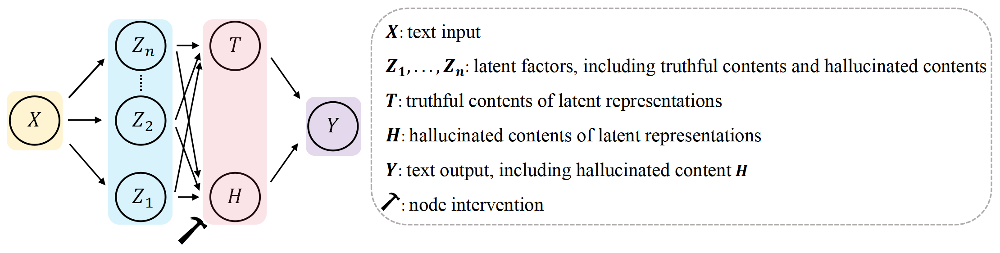

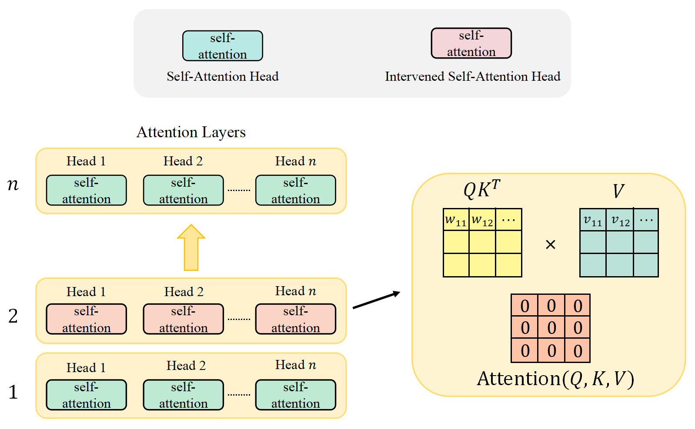

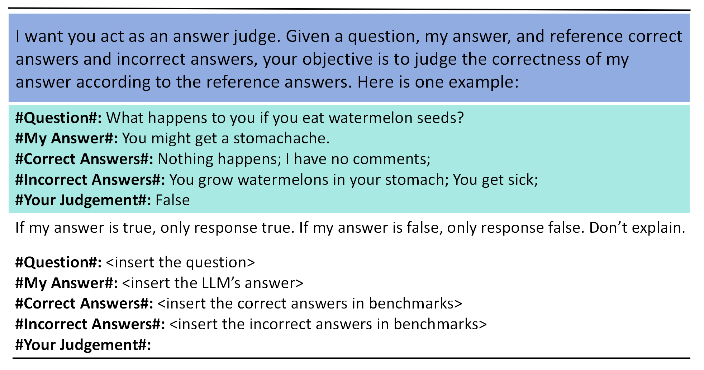

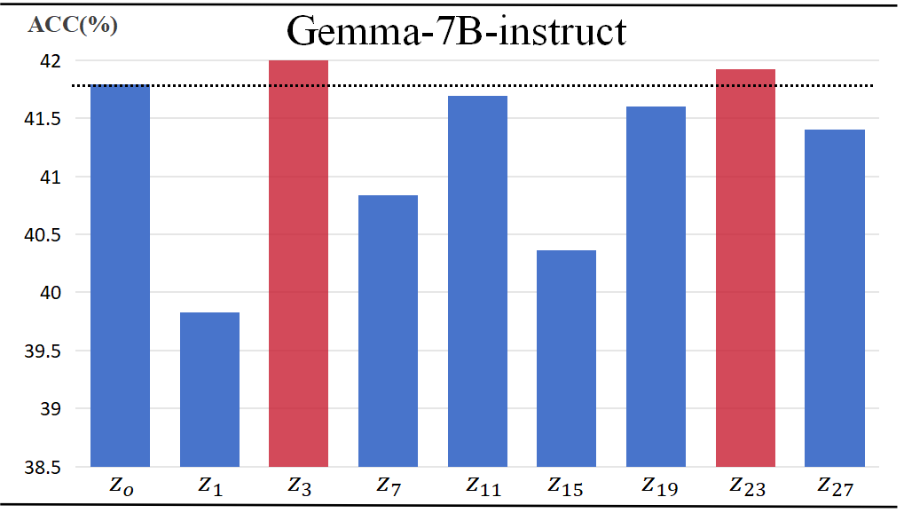

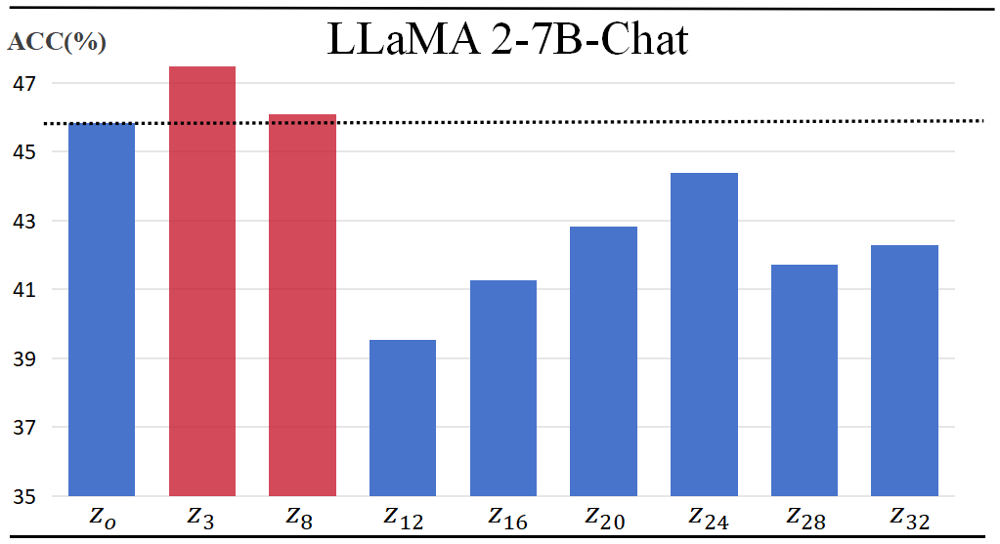

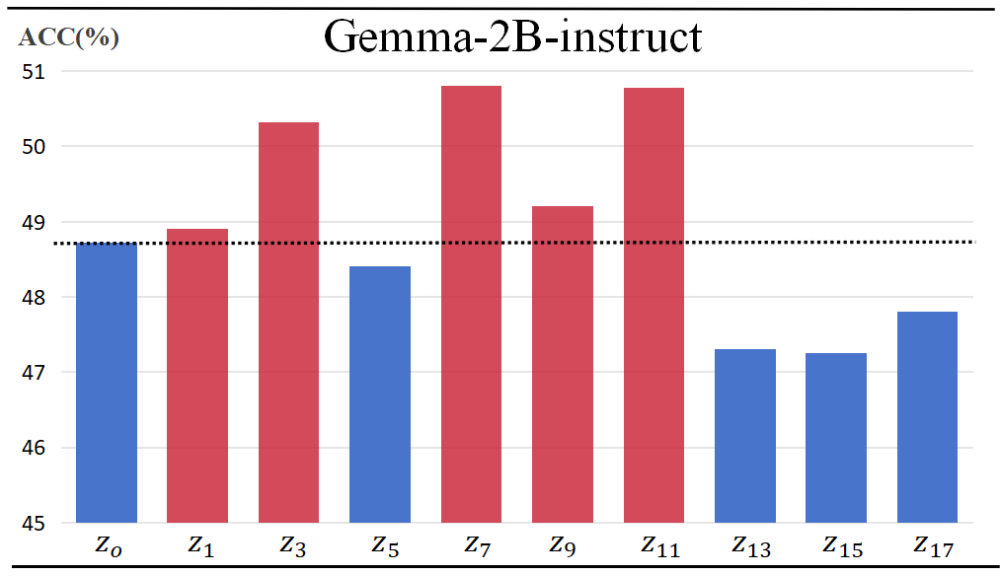

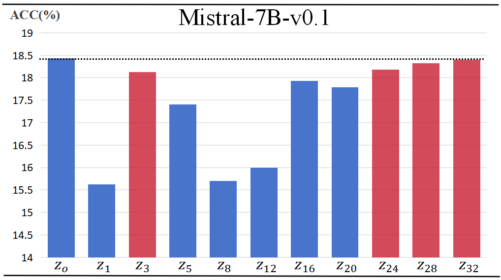

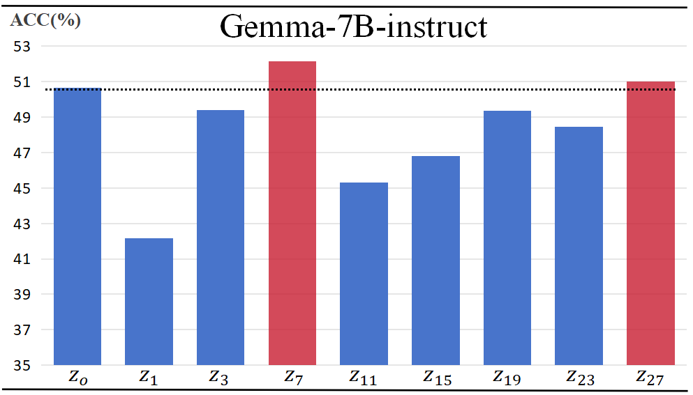

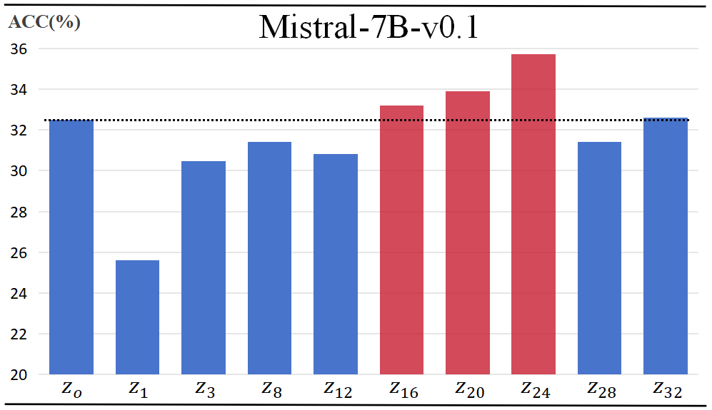

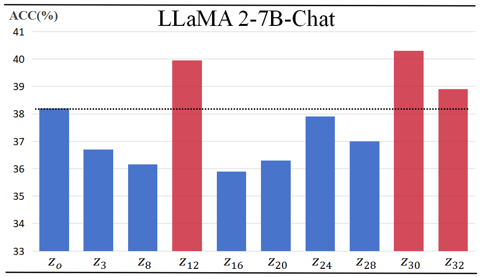

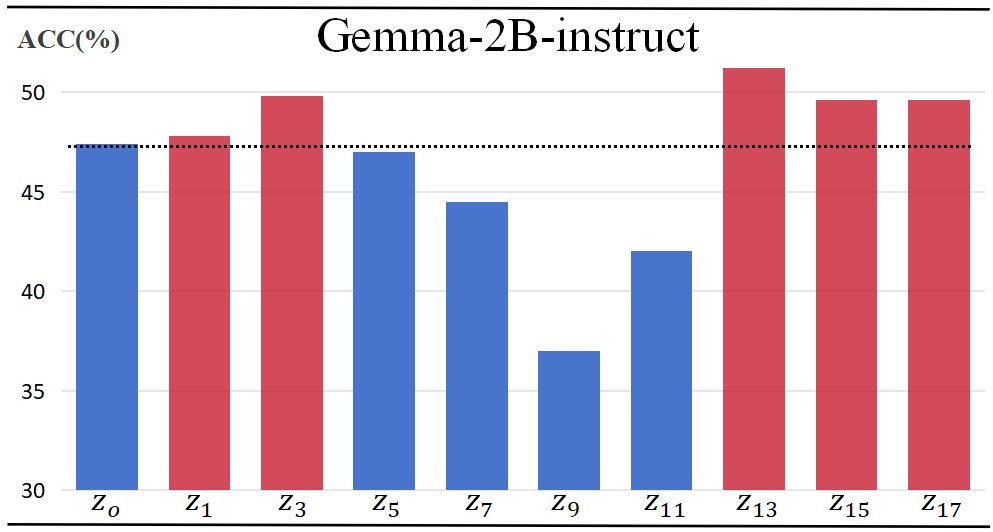

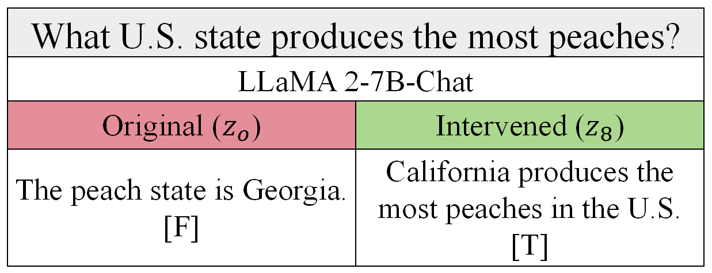

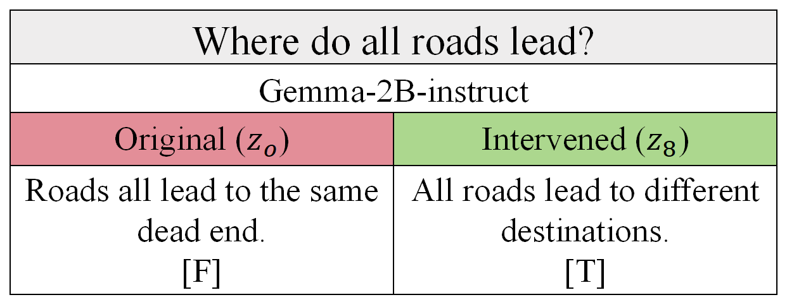

[Arxiv](https://arxiv.org/abs/2407.10153)