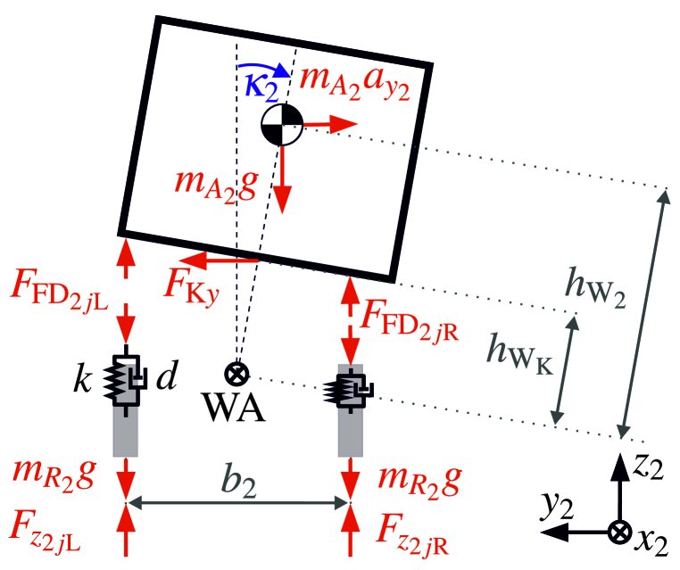

# 半挂车的非线性双轨模型，经实验证实其横向与垂直轮胎力的有效性

发布时间：2024年07月14日

`Agent`

> Nonlinear Two-Track Model of a Semitrailer with Experimental Validation of Lateral and Vertical Tire Forces

# 摘要

> 随着商用车自动化的发展，辅助系统日益增多。半挂车因其载荷多变且在总质量中占比大，在满载时对行驶动力学影响显著。本文提出一种双轨模型，涵盖半挂车的横向与翻滚动力学，为未来开发难以测量的车辆状态与参数估计技术奠定基础。我们采用粒子群优化算法进行模型参数的离线识别，并通过测试车辆的实测数据验证模型，重点关注半挂车的轮胎横向与垂直力。

> As part of the automation of commercial vehicles, the number of assistance systems in this field is continuously increasing. The semitrailer plays an important role for the vehicles driving dynamics due to its highly varying loads and the large proportion to the total mass of the truck-semitrailer, especially when it is fully loaded. To create a basis for further development of assistance systems for the semitrailer, this paper presents a two-track model which includes the lateral and roll dynamics of the semitrailer. This enables the future development of observer and filter-based estimation of vehicle states and parameters, which are impossible or very difficult to measure. For offline identification of the unknown model parameters, a Particle-Swarm-Optimization (PSO) algorithm will be used. The validation of the model is based on measurements from a test vehicle. The focus is on the lateral and vertical tire forces of the semitrailer, which are measured at the test vehicle using strain gauges.

[Arxiv](https://arxiv.org/abs/2407.10270)