# 大规模语言模型的实用遗忘技术

发布时间：2024年07月14日

`LLM应用` `人工智能` `网络安全`

> Practical Unlearning for Large Language Models

# 摘要

> 尽管大型语言模型（LLMs）在多领域表现卓越，但其安全问题日益严峻。机器遗忘（MU）应运而生，旨在剔除不良数据影响，同时保持模型效用。然而，现有方法常低估能力间的复杂关联，忽视数据访问的实际限制，且未充分应对现实中不断出现的遗忘需求。为此，我们提出O3框架，包含分布外检测器和正交低秩适配器（LoRA），前者用创新对比熵损失训练，后者确保遗忘请求间的参数独立。实验证明，O3在遗忘与效用间找到理想平衡，尤其在持续遗忘场景中表现突出，且不依赖任何保留数据。

> While LLMs have demonstrated impressive performance across various domains and tasks, their security issues have become increasingly severe. Machine unlearning (MU) has emerged as a promising solution to address these issues by removing the influence of undesired data on the target model without compromising its utility in other aspects. MU typically assumes full access to the original training data to preserve utility, which is difficult to achieve in LLM unlearning. Existing LLM unlearning methods often assume access to data most affected by undesired data unlearning. However, this assumption underestimates the entanglement among various LLM capabilities and ignores data access limitations due to various issues. Moreover, these LLM unlearning methods do not sufficiently consider that unlearning requests in real-world scenarios are continuously emerging. To overcome these challenges and achieve practical LLM unlearning, we propose the O3 framework. The O3 framework includes an Out-Of-Distribution (OOD) detector to measure the similarity between input and unlearning data, and an Orthogonal low-rank adapter (LoRA) for continuously unlearning requested data. The OOD detector is trained with a novel contrastive entropy loss and utilizes a local-global layer-aggregated scoring mechanism. The orthogonal LoRA achieves parameter disentanglement among continual unlearning requests. During inference, our O3 framework can smartly decide whether and to what extent to load the unlearning LoRA based on the OOD detector's predictions. Notably, O3's effectiveness does not rely on any retained data. We conducted extensive experiments on O3 and state-of-the-art LLM unlearning methods across three tasks and seven datasets. The results indicate that O3 consistently achieves the best trade-off between unlearning effectiveness and utility preservation, especially when facing continuous unlearning requests.

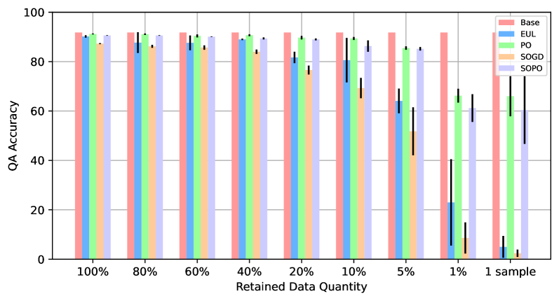

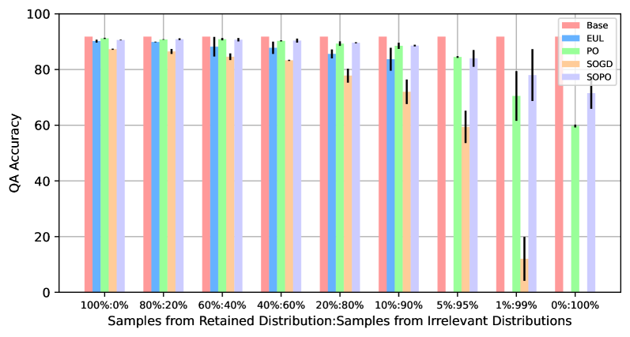

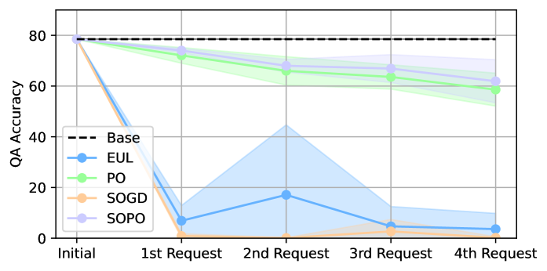

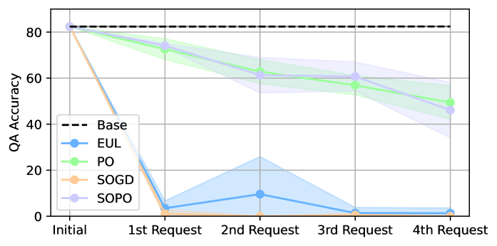

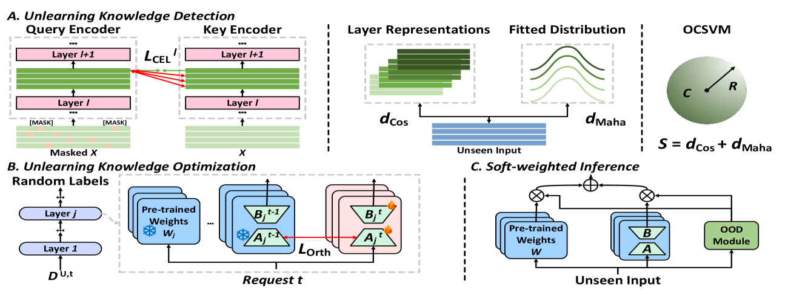

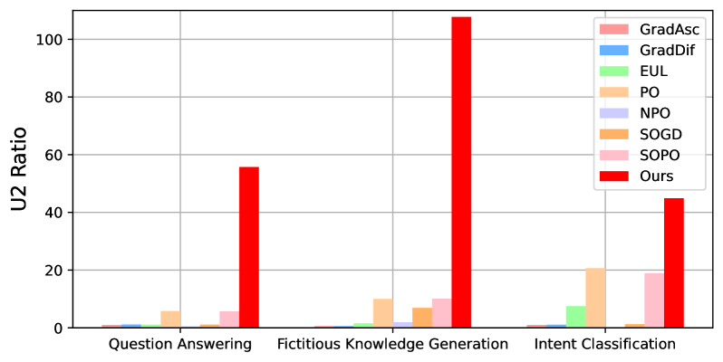

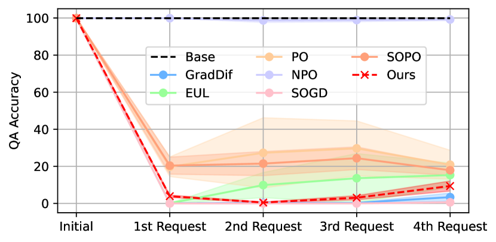

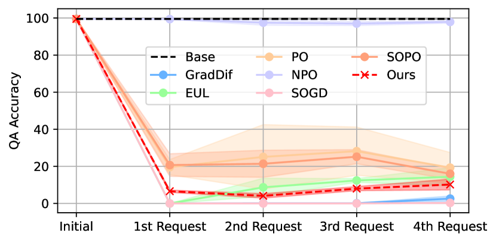

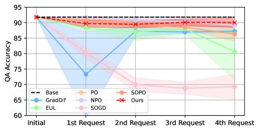

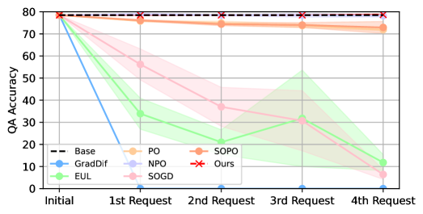

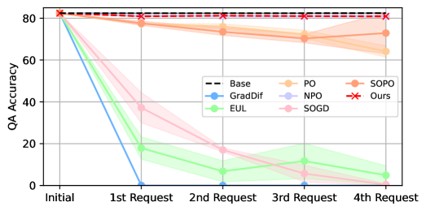

[Arxiv](https://arxiv.org/abs/2407.10223)