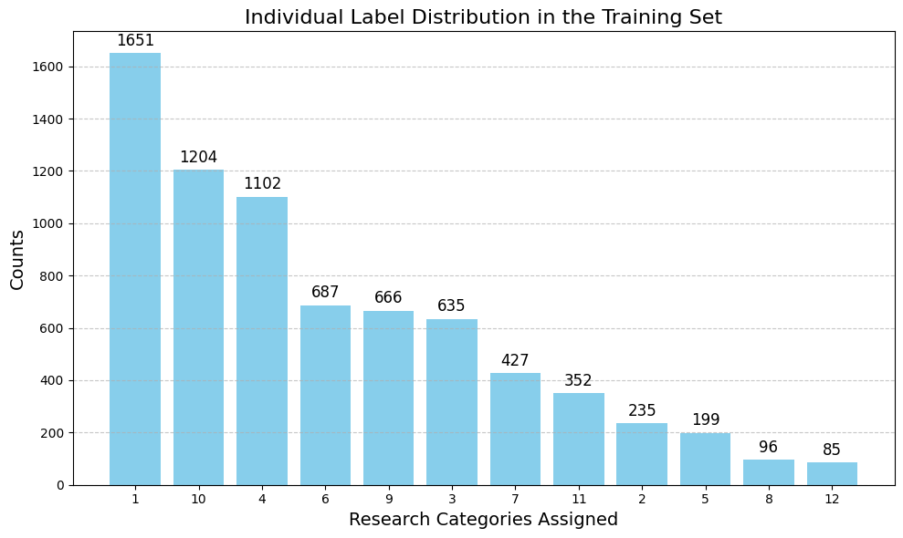
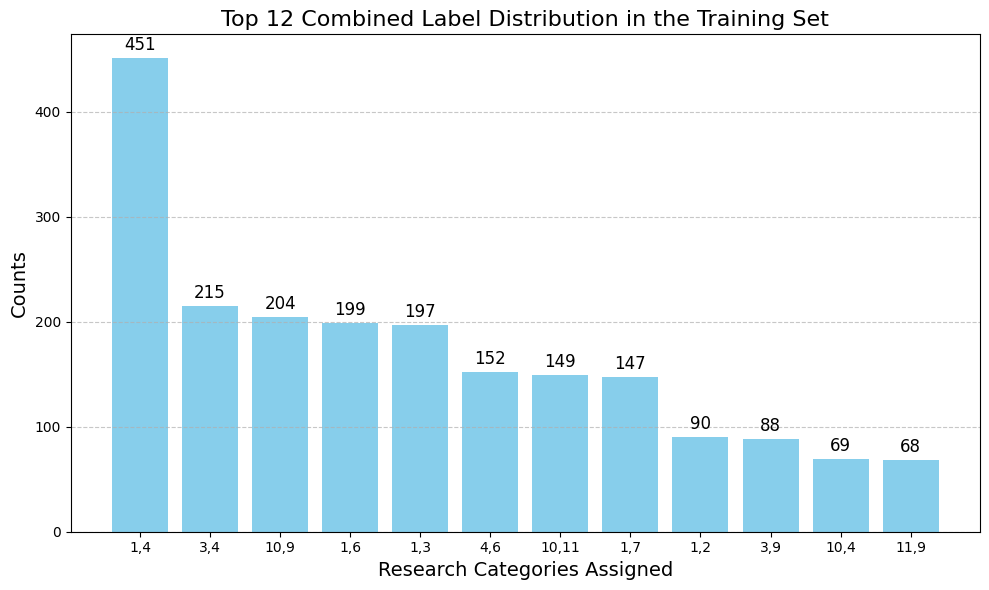
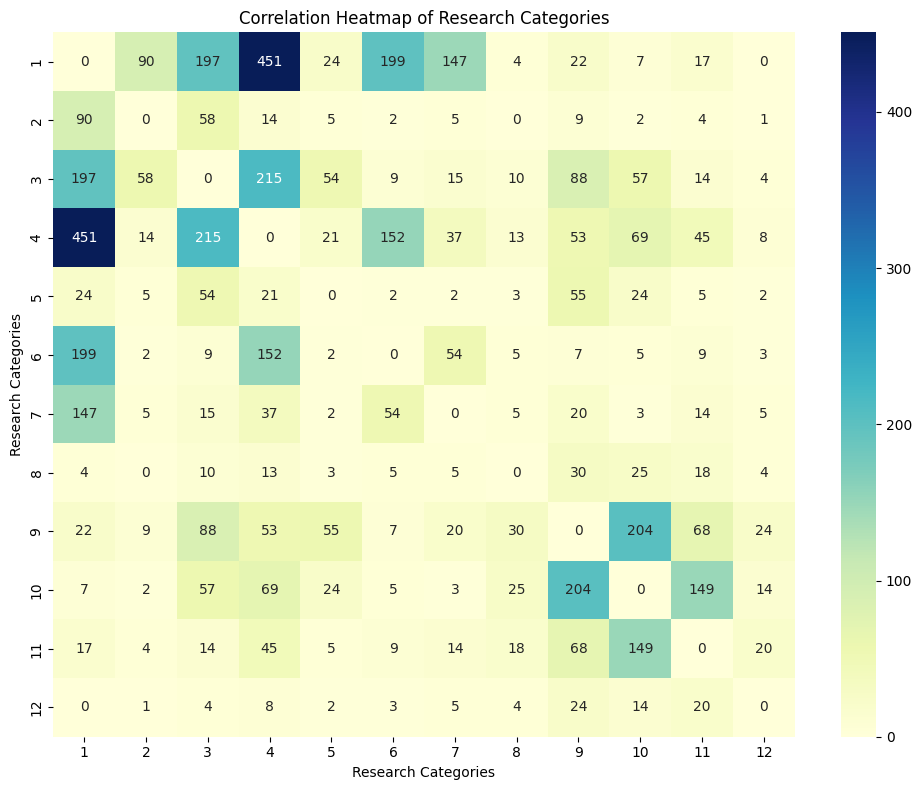
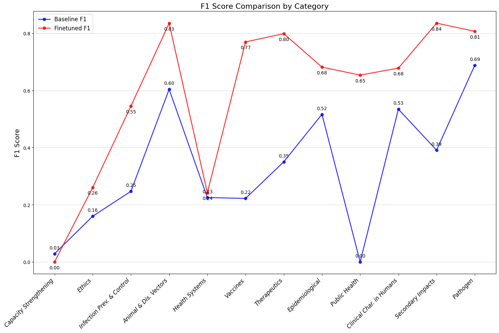
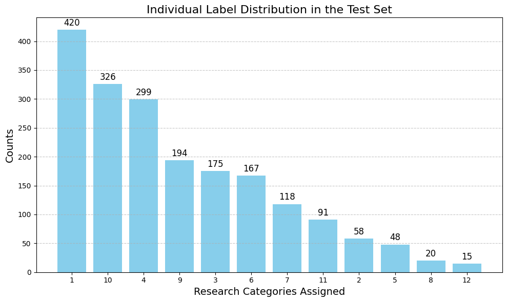

# 快速生物医学研究分类：大流行病 PACT 高级分类引擎

发布时间：2024年07月14日

`LLM应用` `生物医学` `公共卫生`

> Rapid Biomedical Research Classification: The Pandemic PACT Advanced Categorisation Engine

# 摘要

> 本文推出大流行病PACT高级分类引擎（PPACE）及其关联数据集，该引擎专为自动分类生物医学项目摘要而设计，确保与WHO研究优先级一致。此功能对监测研究动向、填补全球卫生应对空白至关重要。我们基于人工标注项目，利用大型语言模型生成标注理由，进而用这些增强数据微调更高效的小型模型。PPACE作为大流行病PACT项目一环，助力科研资助者、政策制定者及独立研究者做出明智决策。我们不仅介绍PPACE，还公开其训练模型及数据集。评估表明，PPACE性能远超基准。PPACE及其数据集的发布，为多标签生物医学文档分类研究提供宝贵资源，推动生物医学研究与全球卫生关键优先级的协同发展。

> This paper introduces the Pandemic PACT Advanced Categorisation Engine (PPACE) along with its associated dataset. PPACE is a fine-tuned model developed to automatically classify research abstracts from funded biomedical projects according to WHO-aligned research priorities. This task is crucial for monitoring research trends and identifying gaps in global health preparedness and response. Our approach builds on human-annotated projects, which are allocated one or more categories from a predefined list. A large language model is then used to generate `rationales' explaining the reasoning behind these annotations. This augmented data, comprising expert annotations and rationales, is subsequently used to fine-tune a smaller, more efficient model. Developed as part of the Pandemic PACT project, which aims to track and analyse research funding and clinical evidence for a wide range of diseases with outbreak potential, PPACE supports informed decision-making by research funders, policymakers, and independent researchers. We introduce and release both the trained model and the instruction-based dataset used for its training. Our evaluation shows that PPACE significantly outperforms its baselines. The release of PPACE and its associated dataset offers valuable resources for researchers in multilabel biomedical document classification and supports advancements in aligning biomedical research with key global health priorities.

[Arxiv](https://arxiv.org/abs/2407.10086)