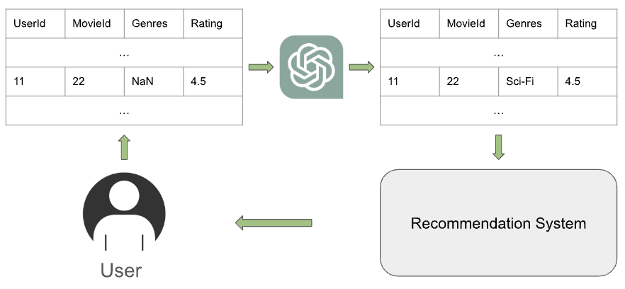

# 借助大型语言模型，我们致力于通过语义理解和数据插补来提升推荐系统的速度。

发布时间：2024年07月14日

`LLM应用` `推荐系统` `用户体验`

> Semantic Understanding and Data Imputation using Large Language Model to Accelerate Recommendation System

# 摘要

> 本文针对推荐系统中稀疏和缺失数据的难题，提出了一种创新方法：微调大型语言模型（LLM）以智能填补数据空缺。LLM的广泛文本训练使其能深入理解数据关系，从而生成更精准、个性化的推荐，优化用户体验。我们在多种推荐任务中验证了LLM插补法的优越性，证实了其在提升推荐系统性能方面的潜力。

> This paper aims to address the challenge of sparse and missing data in recommendation systems, a significant hurdle in the age of big data. Traditional imputation methods struggle to capture complex relationships within the data. We propose a novel approach that fine-tune Large Language Model (LLM) and use it impute missing data for recommendation systems. LLM which is trained on vast amounts of text, is able to understand complex relationship among data and intelligently fill in missing information. This enriched data is then used by the recommendation system to generate more accurate and personalized suggestions, ultimately enhancing the user experience. We evaluate our LLM-based imputation method across various tasks within the recommendation system domain, including single classification, multi-classification, and regression compared to traditional data imputation methods. By demonstrating the superiority of LLM imputation over traditional methods, we establish its potential for improving recommendation system performance.

[Arxiv](https://arxiv.org/abs/2407.10078)