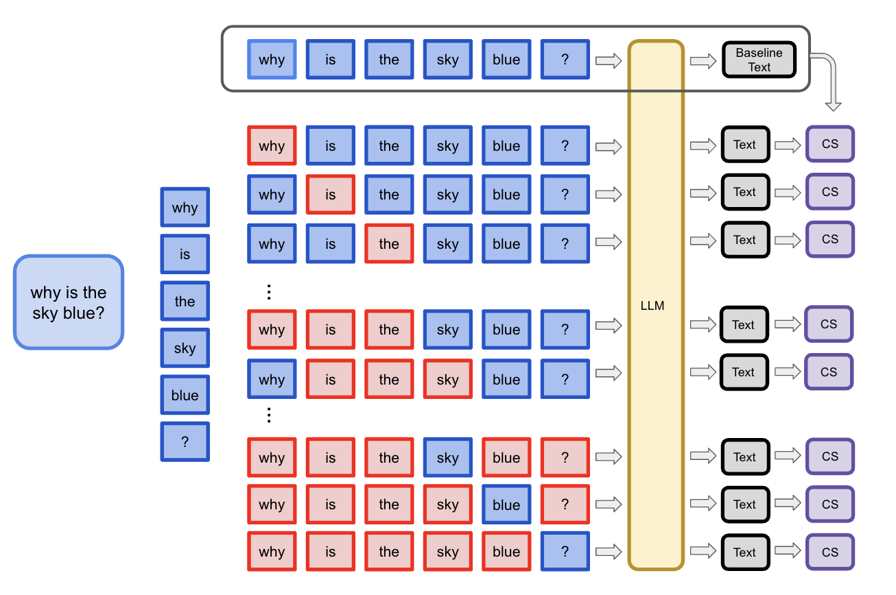
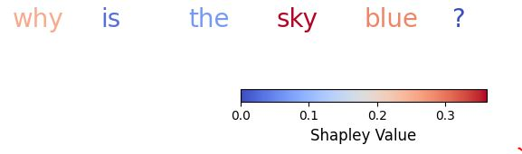
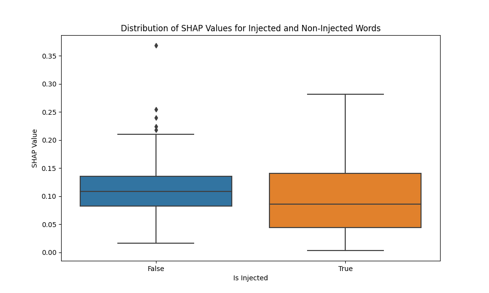
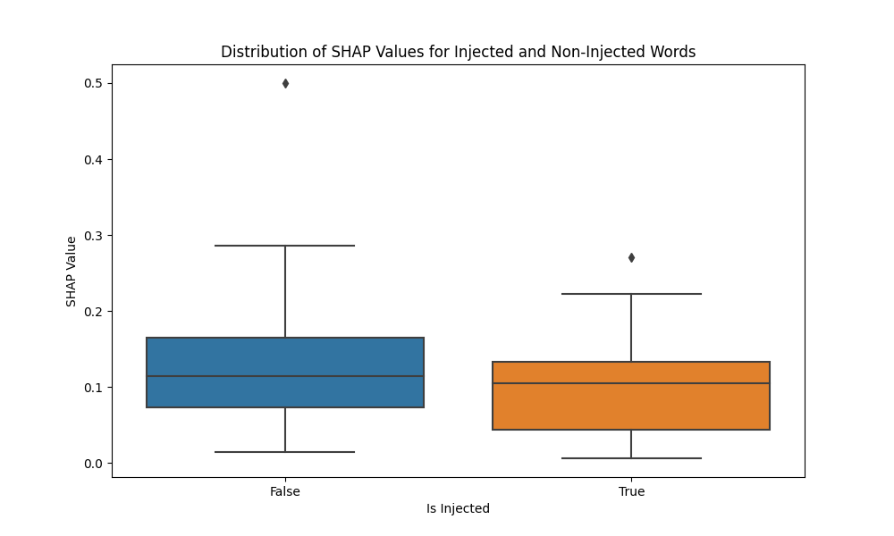
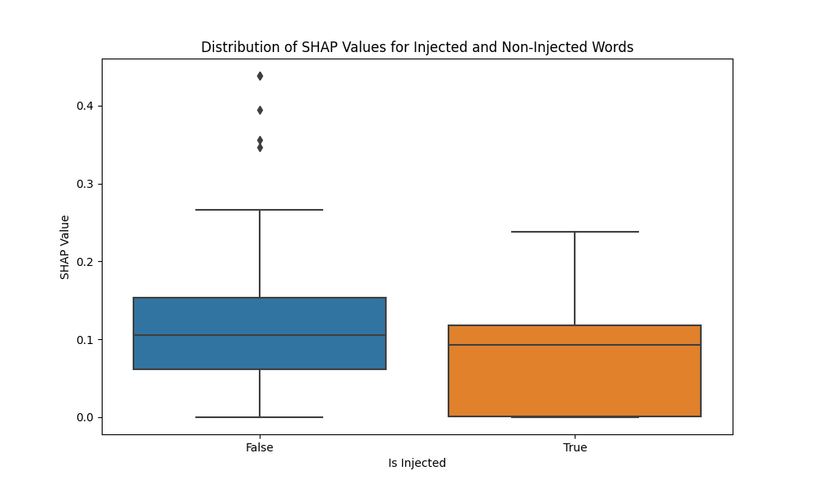
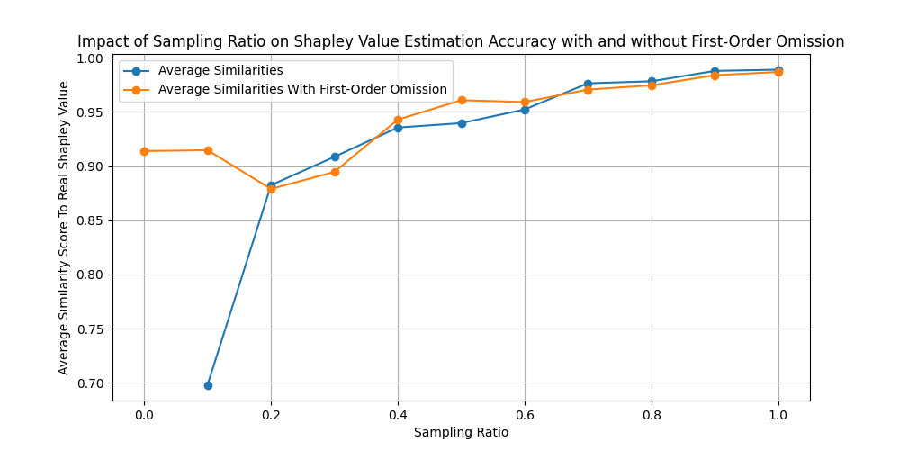

# TokenSHAP：通过蒙特卡洛 Shapley 值估计来解读大型语言模型

发布时间：2024年07月14日

`LLM理论` `人工智能`

> TokenSHAP: Interpreting Large Language Models with Monte Carlo Shapley Value Estimation

# 摘要

> 随着 LLM 在关键领域的普及，可解释 AI 的需求日益增长。我们提出的 TokenSHAP 方法，通过评估输入提示中各标记或子串的重要性，为解释 LLM 提供了新视角。该方法借鉴合作博弈理论中的 Shapley 值，为 NLP 领域带来了严谨的分析框架，揭示了输入各部分对模型输出的贡献。借助高效的蒙特卡洛采样，TokenSHAP 提供了量化且易于理解的标记重要性评估。在多种提示和模型架构中，TokenSHAP 均展现出优于传统方法的性能，更符合人类判断，忠实于模型行为，且保持一致性。TokenSHAP 深入解析标记间的交互，为 LLM 的运作机制提供了深刻洞察，不仅提升了模型的透明度，优化了提示设计，还助力构建更为可靠的 AI 系统。这一创新方法，是推动 AI 向更透明、可问责、可信赖方向发展的重要一步。

> As large language models (LLMs) become increasingly prevalent in critical applications, the need for interpretable AI has grown. We introduce TokenSHAP, a novel method for interpreting LLMs by attributing importance to individual tokens or substrings within input prompts. This approach adapts Shapley values from cooperative game theory to natural language processing, offering a rigorous framework for understanding how different parts of an input contribute to a model's response. TokenSHAP leverages Monte Carlo sampling for computational efficiency, providing interpretable, quantitative measures of token importance. We demonstrate its efficacy across diverse prompts and LLM architectures, showing consistent improvements over existing baselines in alignment with human judgments, faithfulness to model behavior, and consistency.
  Our method's ability to capture nuanced interactions between tokens provides valuable insights into LLM behavior, enhancing model transparency, improving prompt engineering, and aiding in the development of more reliable AI systems. TokenSHAP represents a significant step towards the necessary interpretability for responsible AI deployment, contributing to the broader goal of creating more transparent, accountable, and trustworthy AI systems.

[Arxiv](https://arxiv.org/abs/2407.10114)