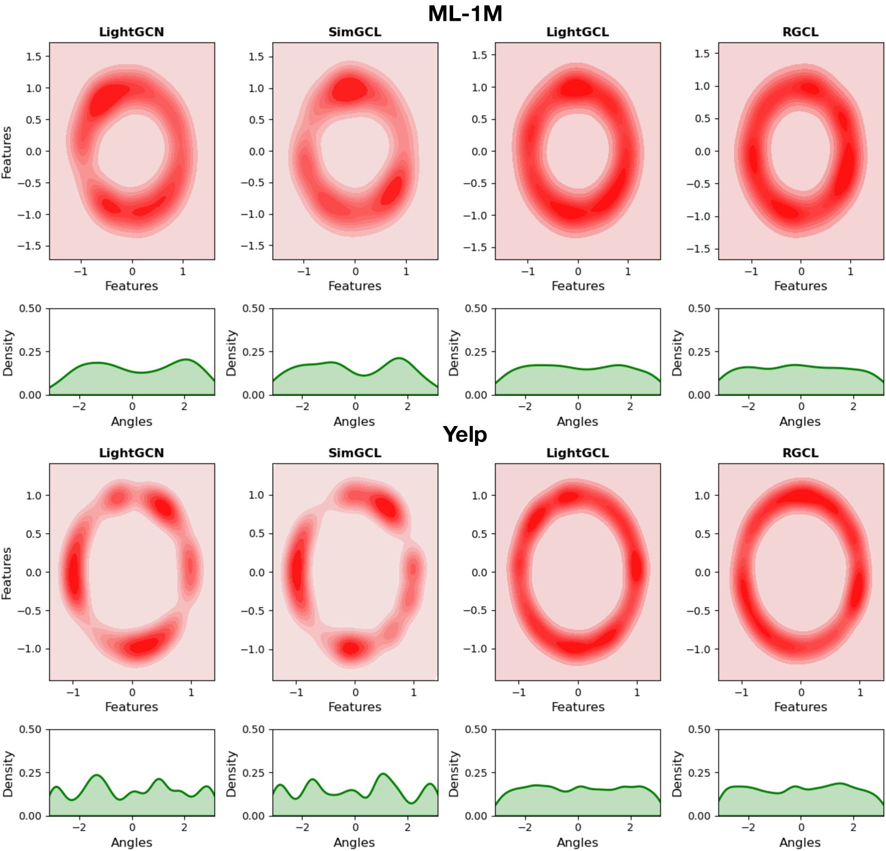

# 本研究旨在通过决策边界感知图对比学习，提升推荐的鲁棒性。

发布时间：2024年07月14日

`Agent` `推荐系统` `人工智能`

> Towards Robust Recommendation via Decision Boundary-aware Graph Contrastive Learning

# 摘要

> 近年来，图对比学习 (GCL) 在推荐系统中因其有效减少数据稀疏性引起的偏差而受到越来越多的关注。然而，大多数现有的 GCL 模型依赖于启发式方法，并且在构建对比视图时通常假设实体独立性。我们认为这些方法在动态训练过程中难以在语义不变性和视图难度之间取得平衡，这两者都是图对比学习中的关键因素。  为了解决上述问题，我们提出了一种新的基于 GCL 的推荐框架 RGCL，该框架有效地保持了对比对的语义不变性，并随着训练过程中模型能力的演变动态适应。具体来说，RGCL 首先引入决策边界感知的对抗性扰动来约束对比增强视图的探索空间，避免任务特定信息的减少。此外，为了纳入全局用户-用户和项目-项目协作关系以指导硬对比视图的生成，我们提出了一种对抗性对比学习目标来构建关系感知的视图生成器。此外，考虑到无监督 GCL 可能会缩小数据点与决策边界之间的差距，导致模型鲁棒性降低，我们引入了基于最大扰动的对抗性示例来实现边际最大化。我们还对我们的设计效果进行了理论分析。通过在五个公共数据集上进行广泛的实验，我们证明了 RGCL 相对于十二个基线模型的优越性。

> In recent years, graph contrastive learning (GCL) has received increasing attention in recommender systems due to its effectiveness in reducing bias caused by data sparsity. However, most existing GCL models rely on heuristic approaches and usually assume entity independence when constructing contrastive views. We argue that these methods struggle to strike a balance between semantic invariance and view hardness across the dynamic training process, both of which are critical factors in graph contrastive learning.
  To address the above issues, we propose a novel GCL-based recommendation framework RGCL, which effectively maintains the semantic invariance of contrastive pairs and dynamically adapts as the model capability evolves through the training process. Specifically, RGCL first introduces decision boundary-aware adversarial perturbations to constrain the exploration space of contrastive augmented views, avoiding the decrease of task-specific information. Furthermore, to incorporate global user-user and item-item collaboration relationships for guiding on the generation of hard contrastive views, we propose an adversarial-contrastive learning objective to construct a relation-aware view-generator. Besides, considering that unsupervised GCL could potentially narrower margins between data points and the decision boundary, resulting in decreased model robustness, we introduce the adversarial examples based on maximum perturbations to achieve margin maximization. We also provide theoretical analyses on the effectiveness of our designs. Through extensive experiments on five public datasets, we demonstrate the superiority of RGCL compared against twelve baseline models.

[Arxiv](https://arxiv.org/abs/2407.10184)