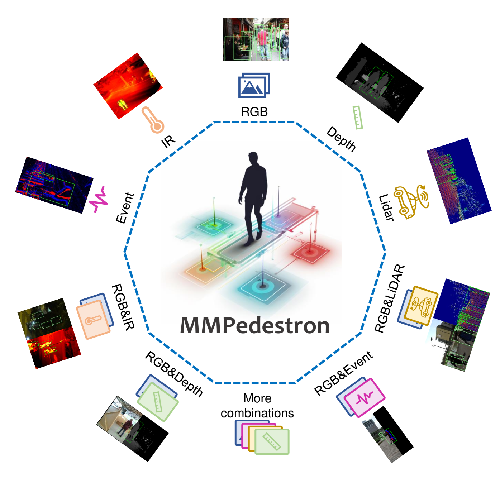
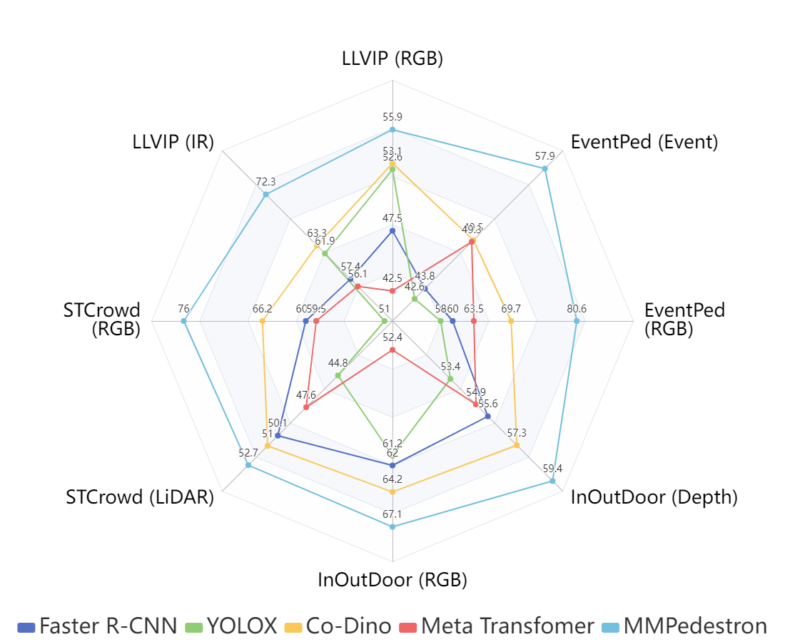
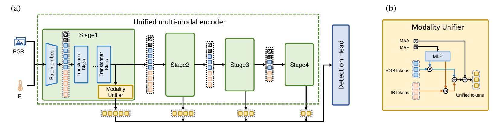
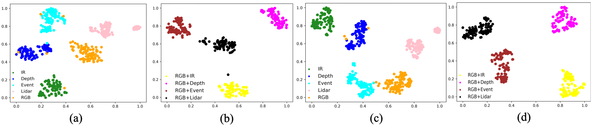
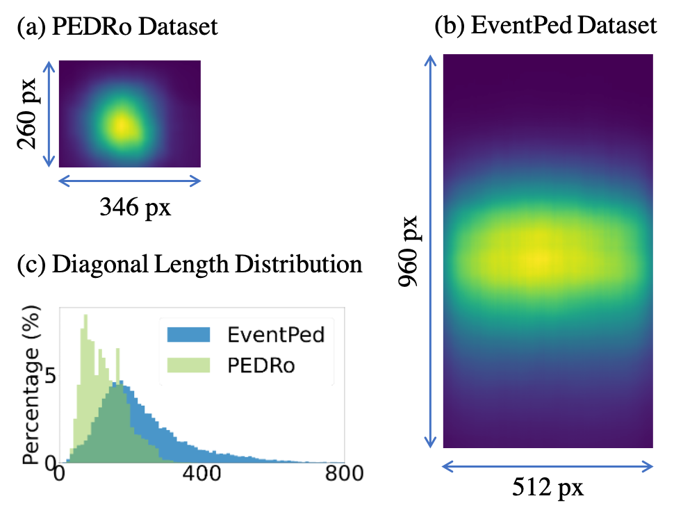
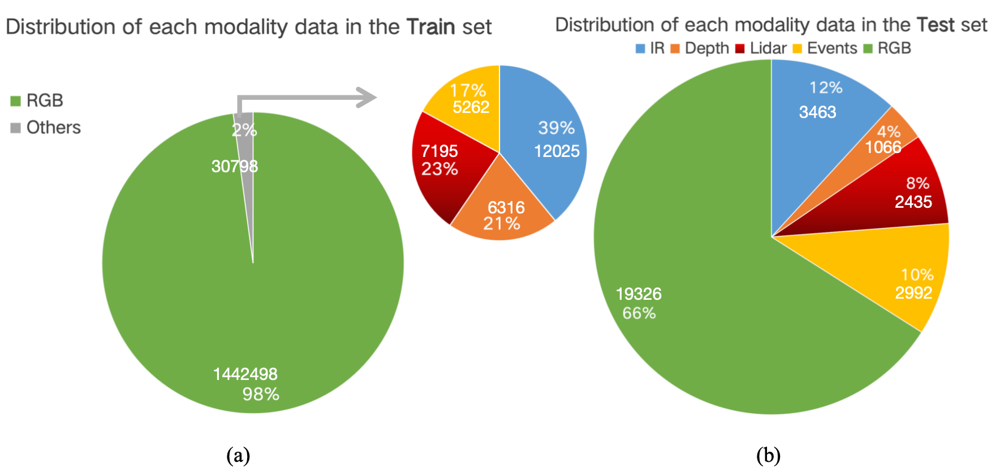
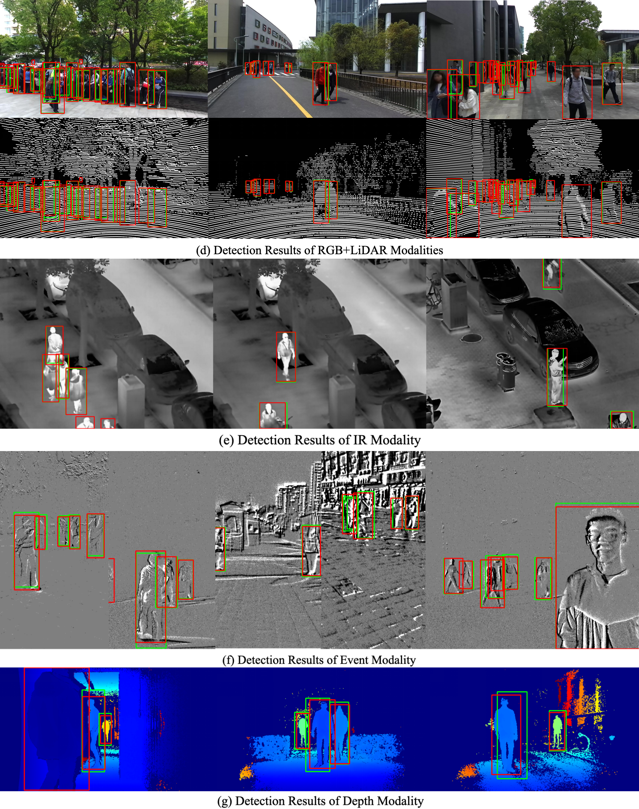

# 行人检测与多模态学习的结合，催生了通才模型与基准数据集的诞生。

发布时间：2024年07月14日

`LLM应用`

> When Pedestrian Detection Meets Multi-Modal Learning: Generalist Model and Benchmark Dataset

# 摘要

> 近年来，行人检测领域借助RGB、IR、深度、LiDAR和事件等多种传感器模态的研究日益增多。然而，构建一个能有效处理这些多样模态的统一模型仍具挑战。本文提出的MMPedestron模型，不同于以往专注于单一或成对模态的专家模型，能处理多模态输入及其动态组合。该模型包含一个统一的模态表示与融合编码器和一个通用的行人检测头部，并引入了MAA和MAF两个可学习令牌以实现自适应多模态特征融合。此外，我们创建了首个多模态行人检测的大规模基准MMPD数据集，涵盖RGB、IR、深度、LiDAR和事件等多种模态。通过多模态联合训练，MMPedestron在多个行人检测基准上表现卓越，超越了针对特定模态的顶尖模型，如在COCO-Persons和LLVIP上分别达到71.1 AP和72.6 AP。特别地，在CrowdHuman数据集上，MMPedestron以仅30分之一的参数量，与InternImage-H模型性能相当。相关代码和数据已公开于https://github.com/BubblyYi/MMPedestron。

> Recent years have witnessed increasing research attention towards pedestrian detection by taking the advantages of different sensor modalities (e.g. RGB, IR, Depth, LiDAR and Event). However, designing a unified generalist model that can effectively process diverse sensor modalities remains a challenge. This paper introduces MMPedestron, a novel generalist model for multimodal perception. Unlike previous specialist models that only process one or a pair of specific modality inputs, MMPedestron is able to process multiple modal inputs and their dynamic combinations. The proposed approach comprises a unified encoder for modal representation and fusion and a general head for pedestrian detection. We introduce two extra learnable tokens, i.e. MAA and MAF, for adaptive multi-modal feature fusion. In addition, we construct the MMPD dataset, the first large-scale benchmark for multi-modal pedestrian detection. This benchmark incorporates existing public datasets and a newly collected dataset called EventPed, covering a wide range of sensor modalities including RGB, IR, Depth, LiDAR, and Event data. With multi-modal joint training, our model achieves state-of-the-art performance on a wide range of pedestrian detection benchmarks, surpassing leading models tailored for specific sensor modality. For example, it achieves 71.1 AP on COCO-Persons and 72.6 AP on LLVIP. Notably, our model achieves comparable performance to the InternImage-H model on CrowdHuman with 30x smaller parameters. Codes and data are available at https://github.com/BubblyYi/MMPedestron.

[Arxiv](https://arxiv.org/abs/2407.10125)