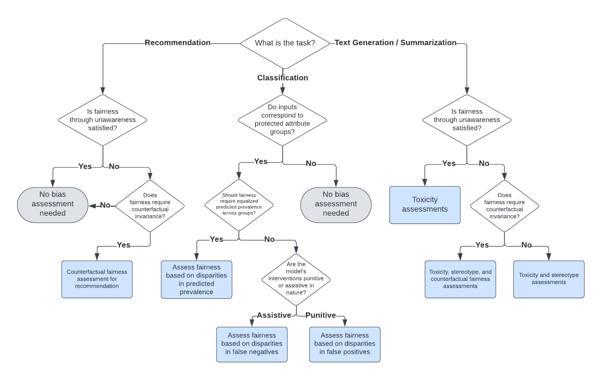

# 本研究提出一个实用框架，旨在评估大型语言模型应用中的偏见与公平性问题。

发布时间：2024年07月15日

`LLM应用` `人工智能` `社会科学`

> An Actionable Framework for Assessing Bias and Fairness in Large Language Model Use Cases

# 摘要

> 大型语言模型（LLM）在多个方面可能表现出偏见，这些偏见可能导致特定群体（如性别、种族、性取向或年龄等受保护属性内的群体）面临不公平的结果。本文为从业者提供了一个技术指南，帮助他们评估LLM应用中的偏见和公平风险。核心贡献是一个决策框架，指导从业者根据特定应用选择合适的评估指标。研究首先对LLM的偏见和公平风险进行分类，并将其对应到LLM应用的分类体系中，进而定义了一系列评估指标。此外，本文还引入了新的偏见和公平评估指标，包括创新的反事实指标和基于刻板印象分类器的指标。评估不仅关注模型本身，还考虑了提示和模型风险对特定应用的影响。由于所有评估均基于LLM的输出进行，该框架具有高度的实用性和操作性，便于从业者实施。

> Large language models (LLMs) can exhibit bias in a variety of ways. Such biases can create or exacerbate unfair outcomes for certain groups within a protected attribute, including, but not limited to sex, race, sexual orientation, or age. This paper aims to provide a technical guide for practitioners to assess bias and fairness risks in LLM use cases. The main contribution of this work is a decision framework that allows practitioners to determine which metrics to use for a specific LLM use case. To achieve this, this study categorizes LLM bias and fairness risks, maps those risks to a taxonomy of LLM use cases, and then formally defines various metrics to assess each type of risk. As part of this work, several new bias and fairness metrics are introduced, including innovative counterfactual metrics as well as metrics based on stereotype classifiers. Instead of focusing solely on the model itself, the sensitivity of both prompt-risk and model-risk are taken into account by defining evaluations at the level of an LLM use case, characterized by a model and a population of prompts. Furthermore, because all of the evaluation metrics are calculated solely using the LLM output, the proposed framework is highly practical and easily actionable for practitioners.

[Arxiv](https://arxiv.org/abs/2407.10853)