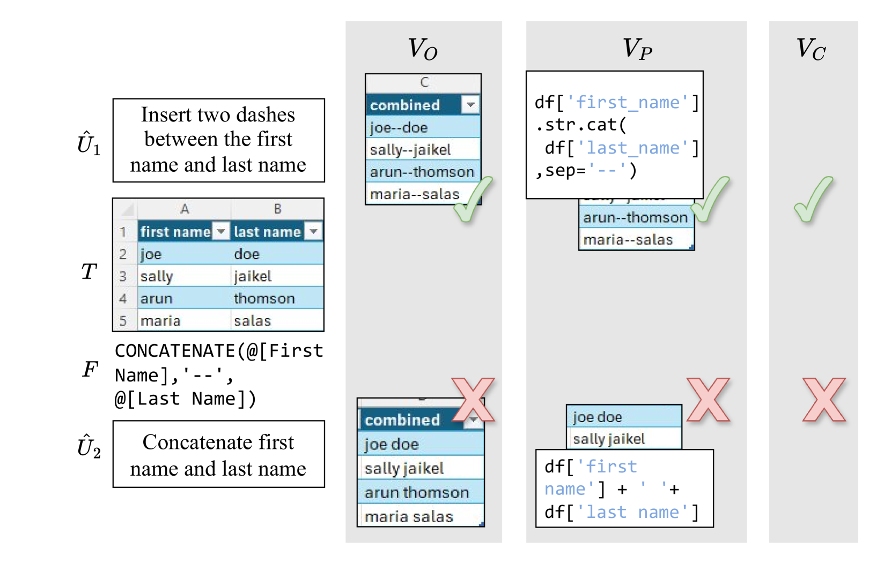
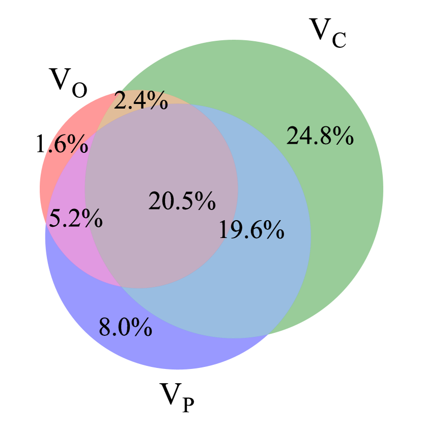
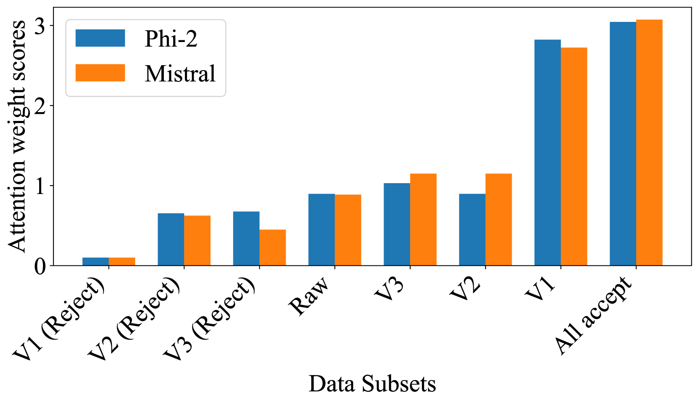
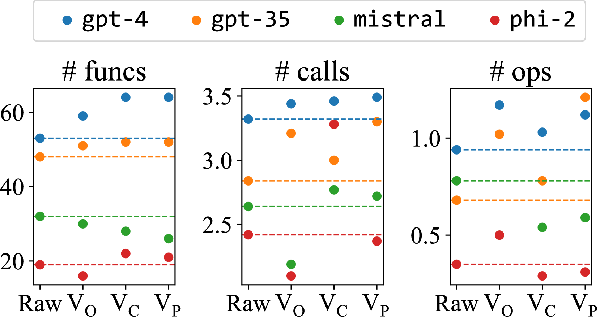

# 探究合成数据在公式生成中的有效性

发布时间：2024年07月15日

`LLM应用` `电子表格` `人工智能`

> An Empirical Study of Validating Synthetic Data for Formula Generation

# 摘要

> LLM 虽能辅助编写电子表格公式，但相关资源匮乏，影响了预训练模型的性能并限制了微调能力。我们利用另一模型生成合成自然语言表述进行微调，并验证其准确性至关重要。本文通过实证研究，展示了验证合成训练示例对提升模型性能的影响，尤其是在四个不同模型上。有趣的是，尽管验证剔除了一些难题，但它实际上增强了模型在微调后解决问题的复杂性。

> Large language models (LLMs) can be leveraged to help with writing formulas in spreadsheets, but resources on these formulas are scarce, impacting both the base performance of pre-trained models and limiting the ability to fine-tune them. Given a corpus of formulas, we can use a(nother) model to generate synthetic natural language utterances for fine-tuning. However, it is important to validate whether the NL generated by the LLM is indeed accurate to be beneficial for fine-tuning. In this paper, we provide empirical results on the impact of validating these synthetic training examples with surrogate objectives that evaluate the accuracy of the synthetic annotations. We demonstrate that validation improves performance over raw data across four models (2 open and 2 closed weight). Interestingly, we show that although validation tends to prune more challenging examples, it increases the complexity of problems that models can solve after being fine-tuned on validated data.

[Arxiv](https://arxiv.org/abs/2407.10657)