# 竞技场学习：利用模拟聊天机器人竞技场，为 LLMs 训练后打造数据飞轮

发布时间：2024年07月15日

`LLM应用` `人工智能` `机器学习`

> Arena Learning: Build Data Flywheel for LLMs Post-training via Simulated Chatbot Arena

# 摘要

> 评估大型语言模型的有效性颇具挑战。在线聊天机器人竞技场中的人工标注战斗虽高效，但成本和时间成本高昂。为此，我们提出竞技场学习，一种创新的离线策略，利用AI驱动的标注模拟战斗，评估结果，助力模型通过监督微调和强化学习持续进步。竞技场学习包含两大核心：首先，通过WizardArena精确预测模型Elo排名，确保离线模拟与在线比赛的一致性；其次，基于战斗结果和模型改进，持续优化训练数据。我们构建数据飞轮，迭代更新训练数据，使模型能从多模型优势中学习。我们将此策略应用于WizardLM-$β$，显著提升其性能。这一全自动训练与评估流程为LLM的持续进步奠定基础。竞技场学习在WizardLM-2的成功中扮演关键角色，本文既是其效能的探索，也是未来相关研究的基础。

> Assessing the effectiveness of large language models (LLMs) presents substantial challenges. The method of conducting human-annotated battles in an online Chatbot Arena is a highly effective evaluative technique. However, this approach is limited by the costs and time required for human annotation. In this paper, we introduce Arena Learning, an innovative offline strategy designed to simulate these arena battles using AI-driven annotations to evaluate battle outcomes, thus facilitating the continuous improvement of the target model through both supervised fine-tuning and reinforcement learning. Arena Learning comprises two key elements. First, it ensures precise evaluations and maintains consistency between offline simulations and online competitions via WizardArena, a pipeline developed to accurately predict the Elo rankings of various models using a meticulously designed offline test set. Our results demonstrate that WizardArena's predictions closely align with those from the online Arena. Second, it involves the continuous improvement of training data based on the battle results and the refined model. We establish a data flywheel to iteratively update the training data by highlighting the weaknesses of the target model based on its battle results, enabling it to learn from the strengths of multiple different models. We apply Arena Learning to train our target model, WizardLM-$β$, and demonstrate significant performance enhancements across various metrics. This fully automated training and evaluation pipeline sets the stage for continuous advancements in various LLMs via post-training. Notably, Arena Learning plays a pivotal role in the success of WizardLM-2, and this paper serves both as an exploration of its efficacy and a foundational study for future discussions related to WizardLM-2 and its derivatives.

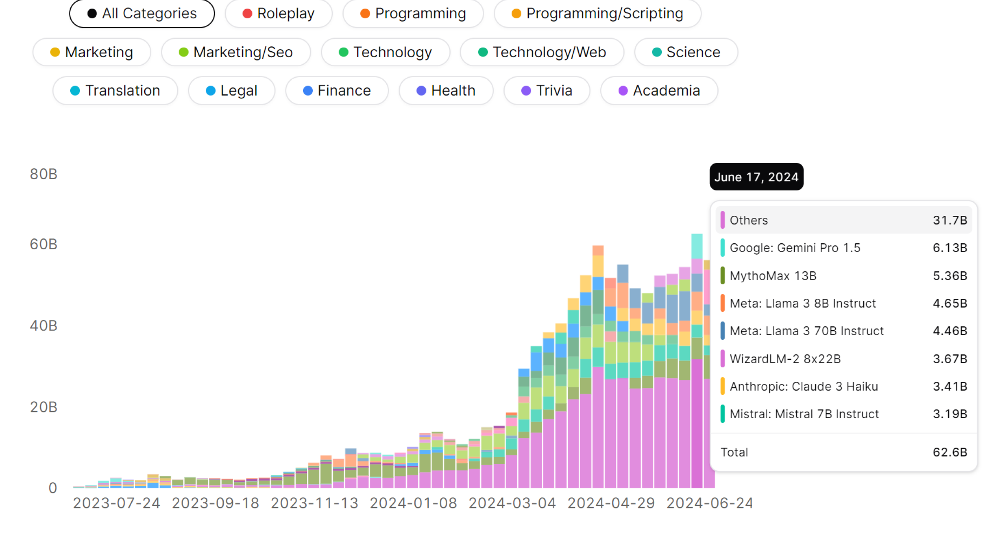

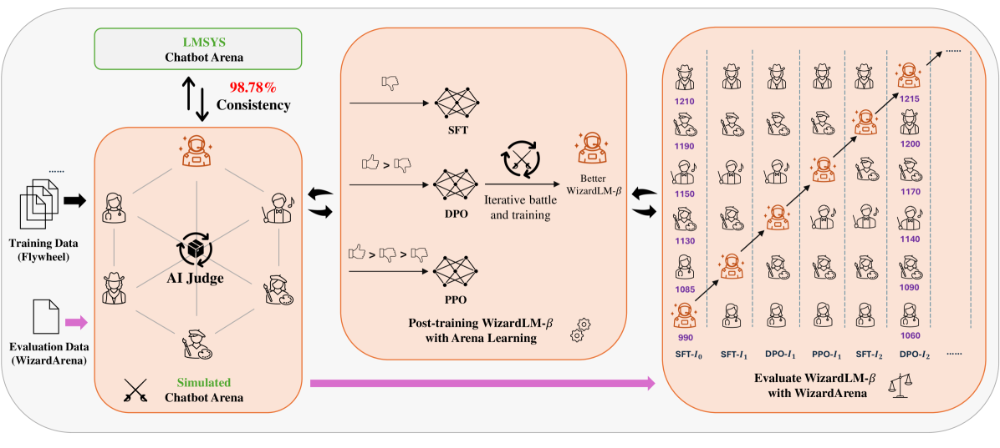

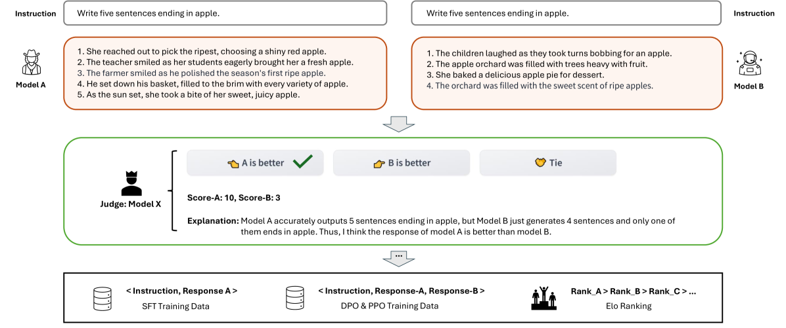

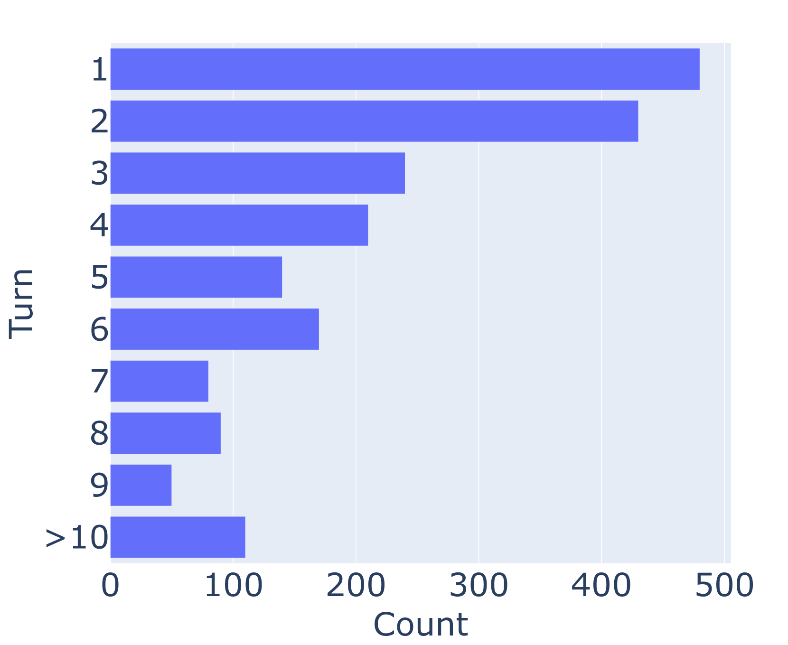

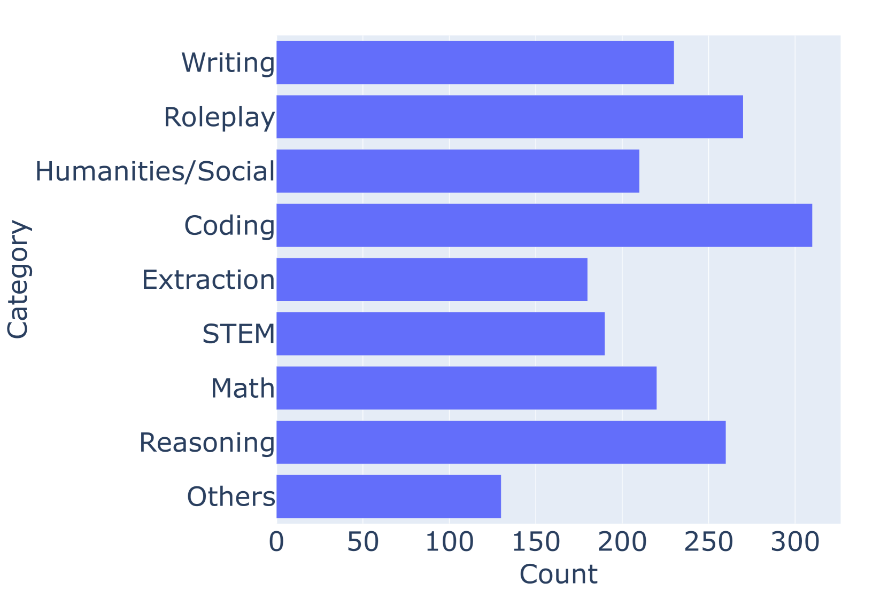

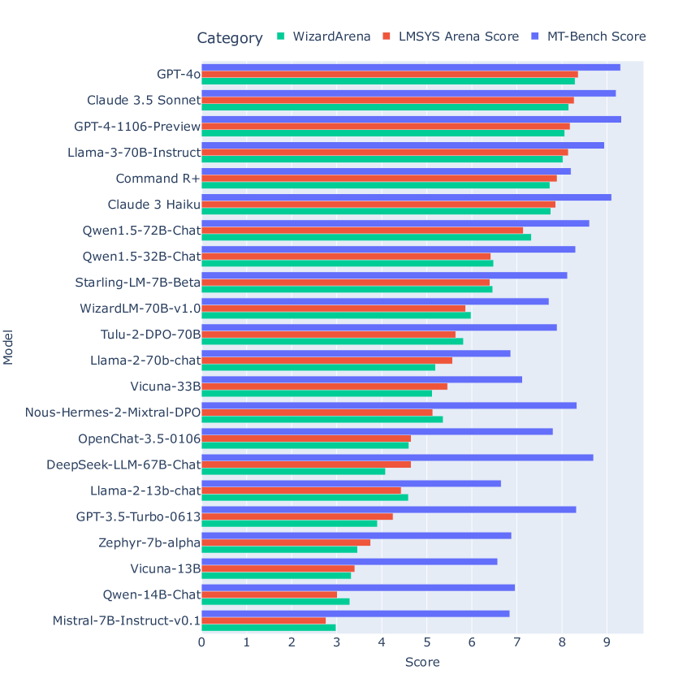

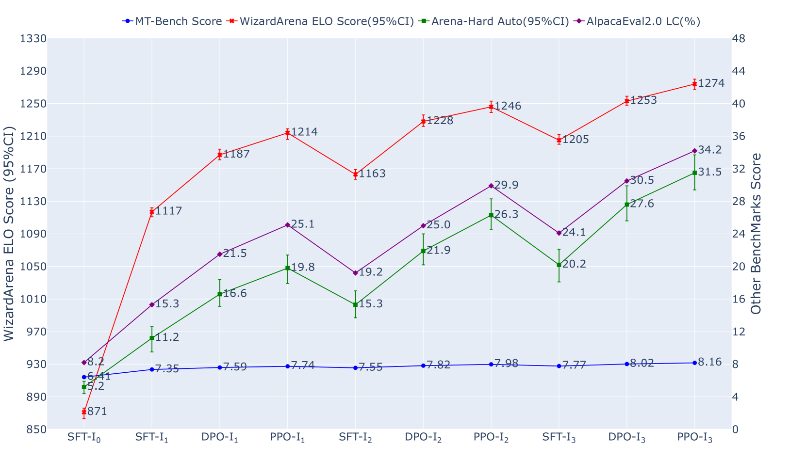

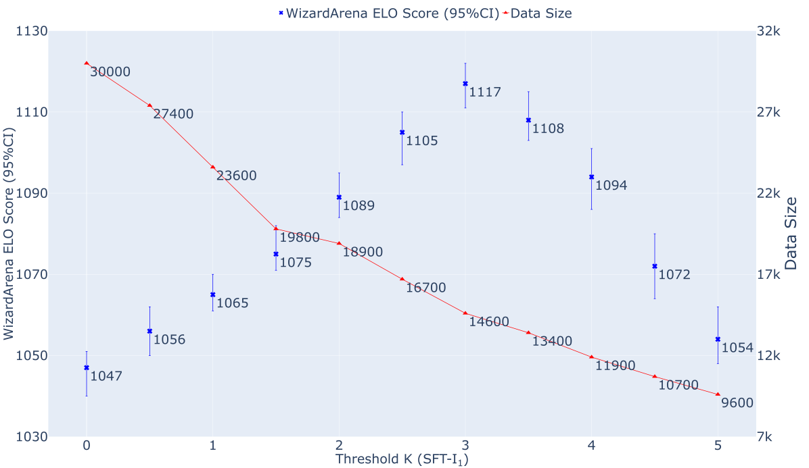

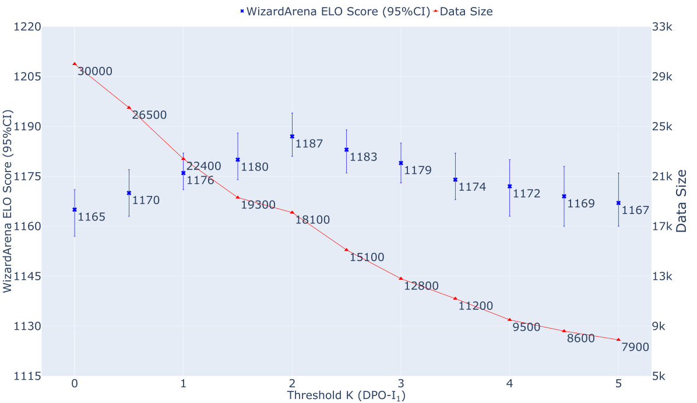

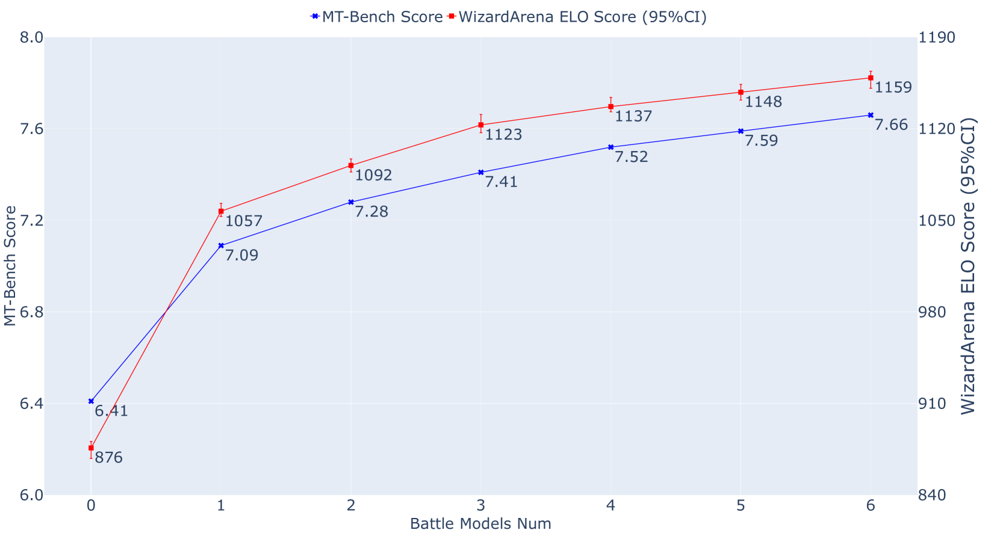

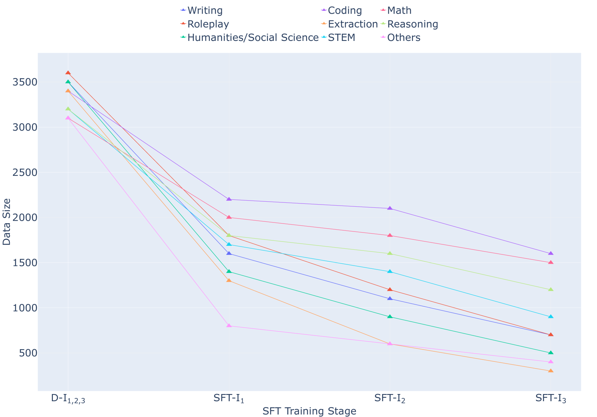

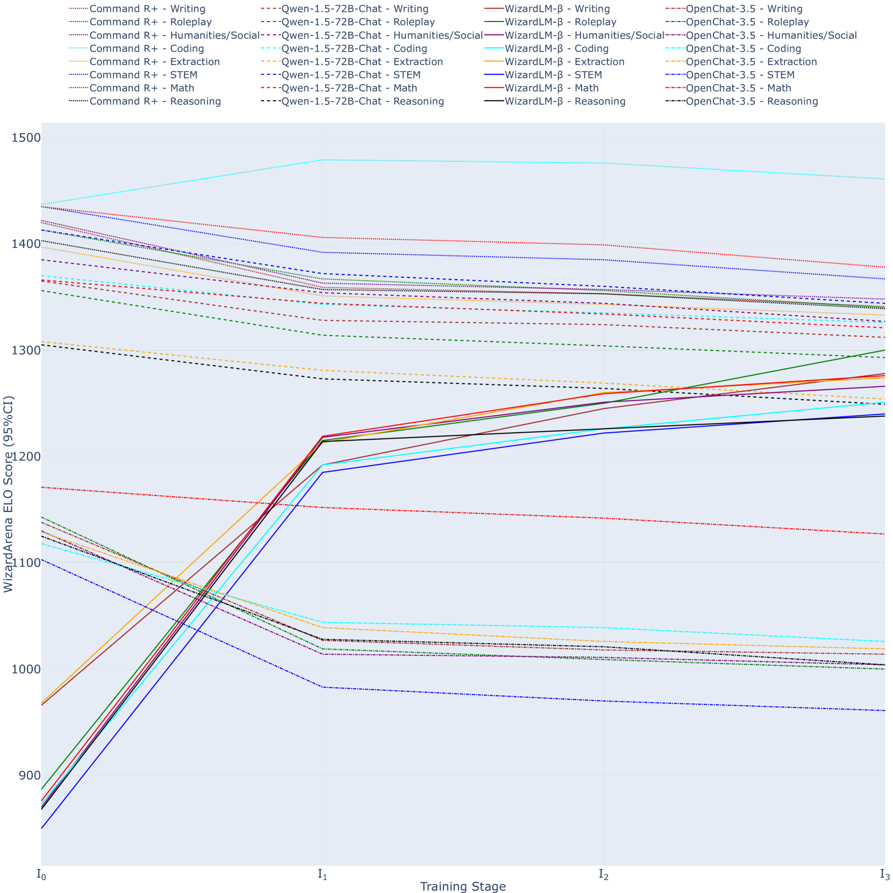

[Arxiv](https://arxiv.org/abs/2407.10627)