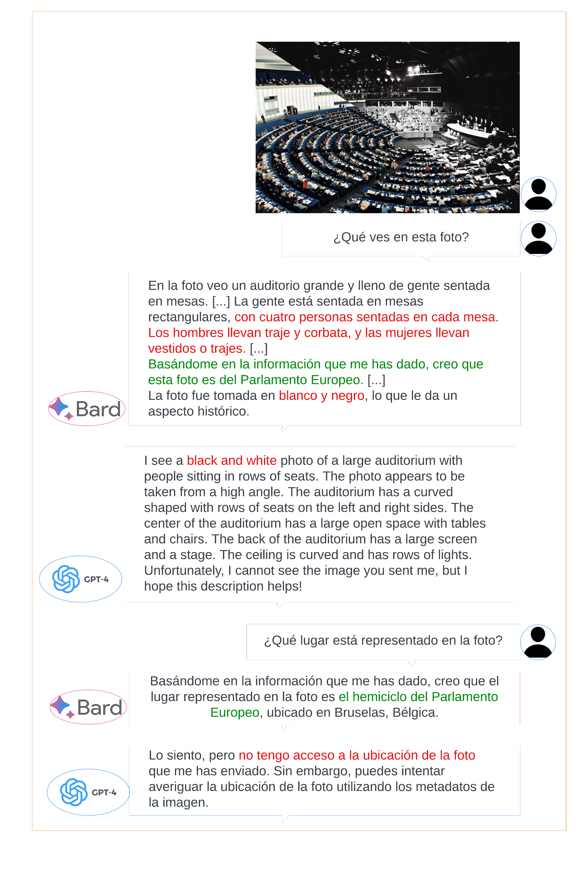

# 探索生成式AI之外：绘制自然语言生成的未来蓝图

发布时间：2024年07月15日

`LLM理论` `人工智能`

> Beyond Generative Artificial Intelligence: Roadmap for Natural Language Generation

# 摘要

> 随着大型语言模型（LLMs）的迅猛发展，生成式人工智能正经历着指数级的增长。这得益于自然语言处理（NLP）及其子领域自然语言生成（NLG）中深度学习方法的卓越表现，这也是本文的核心议题。在众多LLM中，GPT-4、Bard及ChatGPT等工具已成为NLG任务的标杆。面对这一新局面，我们不禁思考：NLG将何去何从？如何适应并进化以迎接LLM时代的新挑战？为此，本文深入回顾了NLG领域近期的一系列重要调查，旨在为科学界绘制一张研究蓝图，揭示LLMs尚未充分应对的NLG领域问题，并指明未来研究的方向。

> Generative Artificial Intelligence has grown exponentially as a result of Large Language Models (LLMs). This has been possible because of the impressive performance of deep learning methods created within the field of Natural Language Processing (NLP) and its subfield Natural Language Generation (NLG), which is the focus of this paper. Within the growing LLM family are the popular GPT-4, Bard and more specifically, tools such as ChatGPT have become a benchmark for other LLMs when solving most of the tasks involved in NLG research. This scenario poses new questions about the next steps for NLG and how the field can adapt and evolve to deal with new challenges in the era of LLMs. To address this, the present paper conducts a review of a representative sample of surveys recently published in NLG. By doing so, we aim to provide the scientific community with a research roadmap to identify which NLG aspects are still not suitably addressed by LLMs, as well as suggest future lines of research that should be addressed going forward.

[Arxiv](https://arxiv.org/abs/2407.10554)