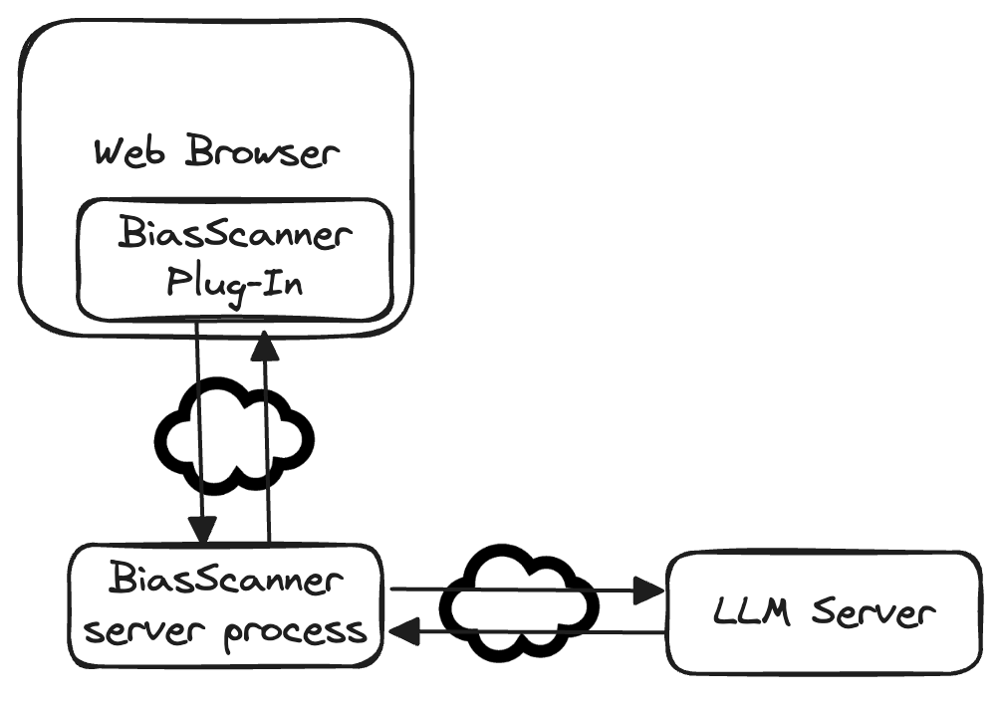
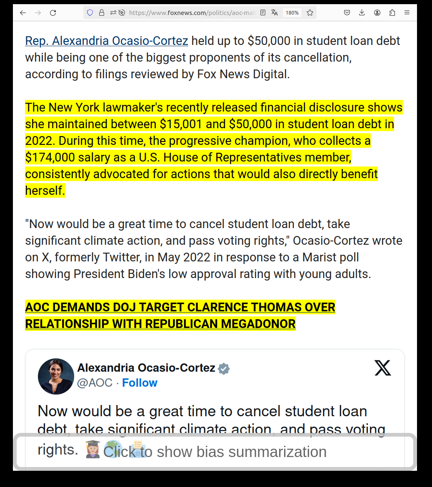
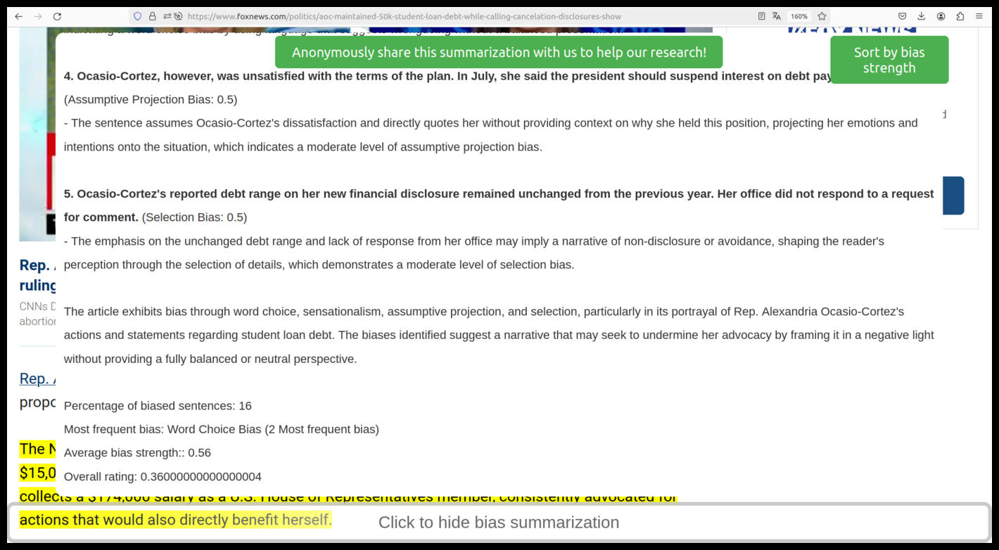

# BiasScanner 工具旨在自动识别并分类新闻中的偏见，从而助力民主的稳固。

发布时间：2024年07月15日

`LLM应用` `新闻媒体` `信息技术`

> BiasScanner: Automatic Detection and Classification of News Bias to Strengthen Democracy

# 摘要

> 随着21世纪在线新闻消费的增长，虚假信息、偏见报道和仇恨言论等不良内容也在增多。为此，我们推出了BiasScanner，一款旨在通过帮助读者仔细审查在线新闻来强化民主的应用。该应用包含一个预训练的大型语言模型，用于识别新闻中的偏见句子，并配备了一个浏览器插件。目前，BiasScanner能在句子层面识别并分类超过24种媒体偏见，成为同类中最精细且唯一实际部署的系统。它设计轻巧且注重隐私，不仅能标记可能存在偏见的句子，还为每个分类提供解释，并为每篇文章提供总结分析。尽管已有研究关注新闻偏见检测，但BiasScanner是首个实现为浏览器插件并投入使用的工具（详见biasscanner.org的在线演示）。

> The increasing consumption of news online in the 21st century coincided with increased publication of disinformation, biased reporting, hate speech and other unwanted Web content. We describe BiasScanner, an application that aims to strengthen democracy by supporting news consumers with scrutinizing news articles they are reading online. BiasScanner contains a server-side pre-trained large language model to identify biased sentences of news articles and a front-end Web browser plug-in. At the time of writing, BiasScanner can identify and classify more than two dozen types of media bias at the sentence level, making it the most fine-grained model and only deployed application (automatic system in use) of its kind. It was implemented in a light-weight and privacy-respecting manner, and in addition to highlighting likely biased sentence it also provides explanations for each classification decision as well as a summary analysis for each news article. While prior research has addressed news bias detection, we are not aware of any work that resulted in a deployed browser plug-in (c.f. also biasscanner.org for a Web demo).

[Arxiv](https://arxiv.org/abs/2407.10829)