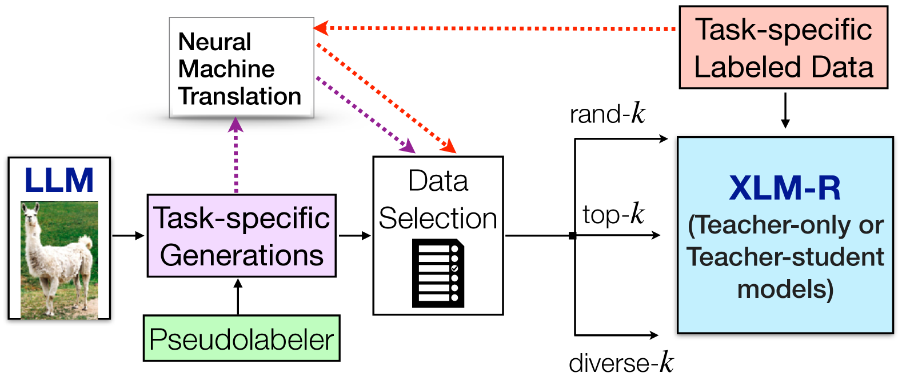
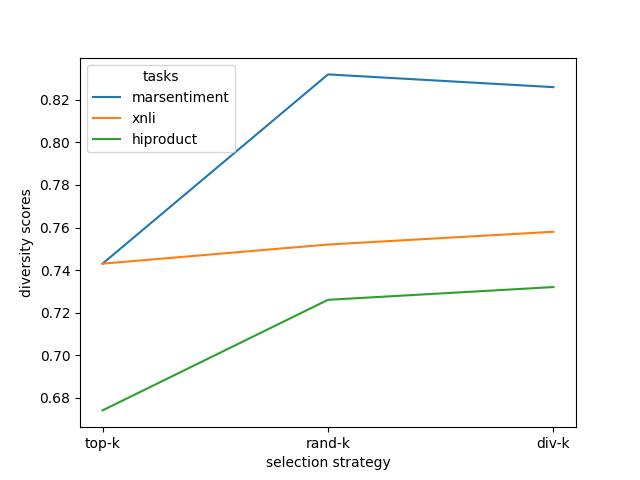

# 通过基于LLM的增强和精准数据选择，提升零-shot跨语言性能

发布时间：2024年07月15日

`LLM应用` `跨语言学习`

> Boosting Zero-Shot Crosslingual Performance using LLM-Based Augmentations with Effective Data Selection

# 摘要

> 大型语言模型 (LLM) 擅长文本生成。我们利用这一特点，通过零-shot 提示为低资源目标语言生成特定任务数据，并促进跨语言转移。我们提出使用在源语言数据上训练的教师模型来标记 LLM 生成的内容，并采用基于教师标签概率的简单数据选择策略。这些策略帮助我们高效地筛选出多样且具代表性的生成内容子集，从而提升零-shot 准确性。此外，我们还探讨了影响跨语言性能的关键设计选择，如源数据翻译的使用和最佳标签选择。实验显示，在多种目标语言和领域中，情感分析与自然语言推理任务的性能显著提升，最高可达 7.13 绝对点，平均提升 1.5 绝对点。

> Large language models (LLMs) are very proficient text generators. We leverage this capability of LLMs to generate task-specific data via zero-shot prompting and promote cross-lingual transfer for low-resource target languages. Given task-specific data in a source language and a teacher model trained on this data, we propose using this teacher to label LLM generations and employ a set of simple data selection strategies that use the teacher's label probabilities. Our data selection strategies help us identify a representative subset of diverse generations that help boost zero-shot accuracies while being efficient, in comparison to using all the LLM generations (without any subset selection). We also highlight other important design choices that affect cross-lingual performance such as the use of translations of source data and what labels are best to use for the LLM generations. We observe significant performance gains across sentiment analysis and natural language inference tasks (of up to a maximum of 7.13 absolute points and 1.5 absolute points on average) across a number of target languages (Hindi, Marathi, Urdu, Swahili) and domains.

[Arxiv](https://arxiv.org/abs/2407.10582)