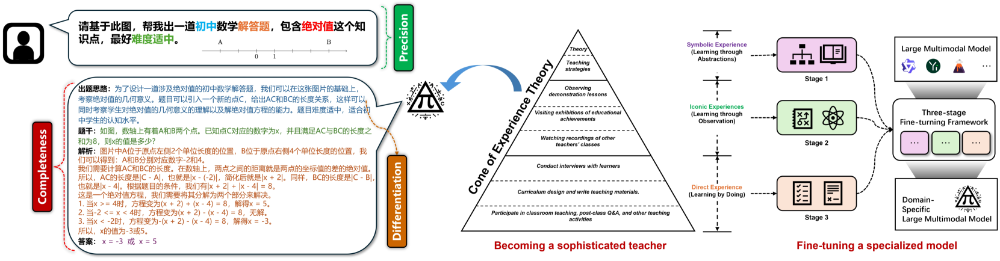
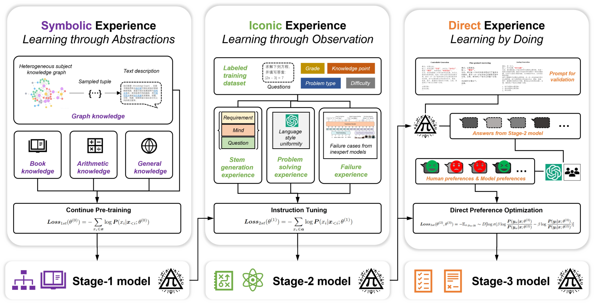
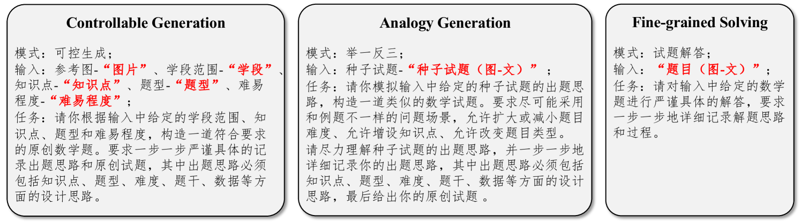
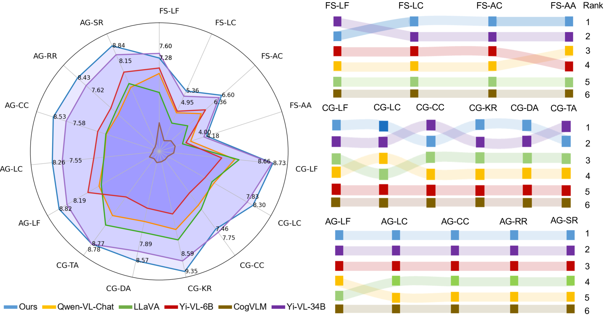
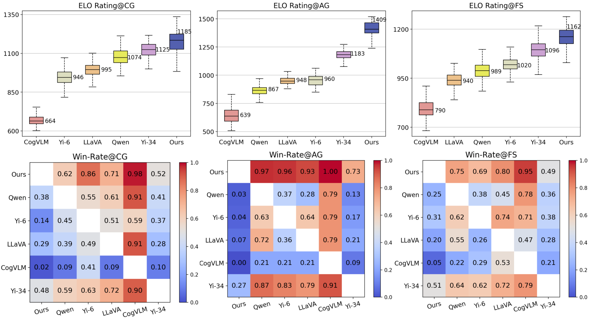
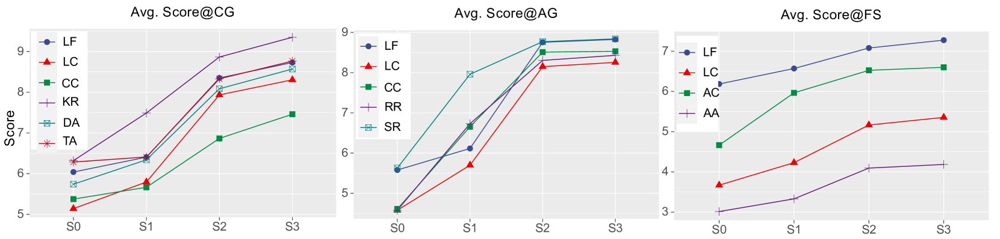
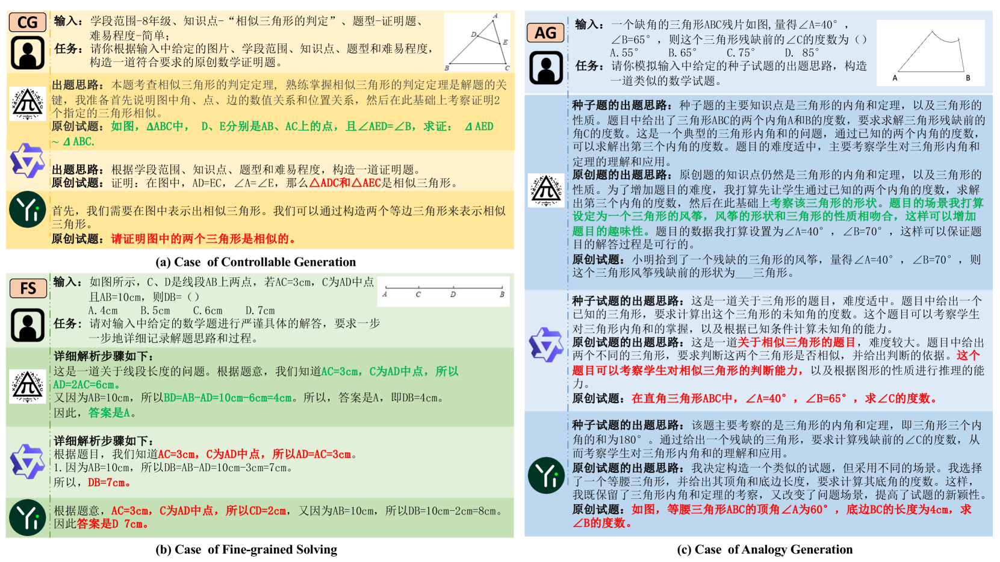

# COMET：融合“经验锥”理念的大型多模态模型，专为数学问题生成而设计

发布时间：2024年07月15日

`LLM应用`

> COMET: "Cone of experience" enhanced large multimodal model for mathematical problem generation

# 摘要

> 在教育领域，高质量数学问题的自动生成极具价值。大型多模态模型因其跨模态应用的成功，为数学问题生成开辟了新途径。然而，传统方法将问题解决与生成割裂，以及主流微调框架的单一数据结构和目标，限制了其应用。为此，我们提出COMET模型，通过“经验锥”增强，统一题干生成与问题解决，并设计三阶段微调框架，细分数据为符号、图像和直接经验，以模拟教师成长路径。此外，我们构建了中文多模态数学问题数据集，填补了领域空白。实验证明，该框架和模型在多个数据集上表现出色，有效提升了数学问题生成的质量。

> The automatic generation of high-quality mathematical problems is practically valuable in many educational scenarios. Large multimodal model provides a novel technical approach for the mathematical problem generation because of its wide success in cross-modal data scenarios. However, the traditional method of separating problem solving from problem generation and the mainstream fine-tuning framework of monotonous data structure with homogeneous training objectives limit the application of large multimodal model in mathematical problem generation. Addressing these challenges, this paper proposes COMET, a "Cone of Experience" enhanced large multimodal model for mathematical problem generation. Firstly, from the perspective of mutual ability promotion and application logic, we unify stem generation and problem solving into mathematical problem generation. Secondly, a three-stage fine-turning framework guided by the "Cone of Experience" is proposed. The framework divides the fine-tuning data into symbolic experience, iconic experience, and direct experience to draw parallels with experiences in the career growth of teachers. Several fine-grained data construction and injection methods are designed in this framework. Finally, we construct a Chinese multimodal mathematical problem dataset to fill the vacancy of Chinese multimodal data in this field. Combined with objective and subjective indicators, experiments on multiple datasets fully verify the effectiveness of the proposed framework and model.

[Arxiv](https://arxiv.org/abs/2407.11315)