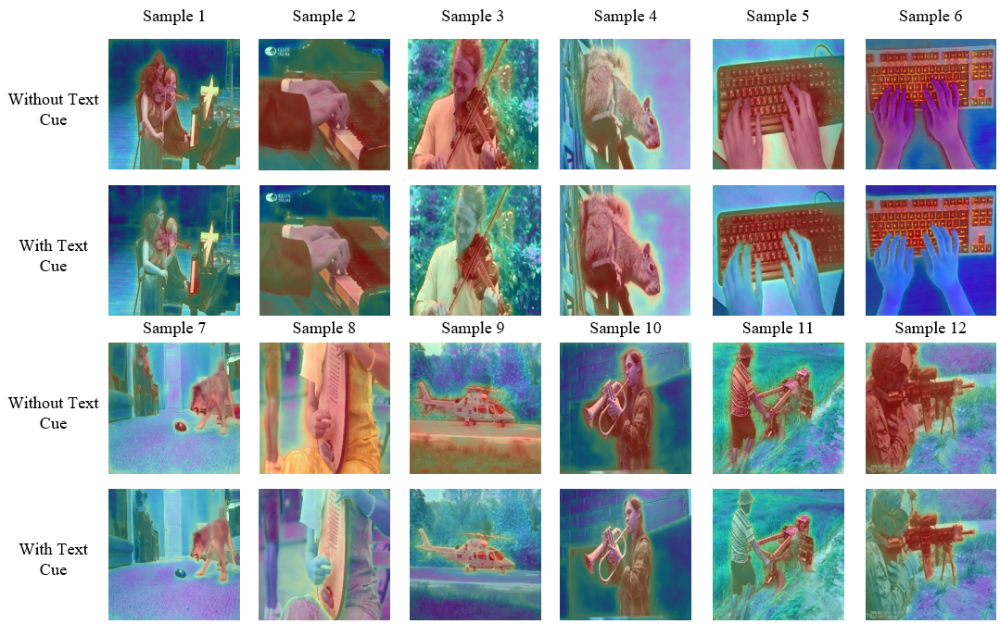

# 文本语义是否能减轻对发声物体分割的偏好？

发布时间：2024年07月15日

`LLM应用` `音频处理` `计算机视觉`

> Can Textual Semantics Mitigate Sounding Object Segmentation Preference?

# 摘要

> 音频-视觉分割任务旨在通过音频线索在视觉空间中精准分割发声物体。然而，现有方法往往过度依赖于可听物体的损害性分割偏好，而非精确的音频引导。究其原因，音频在多源发声场景中缺乏稳健的语义，导致其对视觉空间的引导力不足。鉴于此，我们提出利用视觉场景中的文本线索，通过文本的丰富语义来强化音频引导。具体而言，我们首先通过图像描述生成器获取场景描述，并利用大型语言模型推断潜在的发声物体作为文本线索。随后，我们设计了一个语义驱动的音频建模模块，通过动态掩码将音频特征与文本线索融合，生成既包含音频线索又富含语义的发声物体特征，从而为视觉空间提供更明确的引导。实验结果表明，在文本线索的辅助下，我们的方法对音频的敏感性显著提升，在所有测试子集上均展现出卓越的性能。项目详情请访问：\href{https://github.com/GeWu-Lab/Sounding-Object-Segmentation-Preference}{项目页面}。

> The Audio-Visual Segmentation (AVS) task aims to segment sounding objects in the visual space using audio cues. However, in this work, it is recognized that previous AVS methods show a heavy reliance on detrimental segmentation preferences related to audible objects, rather than precise audio guidance. We argue that the primary reason is that audio lacks robust semantics compared to vision, especially in multi-source sounding scenes, resulting in weak audio guidance over the visual space. Motivated by the the fact that text modality is well explored and contains rich abstract semantics, we propose leveraging text cues from the visual scene to enhance audio guidance with the semantics inherent in text. Our approach begins by obtaining scene descriptions through an off-the-shelf image captioner and prompting a frozen large language model to deduce potential sounding objects as text cues. Subsequently, we introduce a novel semantics-driven audio modeling module with a dynamic mask to integrate audio features with text cues, leading to representative sounding object features. These features not only encompass audio cues but also possess vivid semantics, providing clearer guidance in the visual space. Experimental results on AVS benchmarks validate that our method exhibits enhanced sensitivity to audio when aided by text cues, achieving highly competitive performance on all three subsets. Project page: \href{https://github.com/GeWu-Lab/Sounding-Object-Segmentation-Preference}{https://github.com/GeWu-Lab/Sounding-Object-Segmentation-Preference}

[Arxiv](https://arxiv.org/abs/2407.10947)