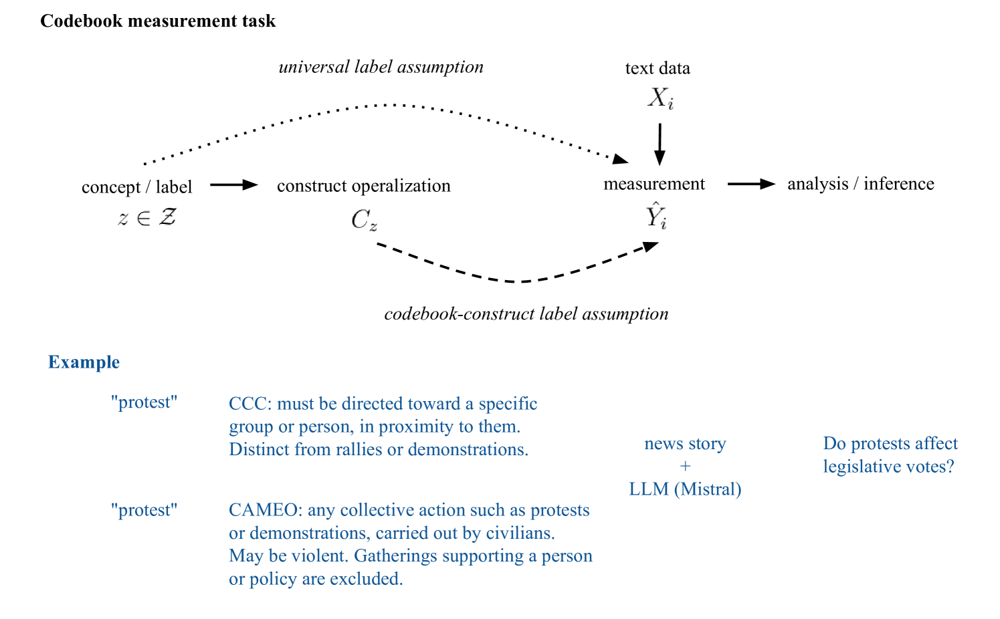

# Codebook LLMs：将政治科学代码簿应用于 LLM，并调整 LLMs 以遵循代码簿规范

发布时间：2024年07月15日

`LLM应用` `政治科学` `社会科学`

> Codebook LLMs: Adapting Political Science Codebooks for LLM Use and Adapting LLMs to Follow Codebooks

# 摘要

> 代码本，作为操作化构建和注释流程的指南，在社会科学领域广泛应用于非结构化政治文本的编码。为降低人工注释成本，政治科学家开始利用大型语言模型（LLM）进行文本标记与分析。然而，以往基于LLM的分类研究暗含了通用标签假设，即仅凭类别标签或简要定义，结合LLM预训练中习得的信息，即可实现文档的准确分类。我们则主张，关注测量有效性的政治科学家应采纳代码本-构建标签假设，即LLM应严格遵循代码本中构建/标签的定义与排除标准。为此，我们收集并优化了三个政治科学数据集及其原始代码本，并开展实验，探究LLM是否遵循代码本指令、重写代码本能否提升性能，以及在代码本-文档-标签三元组上对LLM进行指令调优是否能超越零-shot分类。实验结果显示，尽管重新构建代码本在零-shot性能上有所提升，但LLM仍难以完全遵守代码本约束。值得欣喜的是，对Mistral进行指令调优，显著提升了零-shot推理性能（微F1从0.53提升至0.76）。我们期待，通过明确代码本特定任务、假设及指令调优流程，以及采用半结构化的LLM代码本格式，能助力政治科学家顺利迈入LLM时代。

> Codebooks -- documents that operationalize constructs and outline annotation procedures -- are used almost universally by social scientists when coding unstructured political texts. Recently, to reduce manual annotation costs, political scientists have looked to generative large language models (LLMs) to label and analyze text data. However, previous work using LLMs for classification has implicitly relied on the universal label assumption -- correct classification of documents is possible using only a class label or minimal definition and the information that the LLM inductively learns during its pre-training. In contrast, we argue that political scientists who care about valid measurement should instead make a codebook-construct label assumption -- an LLM should follow the definition and exclusion criteria of a construct/label provided in a codebook. In this work, we collect and curate three political science datasets and their original codebooks and conduct a set of experiments to understand whether LLMs comply with codebook instructions, whether rewriting codebooks improves performance, and whether instruction-tuning LLMs on codebook-document-label tuples improves performance over zero-shot classification. Using Mistral 7B Instruct as our LLM, we find re-structuring the original codebooks gives modest gains in zero-shot performance but the model still struggles to comply with the constraints of the codebooks. Optimistically, instruction-tuning Mistral on one of our datasets gives significant gains over zero-shot inference (0.76 versus 0.53 micro F1). We hope our conceptualization of the codebook-specific task, assumptions, and instruction-tuning pipeline as well our semi-structured LLM codebook format will help political scientists readily adapt to the LLM era.

[Arxiv](https://arxiv.org/abs/2407.10747)