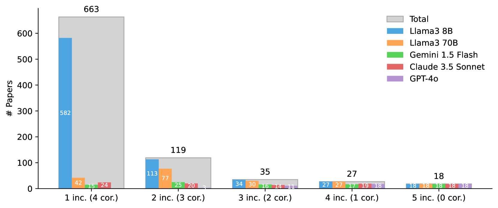
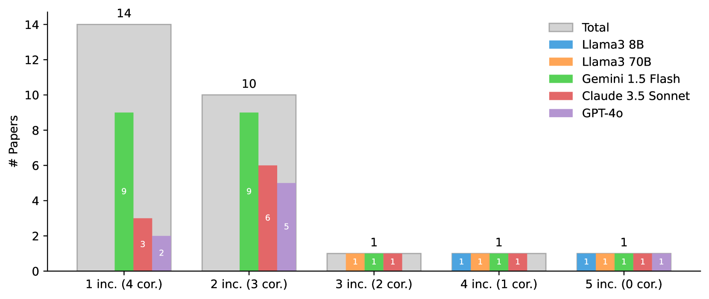
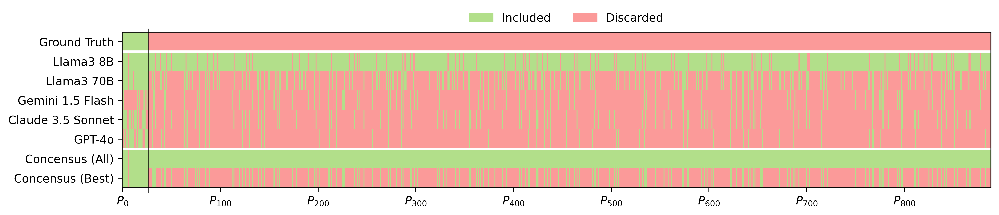

# LLM 在系统性文献综述中展现出了高效过滤的潜力，能够帮助我们穿透信息的杂乱，更精准地筛选出有价值的研究。

发布时间：2024年07月15日

`LLM应用` `学术研究` `文献综述`

> Cutting Through the Clutter: The Potential of LLMs for Efficient Filtration in Systematic Literature Reviews

# 摘要

> 在学术领域，系统性文献综述至关重要，但因其涉及大量出版物和繁琐流程而显得冗长。传统基于关键词的筛选方法常因语义模糊和术语不一致而效果欠佳。为此，我们探索利用大型语言模型（LLMs）提升文献筛选的效率与精准度，减少人工负担。通过模型仅作为分类工具处理结构化数据，我们规避了LLMs的常见缺陷，如产生幻觉。在最近一次文献调查中，我们评估了LLMs在处理超过8.3k篇潜在相关文章时的表现，并与人工筛选进行了对比。结果显示，借助GPT-4o等先进模型及简单提示，文献筛选时间从数周缩短至几分钟。此外，通过共识机制，我们有效控制了假阴性率，召回率超过98.8%，甚至优于人类标准，确保了选文的准确性与相关性。这一研究不仅革新了文献综述方法，更为人工智能在学术研究中的深入应用铺平了道路。

> In academic research, systematic literature reviews are foundational and highly relevant, yet tedious to create due to the high volume of publications and labor-intensive processes involved. Systematic selection of relevant papers through conventional means like keyword-based filtering techniques can sometimes be inadequate, plagued by semantic ambiguities and inconsistent terminology, which can lead to sub-optimal outcomes. To mitigate the required extensive manual filtering, we explore and evaluate the potential of using Large Language Models (LLMs) to enhance the efficiency, speed, and precision of literature review filtering, reducing the amount of manual screening required. By using models as classification agents acting on a structured database only, we prevent common problems inherent in LLMs, such as hallucinations. We evaluate the real-world performance of such a setup during the construction of a recent literature survey paper with initially more than 8.3k potentially relevant articles under consideration and compare this with human performance on the same dataset. Our findings indicate that employing advanced LLMs like GPT-4o, Claude 3.5 Sonnet, Gemini 1.5 Flash, or Llama3 with simple prompting can significantly reduce the time required for literature filtering - from usually weeks of manual research to only a few minutes. Simultaneously, we crucially show that false negatives can indeed be controlled through a consensus scheme, achieving recalls >98.8% at or even beyond the typical human error threshold, thereby also providing for more accurate and relevant articles selected. Our research not only demonstrates a substantial improvement in the methodology of literature reviews but also sets the stage for further integration and extensive future applications of responsible AI in academic research practices.

[Arxiv](https://arxiv.org/abs/2407.10652)