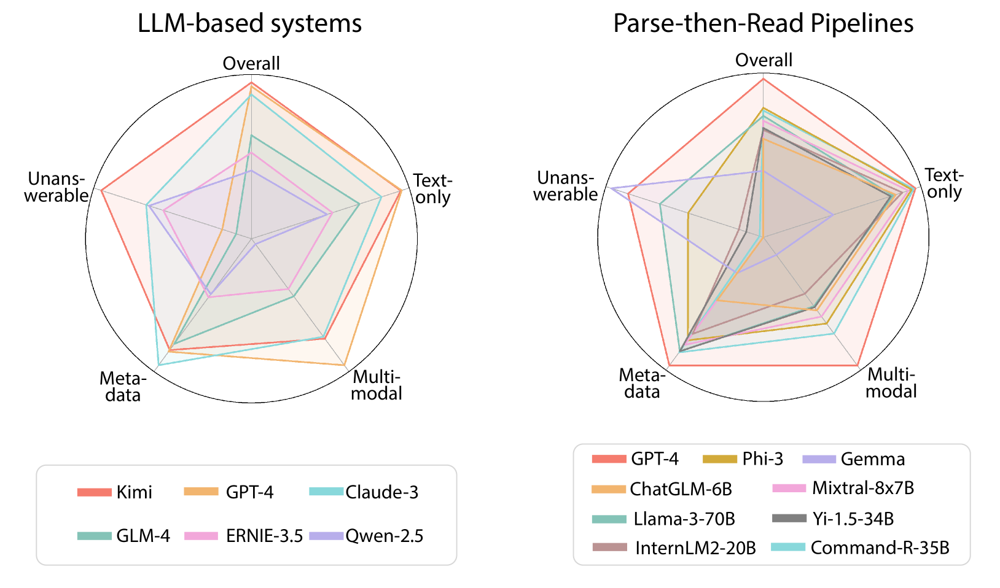

# DOCBENCH：评估 LLM 文档阅读系统性能的标杆

发布时间：2024年07月15日

`LLM应用` `文档管理` `人工智能`

> DOCBENCH: A Benchmark for Evaluating LLM-based Document Reading Systems

# 摘要

> 近期，大型语言模型（LLM）开发者对基于LLM的文档阅读系统兴趣日益浓厚，这类系统不仅支持用户上传文档并提问，还超越了传统阅读理解任务的范畴。为应对文件解析、元数据提取等复杂挑战，这些系统设计精良。然而，目前尚无基准评估其在实际应用中的表现。为此，我们推出了DocBench，一个专为评估基于LLM的文档阅读系统而设计的新基准。该基准精心策划，涵盖人工标注员招募与合成问题生成，包含229份真实文档及1,102个问题，横跨五个领域、四种问题类型。我们评估了通过网页接口或API访问的专有系统，以及采用开源LLM的解析-阅读流水线。评估结果显示，现有系统与人类表现存在显著差距，凸显了开发高效系统的挑战。DocBench旨在为多样化现实场景下的基于LLM的文档阅读系统评估设立标准，引领该领域的未来发展。

> Recently, there has been a growing interest among large language model (LLM) developers in LLM-based document reading systems, which enable users to upload their own documents and pose questions related to the document contents, going beyond simple reading comprehension tasks. Consequently, these systems have been carefully designed to tackle challenges such as file parsing, metadata extraction, multi-modal information understanding and long-context reading. However, no current benchmark exists to evaluate their performance in such scenarios, where a raw file and questions are provided as input, and a corresponding response is expected as output. In this paper, we introduce DocBench, a new benchmark designed to evaluate LLM-based document reading systems. Our benchmark involves a meticulously crafted process, including the recruitment of human annotators and the generation of synthetic questions. It includes 229 real documents and 1,102 questions, spanning across five different domains and four major types of questions. We evaluate both proprietary LLM-based systems accessible via web interfaces or APIs, and a parse-then-read pipeline employing open-source LLMs. Our evaluations reveal noticeable gaps between existing LLM-based document reading systems and human performance, underscoring the challenges of developing proficient systems. To summarize, DocBench aims to establish a standardized benchmark for evaluating LLM-based document reading systems under diverse real-world scenarios, thereby guiding future advancements in this research area.

[Arxiv](https://arxiv.org/abs/2407.10701)