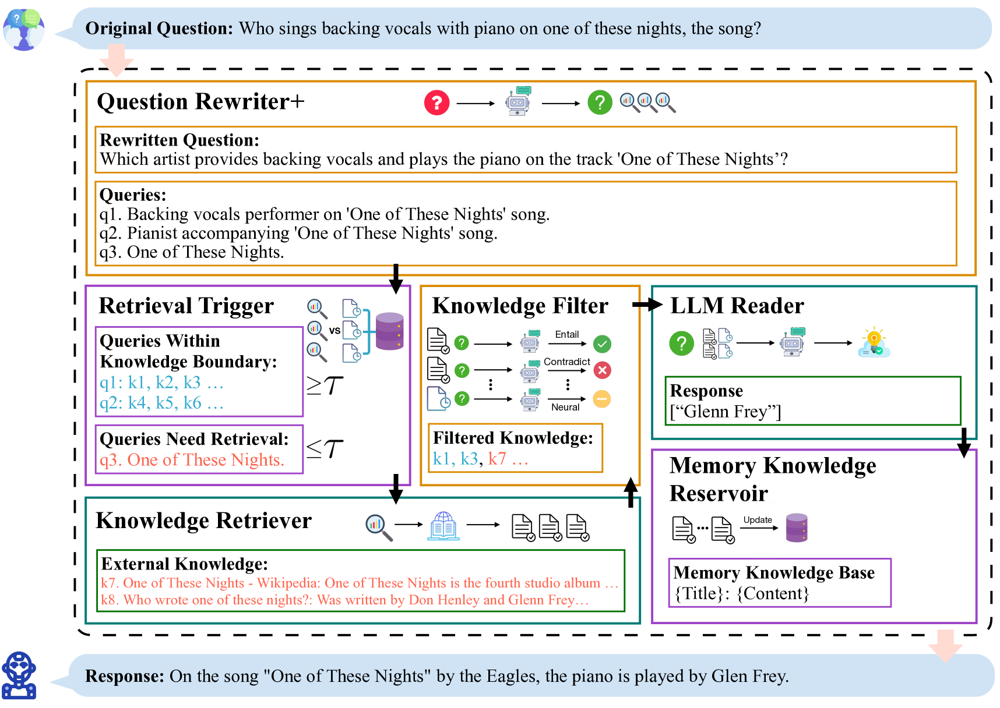
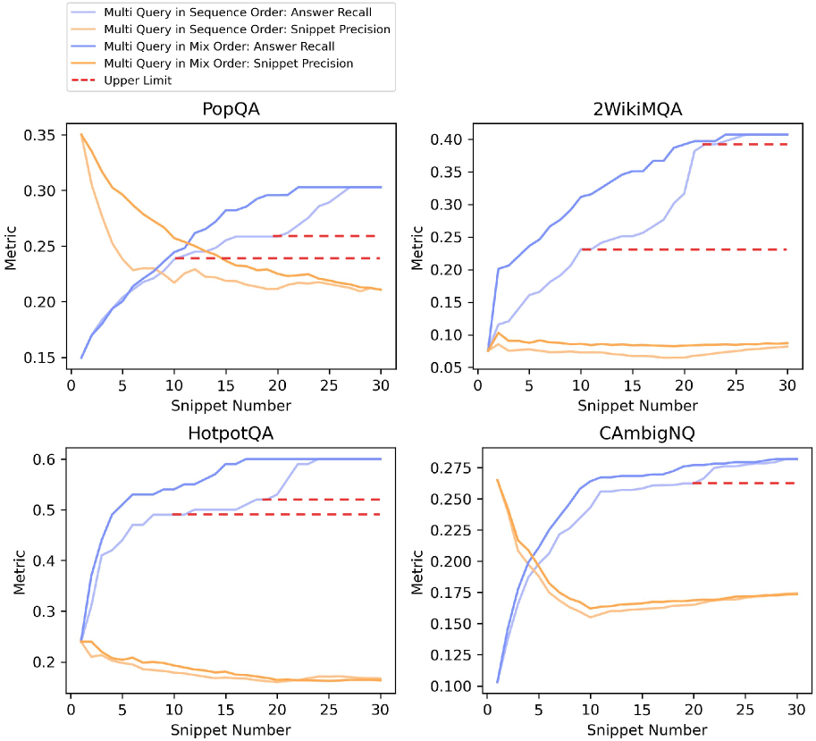
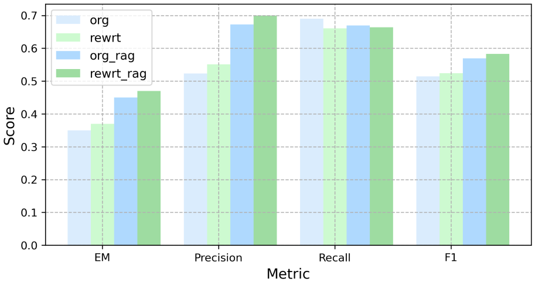
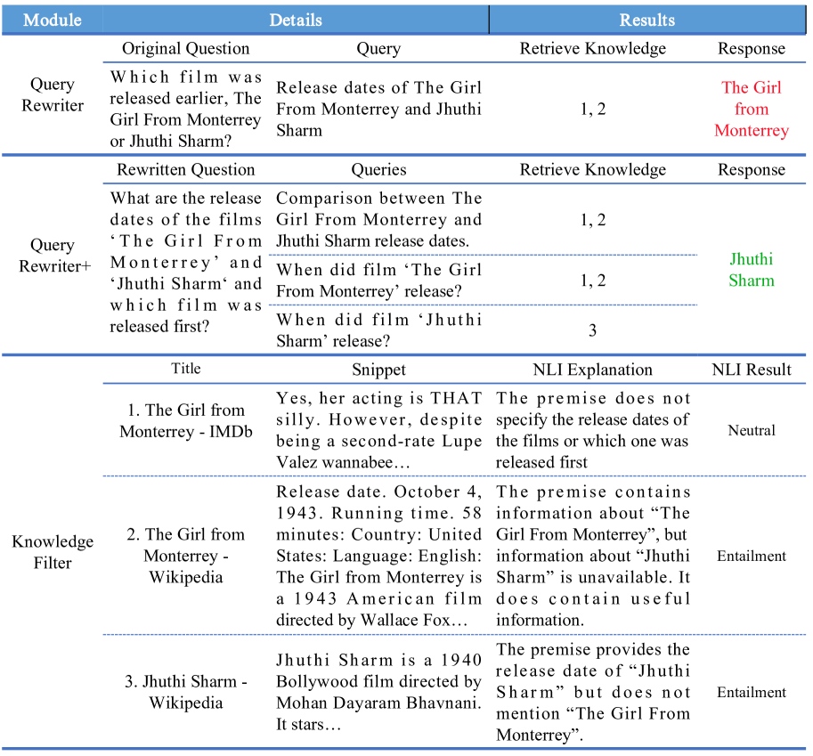

# 通过四模块协同，RAG 系统在增强检索和管理检索方面实现了质量和效率的双重提升。

发布时间：2024年07月15日

`RAG` `问答系统` `人工智能`

> Enhancing Retrieval and Managing Retrieval: A Four-Module Synergy for Improved Quality and Efficiency in RAG Systems

# 摘要

> RAG技术借助LLM的上下文学习能力，生成更精准、更贴切的回答。从最初的“检索-阅读”模式，RAG框架已进化为一个高度灵活且模块化的体系。其中，查询重写器模块通过生成易于搜索的查询，提升了知识检索的精准度，使问题与知识库更紧密契合。我们的研究发现，通过生成多重查询以突破单一查询的信息瓶颈，并通过重写问题消除歧义，可以进一步强化查询重写器模块，升级为查询重写器+。同时，针对RAG系统中存在的无关知识问题，我们提出了知识过滤器。这两个模块均基于Gemma-2B模型，共同提升回答质量。此外，针对冗余检索问题，我们引入了记忆知识库和检索器触发器，前者支持知识库的无参数动态扩展，后者优化了外部知识访问成本，提升了资源利用率和响应效率。这四大RAG模块协同作用，显著提升了RAG系统的响应质量和效率。相关实验和消融研究已在六个常见QA数据集上验证了这些模块的有效性。源代码可访问https://github.com/Ancientshi/ERM4获取。

> Retrieval-augmented generation (RAG) techniques leverage the in-context learning capabilities of large language models (LLMs) to produce more accurate and relevant responses. Originating from the simple 'retrieve-then-read' approach, the RAG framework has evolved into a highly flexible and modular paradigm. A critical component, the Query Rewriter module, enhances knowledge retrieval by generating a search-friendly query. This method aligns input questions more closely with the knowledge base. Our research identifies opportunities to enhance the Query Rewriter module to Query Rewriter+ by generating multiple queries to overcome the Information Plateaus associated with a single query and by rewriting questions to eliminate Ambiguity, thereby clarifying the underlying intent. We also find that current RAG systems exhibit issues with Irrelevant Knowledge; to overcome this, we propose the Knowledge Filter. These two modules are both based on the instruction-tuned Gemma-2B model, which together enhance response quality. The final identified issue is Redundant Retrieval; we introduce the Memory Knowledge Reservoir and the Retriever Trigger to solve this. The former supports the dynamic expansion of the RAG system's knowledge base in a parameter-free manner, while the latter optimizes the cost for accessing external knowledge, thereby improving resource utilization and response efficiency. These four RAG modules synergistically improve the response quality and efficiency of the RAG system. The effectiveness of these modules has been validated through experiments and ablation studies across six common QA datasets. The source code can be accessed at https://github.com/Ancientshi/ERM4.

[Arxiv](https://arxiv.org/abs/2407.10670)