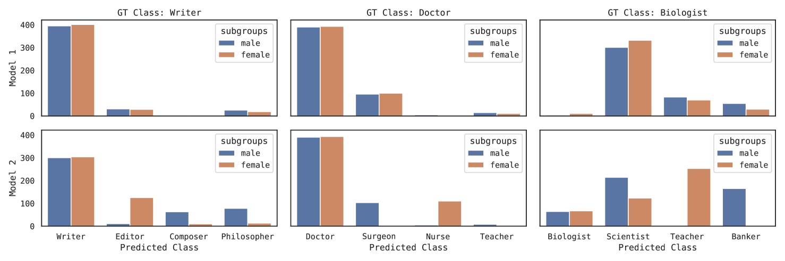
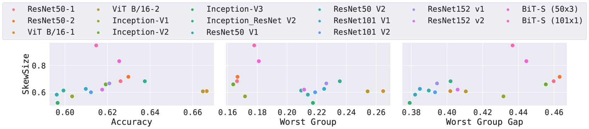
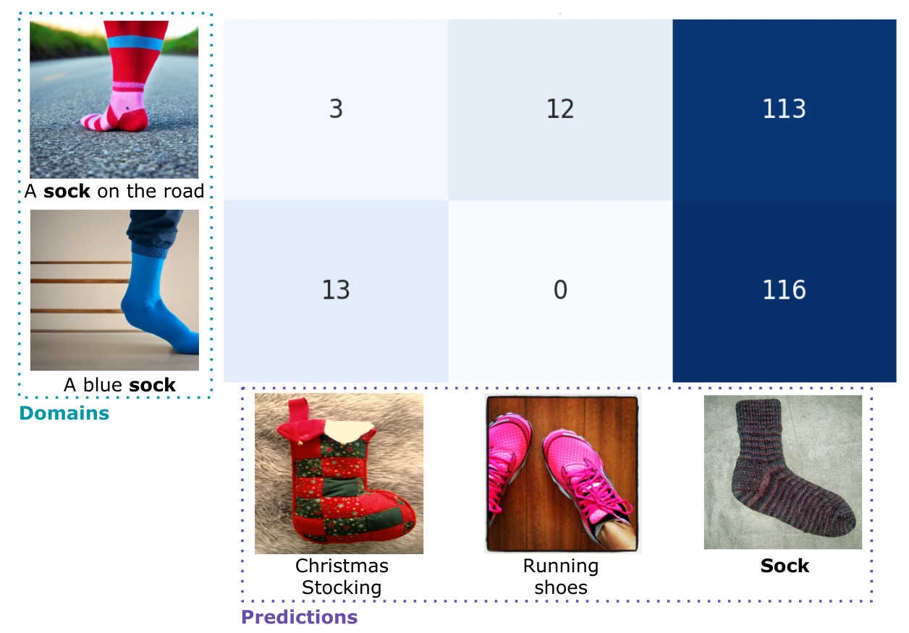
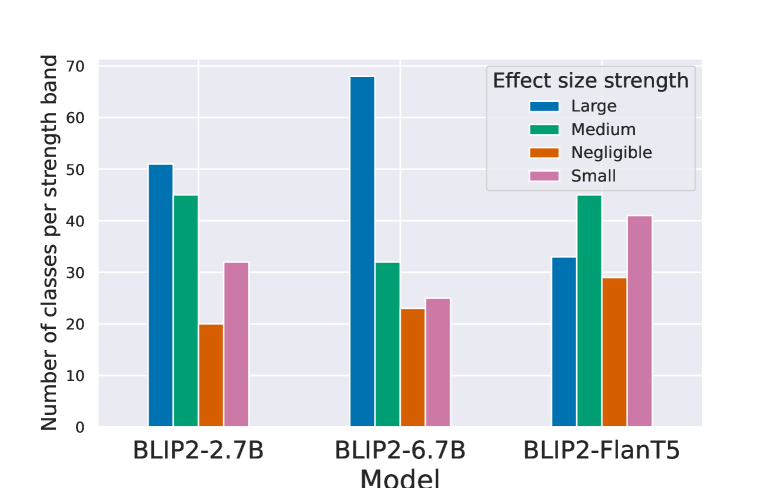
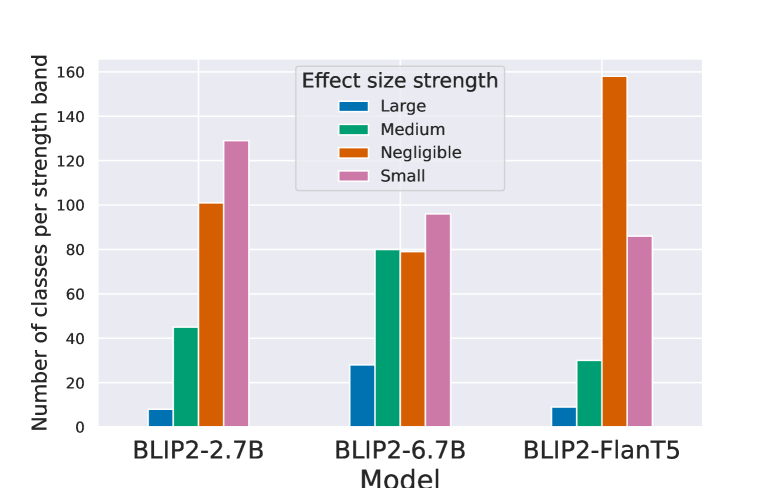
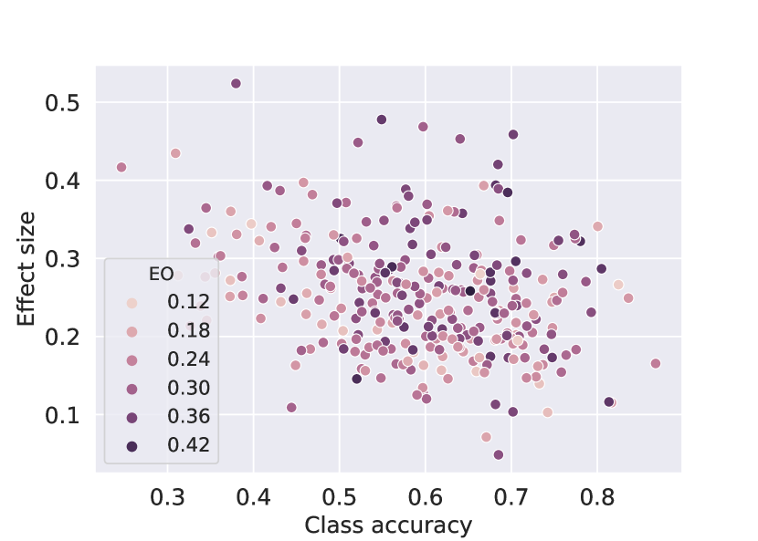
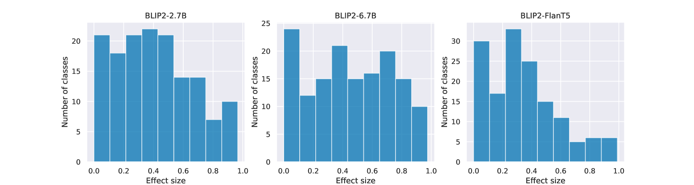
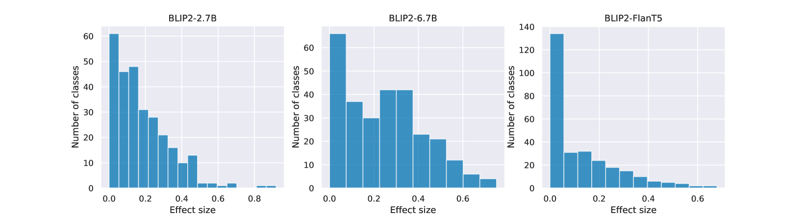

# 要评估模型偏差，关键在于剖析其错误特征。

发布时间：2024年07月15日

`LLM应用` `计算机视觉` `人工智能`

> Evaluating Model Bias Requires Characterizing its Mistakes

# 摘要

> 在处理虚假相关性时，准确评估模型性能对于提升预测质量和增强模型运行信心至关重要。我们通过在不同子组间细致表征模型错误，而非仅量化错误，揭示了模型偏差，这些偏差常被传统指标如最差组准确性所忽略。基于假设检验理念，我们创新性地提出了SkewSize指标，该指标能从模型预测中精准捕捉偏差，并适用于多类别及生成模型的开放词汇场景。SkewSize聚焦于虚假变量与模型预测间的交互效应，我们在多种模型应用场景中验证了其效能，包括合成数据训练的视觉模型、ImageNet训练的视觉模型，以及BLIP-2系列的大规模视觉语言模型。SkewSize不仅揭示了其他指标未察觉的偏差，还深入分析了如指令调优等新技术的实际影响。

> The ability to properly benchmark model performance in the face of spurious correlations is important to both build better predictors and increase confidence that models are operating as intended. We demonstrate that characterizing (as opposed to simply quantifying) model mistakes across subgroups is pivotal to properly reflect model biases, which are ignored by standard metrics such as worst-group accuracy or accuracy gap. Inspired by the hypothesis testing framework, we introduce SkewSize, a principled and flexible metric that captures bias from mistakes in a model's predictions. It can be used in multi-class settings or generalised to the open vocabulary setting of generative models. SkewSize is an aggregation of the effect size of the interaction between two categorical variables: the spurious variable representing the bias attribute and the model's prediction. We demonstrate the utility of SkewSize in multiple settings including: standard vision models trained on synthetic data, vision models trained on ImageNet, and large scale vision-and-language models from the BLIP-2 family. In each case, the proposed SkewSize is able to highlight biases not captured by other metrics, while also providing insights on the impact of recently proposed techniques, such as instruction tuning.

[Arxiv](https://arxiv.org/abs/2407.10633)