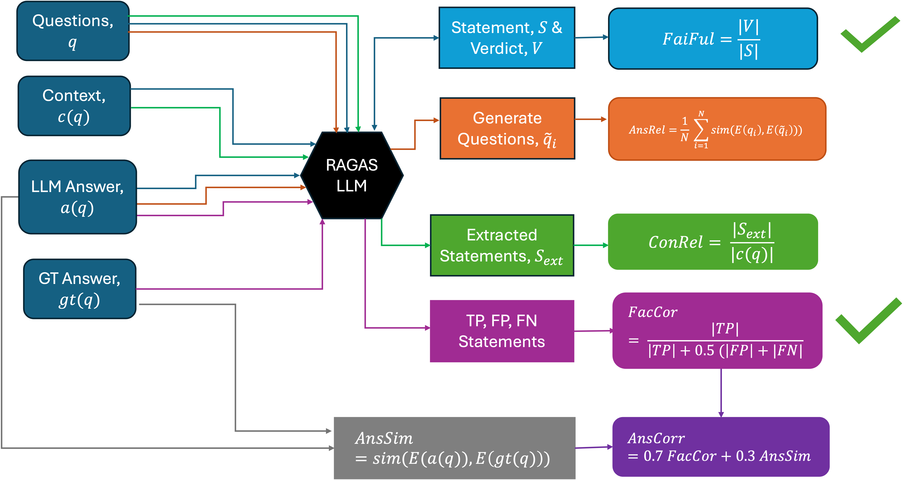

# 电信领域问答中 RAG 指标的评估

发布时间：2024年07月15日

`RAG` `问答系统`

> Evaluation of RAG Metrics for Question Answering in the Telecom Domain

# 摘要

> RAG 广泛应用于使 LLM 在多领域执行 QA 任务，但基于开源 LLM 的 RAG 在专业领域评估生成响应方面面临挑战。RAGAS 是文献中流行的评估框架，但其数值推导细节不足。我们改进了 RAGAS，通过 LLM 提供中间输出，涵盖了忠实度、上下文相关性等关键指标。分析显示，在电信领域使用 RAGAS 存在挑战，且正确检索时某些指标值更高。我们还探讨了预训练与微调对域适应嵌入的影响。最终，我们评估了这些指标在实际电信 QA 任务中的适用性与挑战。

> Retrieval Augmented Generation (RAG) is widely used to enable Large Language Models (LLMs) perform Question Answering (QA) tasks in various domains. However, RAG based on open-source LLM for specialized domains has challenges of evaluating generated responses. A popular framework in the literature is the RAG Assessment (RAGAS), a publicly available library which uses LLMs for evaluation. One disadvantage of RAGAS is the lack of details of derivation of numerical value of the evaluation metrics. One of the outcomes of this work is a modified version of this package for few metrics (faithfulness, context relevance, answer relevance, answer correctness, answer similarity and factual correctness) through which we provide the intermediate outputs of the prompts by using any LLMs. Next, we analyse the expert evaluations of the output of the modified RAGAS package and observe the challenges of using it in the telecom domain. We also study the effect of the metrics under correct vs. wrong retrieval and observe that few of the metrics have higher values for correct retrieval. We also study for differences in metrics between base embeddings and those domain adapted via pre-training and fine-tuning. Finally, we comment on the suitability and challenges of using these metrics for in-the-wild telecom QA task.

[Arxiv](https://arxiv.org/abs/2407.12873)