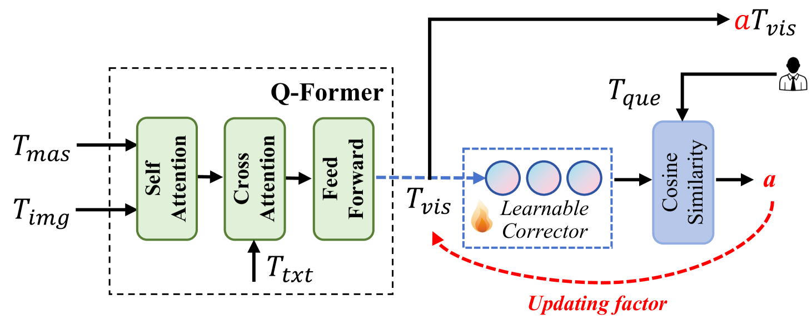

# FabGPT：专为复杂晶圆缺陷知识查询设计的高效大型多模态模型

发布时间：2024年07月15日

`LLM应用` `半导体制造` `智能制造`

> FabGPT: An Efficient Large Multimodal Model for Complex Wafer Defect Knowledge Queries

# 摘要

> 智能技术是推动集成电路制造进步的核心。最新的大型多模态模型（LMMs）在图像与文本理解上取得了突破性进展，为智能制造开辟了新道路。我们基于此，开发了FabGPT，一款专为晶圆缺陷知识查询设计的大型多模态模型。FabGPT擅长于扫描电子显微镜（SEM）图像的缺陷检测、根本原因分析及制造过程的专家问答。它通过匹配增强的多模态特征，自动识别复杂背景下的微小缺陷，并减少人工阈值的主观影响。同时，我们的调制模块与交互式训练策略，有效整合了晶圆缺陷知识，平衡了缺陷与原始知识的查询，并解决了模态偏差问题。实验结果显示，FabGPT在晶圆缺陷检测与知识查询方面表现卓越。

> Intelligence is key to advancing integrated circuit (IC) fabrication. Recent breakthroughs in Large Multimodal Models (LMMs) have unlocked unparalleled abilities in understanding images and text, fostering intelligent fabrication. Leveraging the power of LMMs, we introduce FabGPT, a customized IC fabrication large multimodal model for wafer defect knowledge query. FabGPT manifests expertise in conducting defect detection in Scanning Electron Microscope (SEM) images, performing root cause analysis, and providing expert question-answering (Q&A) on fabrication processes. FabGPT matches enhanced multimodal features to automatically detect minute defects under complex wafer backgrounds and reduce the subjectivity of manual threshold settings. Besides, the proposed modulation module and interactive corpus training strategy embed wafer defect knowledge into the pre-trained model, effectively balancing Q&A queries related to defect knowledge and original knowledge and mitigating the modality bias issues. Experiments on in-house fab data (SEM-WaD) show that our FabGPT achieves significant performance improvement in wafer defect detection and knowledge querying.

[Arxiv](https://arxiv.org/abs/2407.10810)