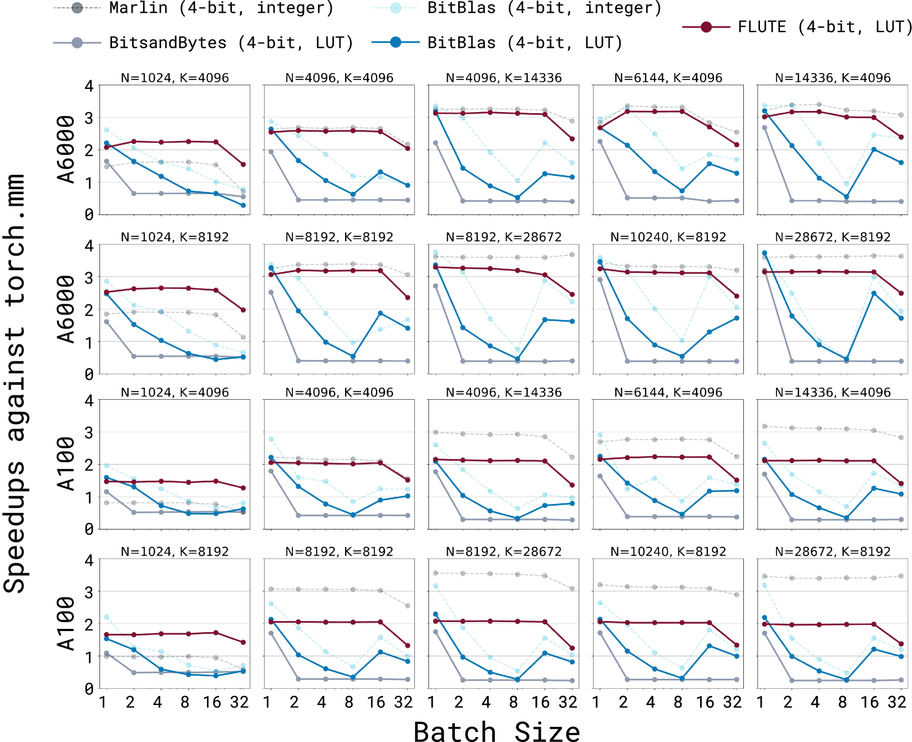

# 针对查找表量化的大型语言模型，采用快速矩阵乘法技术。

发布时间：2024年07月15日

`LLM应用` `半导体` `人工智能`

> Fast Matrix Multiplications for Lookup Table-Quantized LLMs

# 摘要

> 在部署大型语言模型时，内存带宽常成为瓶颈，尤其是模型参数从 GPU 内存传输到寄存器的成本。结合自定义内核，仅权重量化能通过减少内存移动来加速推理。但开发适用于非均匀查找表量化的 LLM 高性能内核颇具挑战。本文介绍的 FLUTE 引擎，通过离线重构权重矩阵和优化查找表，有效缓解了这些难题。在典型推理条件下，FLUTE 内核性能较现有 GEMM 内核提升 2-4 倍。此外，FLUTE 还应用于 LLaMA3 的量化，不仅保持了竞争性能，还显著提升了端到端吞吐量。

> The deployment of large language models (LLMs) is often constrained by memory bandwidth, where the primary bottleneck is the cost of transferring model parameters from the GPU's global memory to its registers. When coupled with custom kernels that fuse the dequantization and matmul operations, weight-only quantization can thus enable faster inference by reducing the amount of memory movement. However, developing high-performance kernels for weight-quantized LLMs presents substantial challenges, especially when the weights are compressed to non-evenly-divisible bit widths (e.g., 3 bits) with non-uniform, lookup table (LUT) quantization. This paper describes FLUTE, a flexible lookup table engine for LUT-quantized LLMs, which uses offline restructuring of the quantized weight matrix to minimize bit manipulations associated with unpacking, and vectorization and duplication of the lookup table to mitigate shared memory bandwidth constraints. At batch sizes < 32 and quantization group size of 128 (typical in LLM inference), the FLUTE kernel can be 2-4x faster than existing GEMM kernels. As an application of FLUTE, we explore a simple extension to lookup table-based NormalFloat quantization and apply it to quantize LLaMA3 to various configurations, obtaining competitive quantization performance against strong baselines while obtaining an end-to-end throughput increase of 1.5 to 2 times.

[Arxiv](https://arxiv.org/abs/2407.10960)