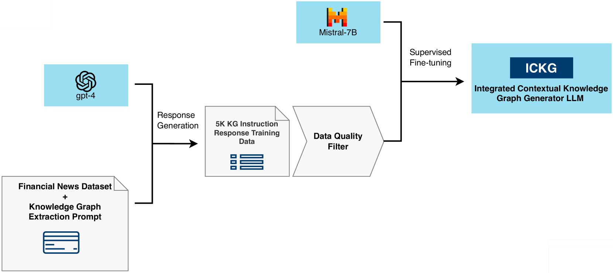
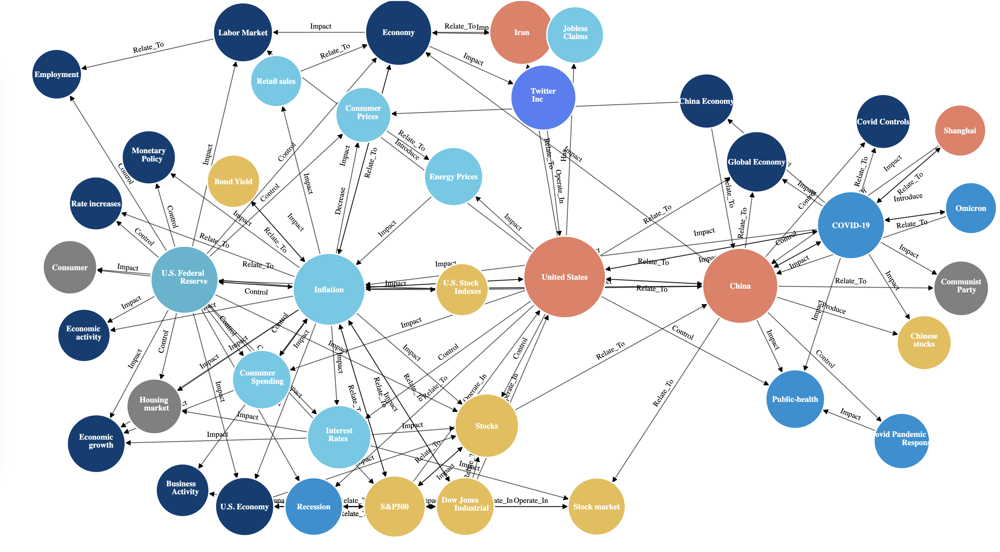
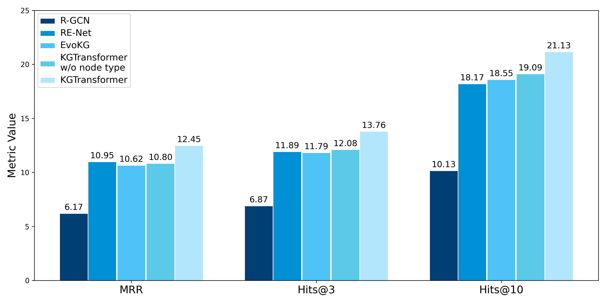
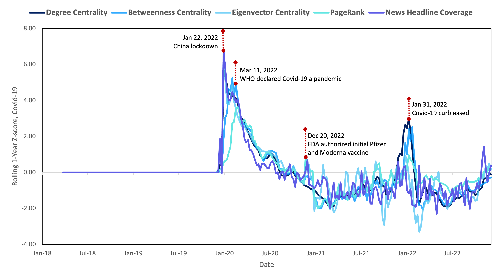
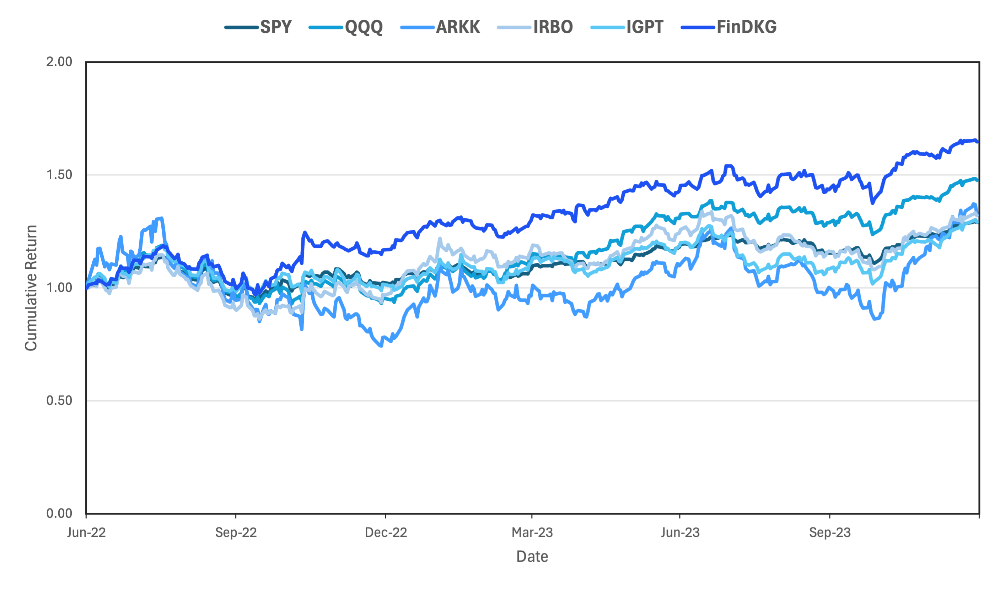

# FinDKG 项目通过整合大型语言模型，构建动态知识图谱，旨在精准捕捉金融市场中的全球趋势。

发布时间：2024年07月15日

`LLM应用` `知识图谱`

> FinDKG: Dynamic Knowledge Graphs with Large Language Models for Detecting Global Trends in Financial Markets

# 摘要

> 动态知识图谱 (DKGs) 是随时间表达对象间多样联系的流行工具，亦是处理复杂非结构化数据（如文本或图像）的有效手段。在金融领域，DKGs 能助我们洞察新闻动态，引领战略投资。本研究中，我们挖掘大型语言模型 (LLMs) 生成动态知识图谱的潜力，创新推出开源微调模型——集成上下文知识图谱生成器 (ICKG)。借助 ICKG，我们构建了金融新闻领域的开源知识图谱 FinDKG，并设计了基于注意力的图神经网络架构 KGTransformer 进行深入分析。实证检验表明，我们的模型在链接预测任务中表现卓越，且在主题投资分析中超越传统 ETF 策略。

> Dynamic knowledge graphs (DKGs) are popular structures to express different types of connections between objects over time. They can also serve as an efficient mathematical tool to represent information extracted from complex unstructured data sources, such as text or images. Within financial applications, DKGs could be used to detect trends for strategic thematic investing, based on information obtained from financial news articles. In this work, we explore the properties of large language models (LLMs) as dynamic knowledge graph generators, proposing a novel open-source fine-tuned LLM for this purpose, called the Integrated Contextual Knowledge Graph Generator (ICKG). We use ICKG to produce a novel open-source DKG from a corpus of financial news articles, called FinDKG, and we propose an attention-based GNN architecture for analysing it, called KGTransformer. We test the performance of the proposed model on benchmark datasets and FinDKG, demonstrating superior performance on link prediction tasks. Additionally, we evaluate the performance of the KGTransformer on FinDKG for thematic investing, showing it can outperform existing thematic ETFs.

[Arxiv](https://arxiv.org/abs/2407.10909)