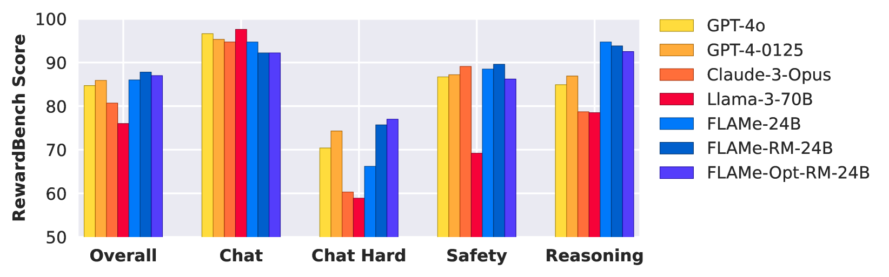
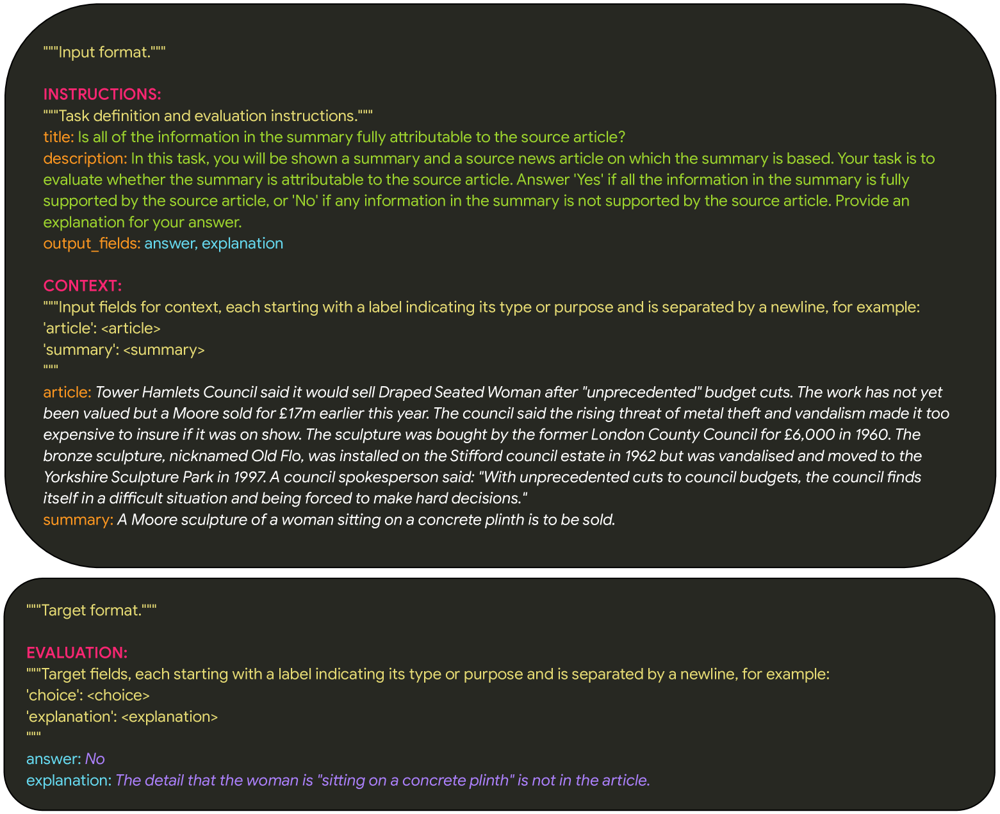
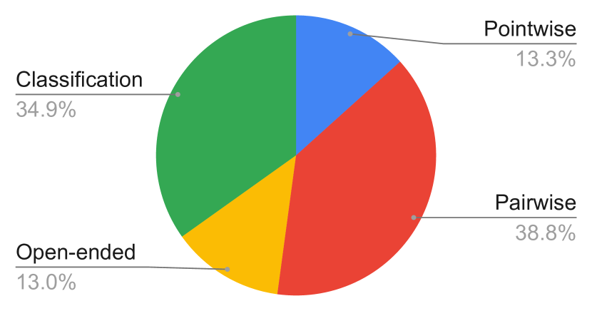
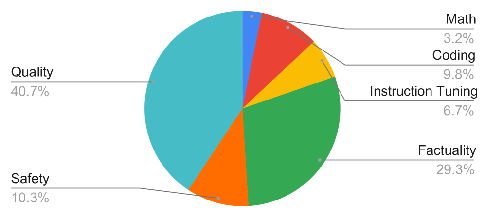
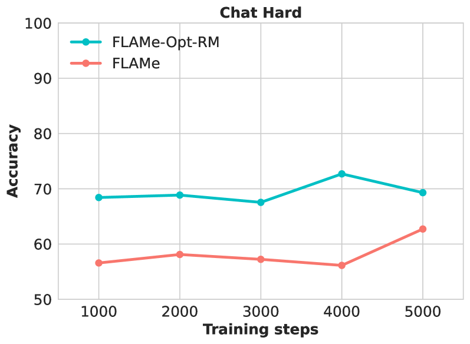
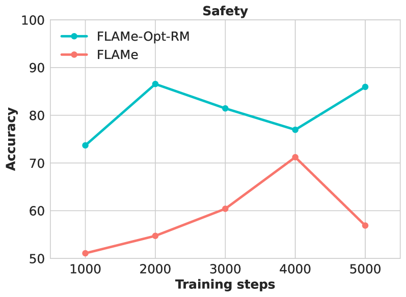

# 基础自动评分器：优化大型语言模型，提升自动评估质量

发布时间：2024年07月15日

`LLM应用` `人工智能` `软件开发`

> Foundational Autoraters: Taming Large Language Models for Better Automatic Evaluation

# 摘要

> 随着大型语言模型的进步，由于人工评估的高成本，可靠地评估它们的输出变得越来越具有挑战性。为此，我们引入了FLAMe，一系列基础大型自动评估模型。FLAMe在我们收集的100多个质量评估任务中进行了训练，这些任务包含超过500万个人类判断，这些判断是通过以前研究中公开发布的人类评估精心挑选和标准化的。FLAMe在广泛的保留任务上显著提高了泛化能力，在许多任务上超过了像GPT-4和Claude-3这样在专有数据上训练的LLM。我们展示了FLAMe也可以作为一个强大的起点，用于进一步的下游微调，以奖励模型评估为例（FLAMe-RM）。值得注意的是，在我们的RewardBench上，我们的FLAMe-RM-24B模型（准确率为87.8%）是表现最佳的仅在许可数据上训练的生成模型，超过了GPT-4-0125（85.9%）和GPT-4o（84.7%）。此外，我们探索了一种更计算效率高的方法，使用一种新颖的尾部补丁微调策略来优化我们的FLAMe多任务混合模型，用于奖励模型评估（FLAMe-Opt-RM），提供了有竞争力的RewardBench性能，同时需要的训练数据点大约减少了25倍。总的来说，我们的FLAMe变体在12个自动评估基准中的8个上超过了我们考虑的所有流行的专有LLM-as-a-Judge模型，涵盖了53个质量评估任务，包括RewardBench和LLM-AggreFact。最后，我们的分析显示，FLAMe在CoBBLEr自动评估偏差基准上显著比这些LLM-as-a-Judge模型偏差更小，同时有效地识别了高质量的代码生成响应。

> As large language models (LLMs) advance, it becomes more challenging to reliably evaluate their output due to the high costs of human evaluation. To make progress towards better LLM autoraters, we introduce FLAMe, a family of Foundational Large Autorater Models. FLAMe is trained on our large and diverse collection of 100+ quality assessment tasks comprising 5M+ human judgments, curated and standardized using publicly released human evaluations from previous research. FLAMe significantly improves generalization to a wide variety of held-out tasks, outperforming LLMs trained on proprietary data like GPT-4 and Claude-3 on many tasks. We show that FLAMe can also serve as a powerful starting point for further downstream fine-tuning, using reward modeling evaluation as a case study (FLAMe-RM). Notably, on RewardBench, our FLAMe-RM-24B model (with an accuracy of 87.8%) is the top-performing generative model trained exclusively on permissively licensed data, outperforming both GPT-4-0125 (85.9%) and GPT-4o (84.7%). Additionally, we explore a more computationally efficient approach using a novel tail-patch fine-tuning strategy to optimize our FLAMe multitask mixture for reward modeling evaluation (FLAMe-Opt-RM), offering competitive RewardBench performance while requiring approximately 25x less training datapoints. Overall, our FLAMe variants outperform all popular proprietary LLM-as-a-Judge models we consider across 8 out of 12 autorater evaluation benchmarks, encompassing 53 quality assessment tasks, including RewardBench and LLM-AggreFact. Finally, our analysis reveals that FLAMe is significantly less biased than these LLM-as-a-Judge models on the CoBBLEr autorater bias benchmark, while effectively identifying high-quality responses for code generation.

[Arxiv](https://arxiv.org/abs/2407.10817)