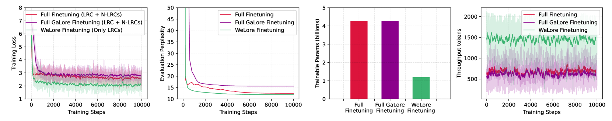
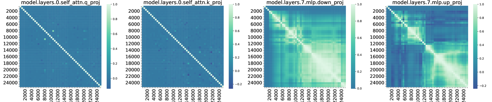
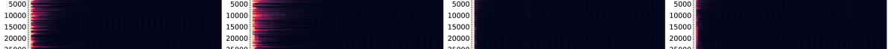
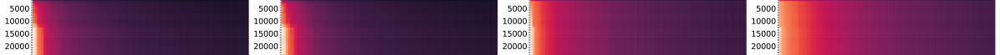
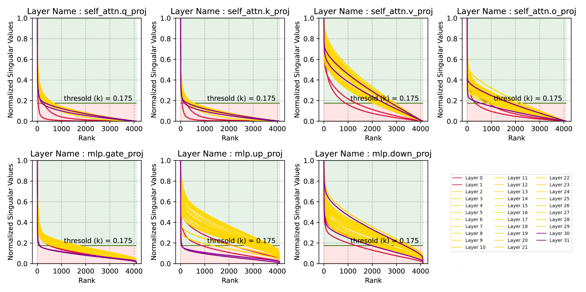
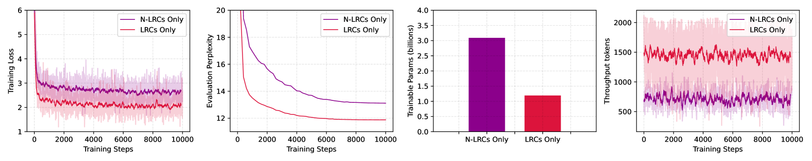
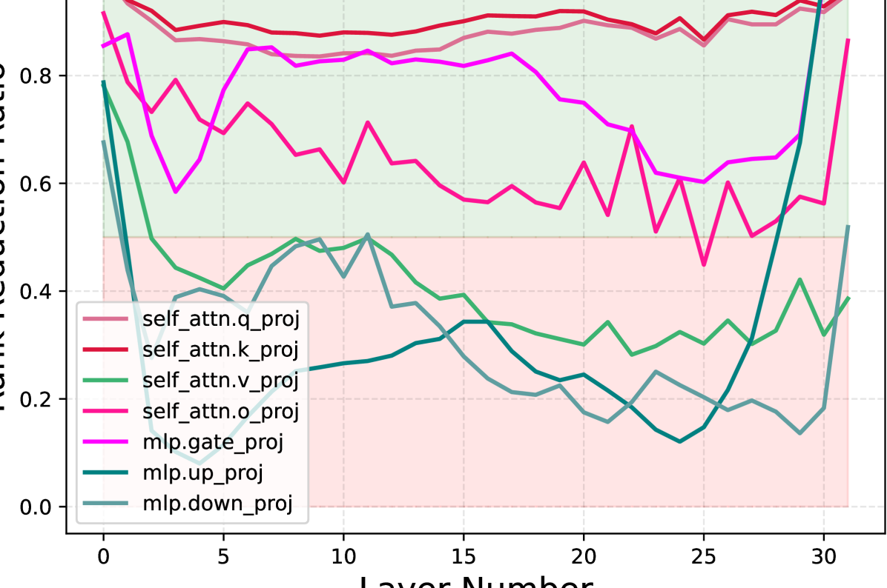
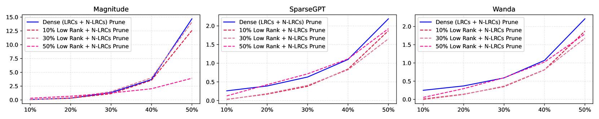
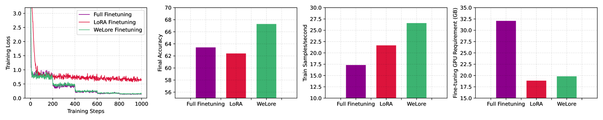

# 从 GaLore 到 WeLore：低秩权重非均匀地源自低秩梯度

发布时间：2024年07月15日

`LLM理论` `计算机科学` `人工智能`

> From GaLore to WeLore: How Low-Rank Weights Non-uniformly Emerge from Low-Rank Gradients

# 摘要

> 现代大型语言模型（LLMs）由包含数十亿元素的矩阵构成，这使得它们的存储和处理在计算资源和内存使用方面相当耗费。由于这些矩阵非常大，它们通常可以用低秩格式表示，从而有可能减轻资源需求。与之前专注于开发新型矩阵分解算法的工作不同，我们首先研究了LLMs不同层中矩阵之间低秩结构的涌现，并建立了梯度动态与矩阵低秩表达性之间的因果关系。我们的发现揭示了不同层表现出不同程度的收敛低秩结构，因此需要在这些层之间进行非均匀的秩降低，以最小化由于压缩而导致性能下降。鉴于此，我们提出了权重低秩投影（WeLore），它将权重压缩和内存高效微调统一为一种数据不可知和一次性方法。WeLore利用奇异值的重尾分布来确定LLMs中矩阵的适当秩降低比率。WeLore不仅作为一种压缩技术，还根据矩阵的低秩表达能力将其分类为低秩组件（LRCs）和非低秩组件（N-LRCs）。我们的梯度视角和广泛实验表明，LRCs往往具有更好的微调能力，并且可以紧密模仿（有时甚至超过）全微调的训练损失轨迹和性能，同时显著减少内存和计算足迹。例如，仅使用LRCs（WeLore）中的一小部分参数微调一个压缩50%的LLaMa-2 7B模型，可以超过其全微调，具有约3倍的吞吐量和约0.6倍的GPU需求。我们的代码可在[https://github.com/VITA-Group/welore](https://github.com/VITA-Group/welore)获取。

> Modern Large Language Models (LLMs) are composed of matrices with billions of elements, making their storage and processing quite demanding in terms of computational resources and memory usage. Being significantly large, such matrices can often be expressed in low-rank format with potential to relax resource requirements. Unlike prior works which focus on developing novel matrix decomposition algorithms, in this work we first study the emergence of low-rank structures across matrices within different layers of LLMs and establish a consequential relationship between the gradient dynamics and emerging low-rank expressiveness of matrices. Our findings reveal that different layers exhibit varying levels of converged low-rank structure, necessitating a non-uniform rank reduction across them to minimize performance drop due to compression. In view of that, we present Weight Low-Rank Projection (WeLore) that unifies weight compression and memory-efficient fine-tuning as ONE, in a data-agnostic and one-shot way. WeLore capitalizes the heavy-tail distribution of singular values to identify a suitable rank reduction ratio for matrices within LLMs. Going beyond only as a compression technique, WeLore categorizes weight matrices into Low-rank Components (LRCs) and Non-Low-rank Components (N-LRCs) based on their ability to express themselves as low-rank. Our gradient perspective and extensive experiments illustrate that LRCs tend to have better finetuning capabilities and can closely mimic (sometimes outperform) the training loss trajectory and performance of full-finetuning with notable memory and compute footprint reduction. For example, finetuning a 50\% compressed LLaMa-2 7B model using only a fraction of parameters in LRCs (WeLore) can outperform its full finetuning with ~3x better throughput and ~0.6x GPU requirement. Our codes are available at \url{https://github.com/VITA-Group/welore}

[Arxiv](https://arxiv.org/abs/2407.11239)