# GPT 超声成像技术：利用 VLM 从前臂超声图像中解读手势

发布时间：2024年07月15日

`LLM应用` `人工智能`

> GPT Sonograpy: Hand Gesture Decoding from Forearm Ultrasound Images via VLM

# 摘要

> GPT-4o等大型视觉-语言模型作为多模态基础模型，正展现出作为多种领域AI辅助工具的巨大潜力。尽管在通用任务中表现出色，但在特定任务上，未经微调的能力有限。全面微调这些模型因资源需求巨大而具挑战性。我们的研究表明，GPT-4o无需微调即可从前臂超声数据解码手势，并通过少量样本情境学习进一步提升性能。

> Large vision-language models (LVLMs), such as the Generative Pre-trained Transformer 4-omni (GPT-4o), are emerging multi-modal foundation models which have great potential as powerful artificial-intelligence (AI) assistance tools for a myriad of applications, including healthcare, industrial, and academic sectors. Although such foundation models perform well in a wide range of general tasks, their capability without fine-tuning is often limited in specialized tasks. However, full fine-tuning of large foundation models is challenging due to enormous computation/memory/dataset requirements. We show that GPT-4o can decode hand gestures from forearm ultrasound data even with no fine-tuning, and improves with few-shot, in-context learning.

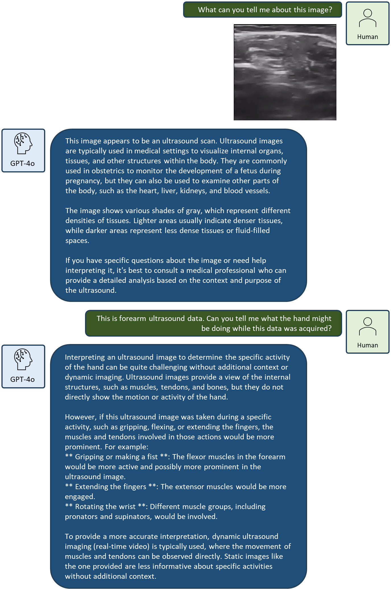

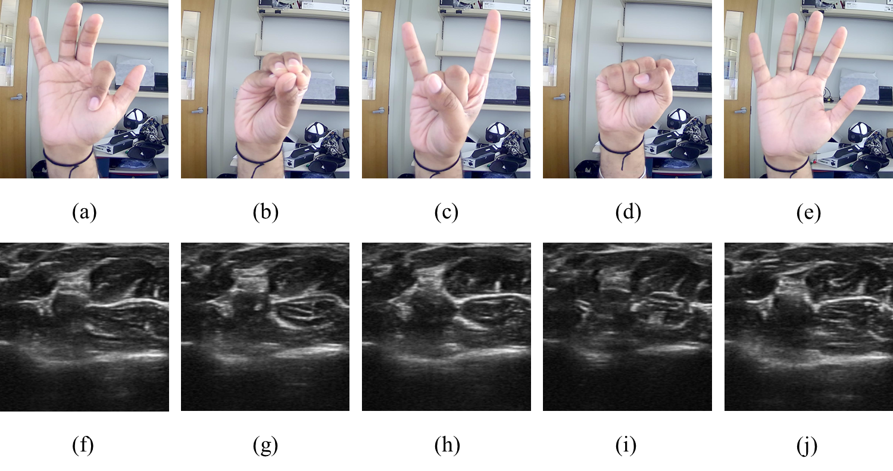

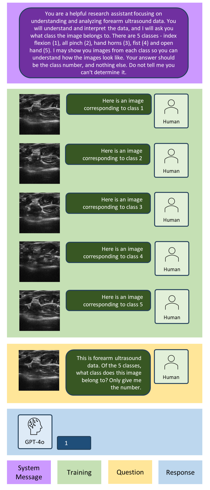

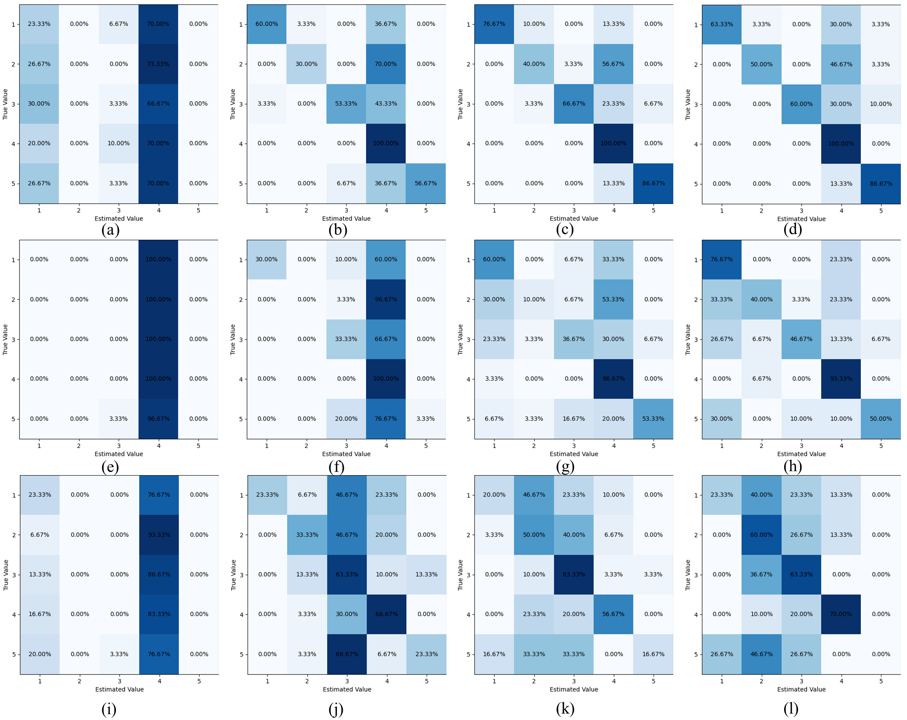

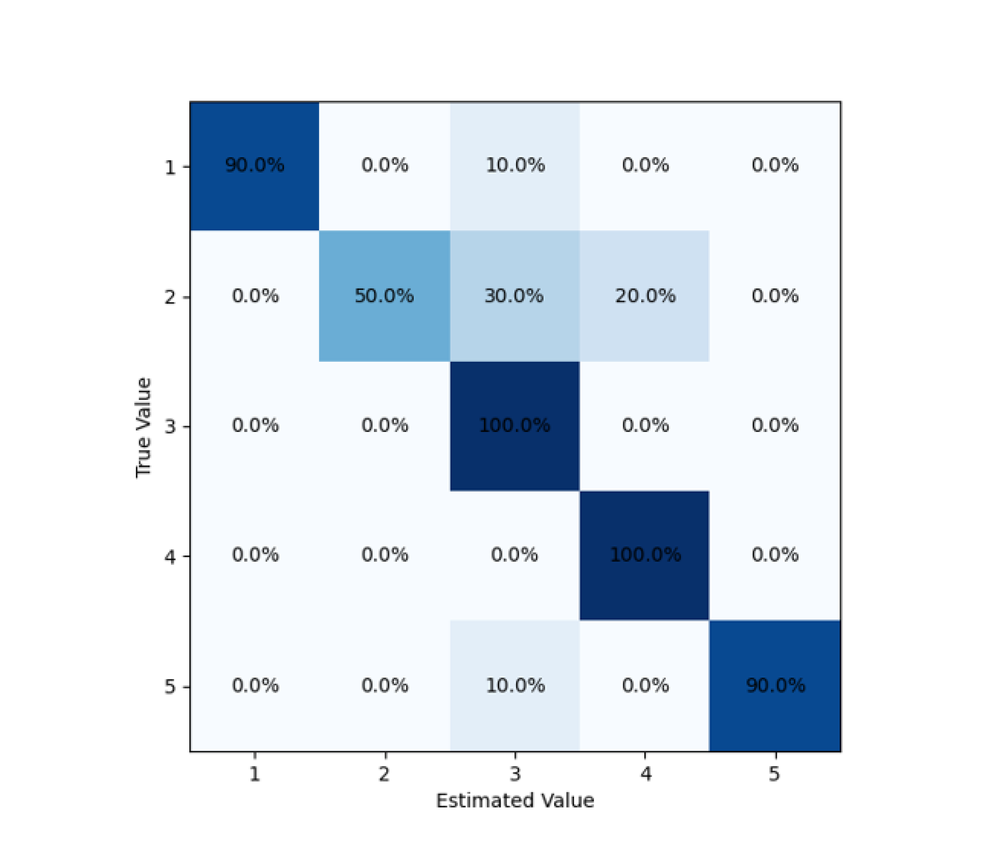

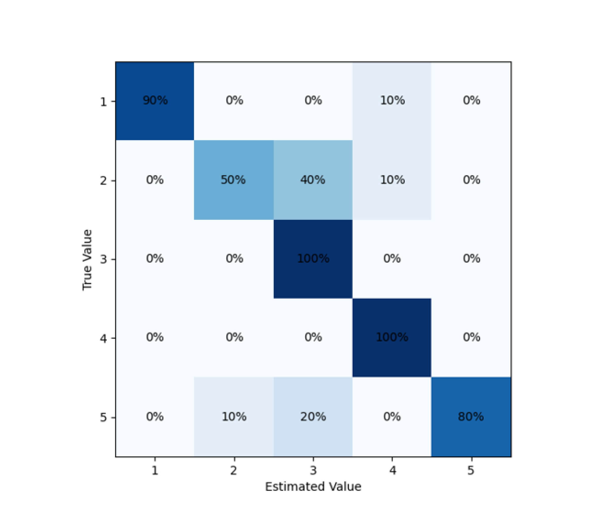

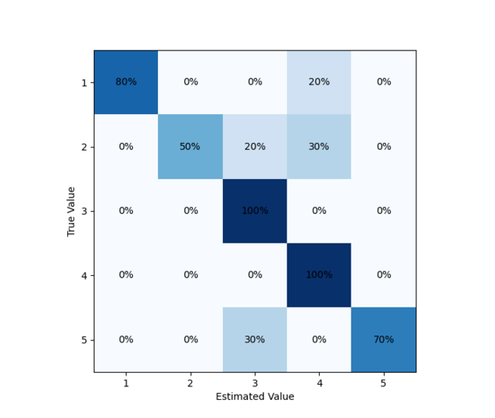

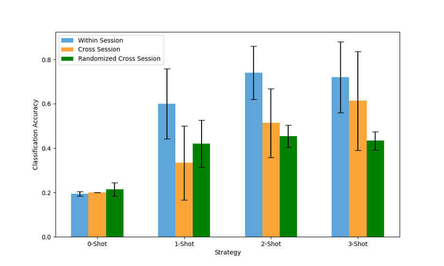

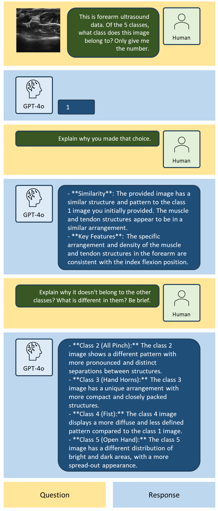

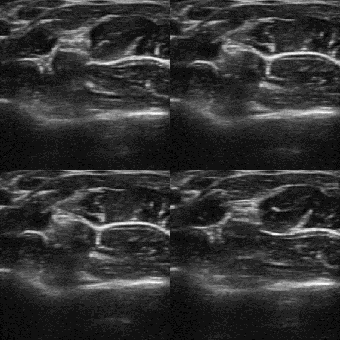

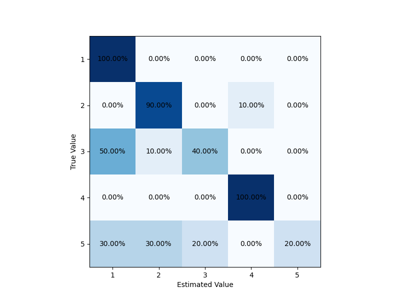

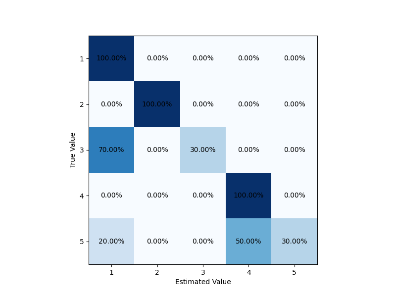

[Arxiv](https://arxiv.org/abs/2407.10870)