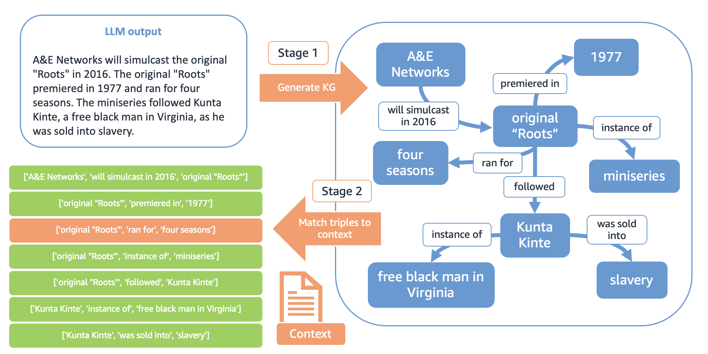

# GraphEval：一款基于知识图谱的 LLM 幻觉评估框架

发布时间：2024年07月15日

`LLM应用` `知识图谱`

> GraphEval: A Knowledge-Graph Based LLM Hallucination Evaluation Framework

# 摘要

> 随着 LLM 应用的普及，评估其响应并检测知识相关的不一致性（即幻觉）的方法愈发关键。现有的评估指标在解释性、全面性及计算成本方面均显不足。为此，我们推出了 GraphEval 框架，该框架利用知识图谱 (KG) 结构进行幻觉评估，能精准定位 KG 中易产生幻觉的三元组，从而更深入地揭示幻觉在响应中的具体位置。此外，结合顶尖的自然语言推理 (NLI) 模型，我们的方法在幻觉基准测试中的平衡准确性上有所提升。最后，我们创新性地提出了 GraphCorrect 方法，通过利用 KG 结构进行幻觉校正，并证实了其对大多数幻觉的纠正效果。

> Methods to evaluate Large Language Model (LLM) responses and detect inconsistencies, also known as hallucinations, with respect to the provided knowledge, are becoming increasingly important for LLM applications. Current metrics fall short in their ability to provide explainable decisions, systematically check all pieces of information in the response, and are often too computationally expensive to be used in practice. We present GraphEval: a hallucination evaluation framework based on representing information in Knowledge Graph (KG) structures. Our method identifies the specific triples in the KG that are prone to hallucinations and hence provides more insight into where in the response a hallucination has occurred, if at all, than previous methods. Furthermore, using our approach in conjunction with state-of-the-art natural language inference (NLI) models leads to an improvement in balanced accuracy on various hallucination benchmarks, compared to using the raw NLI models. Lastly, we explore the use of GraphEval for hallucination correction by leveraging the structure of the KG, a method we name GraphCorrect, and demonstrate that the majority of hallucinations can indeed be rectified.

[Arxiv](https://arxiv.org/abs/2407.10793)