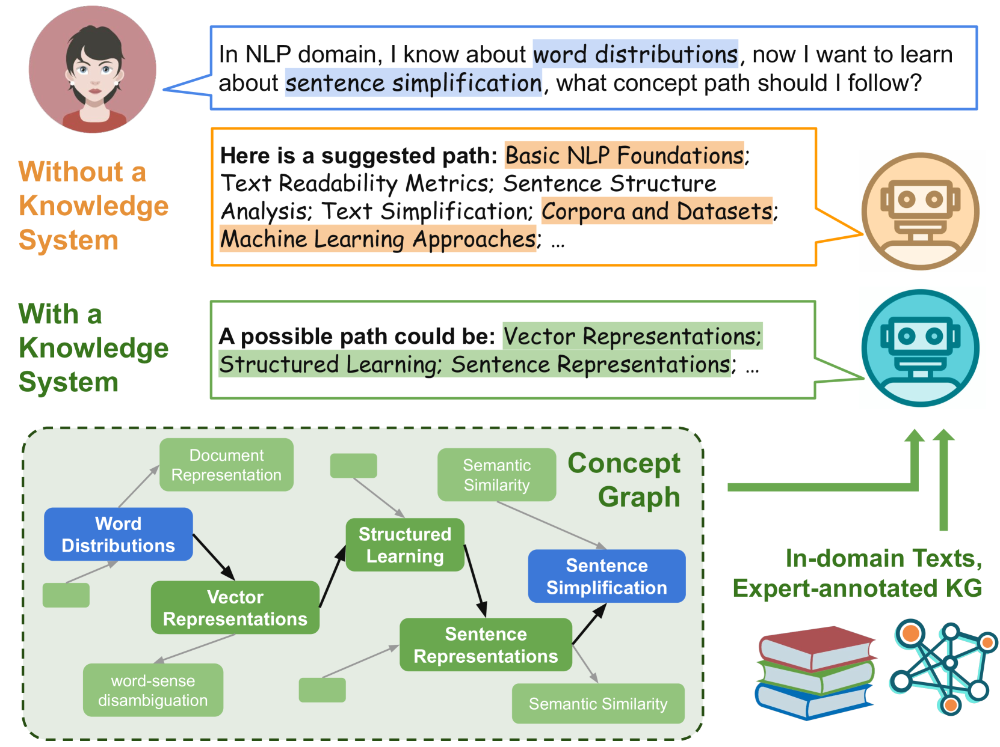
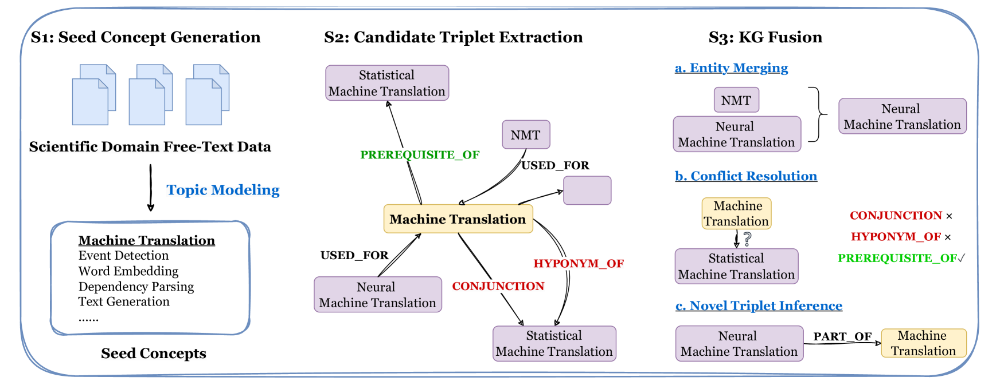
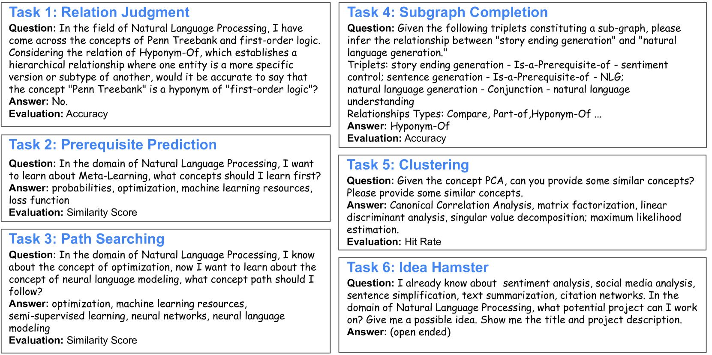
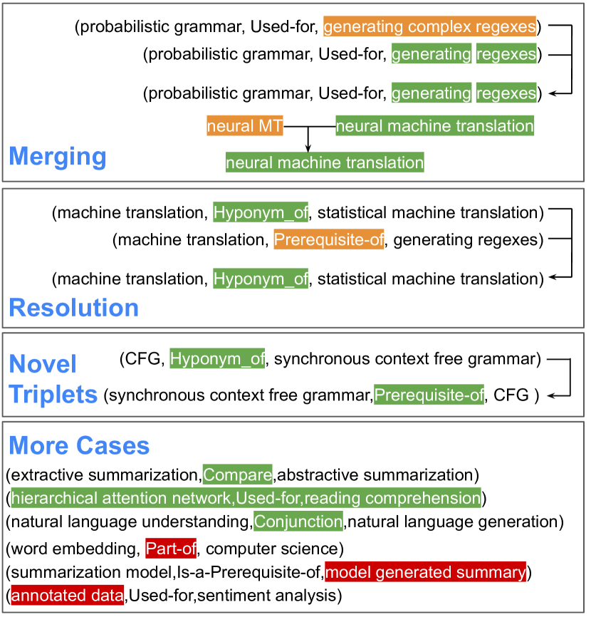

# Graphusion：借助大型语言模型，在 NLP 教育领域实现科学知识图谱的融合与构建

发布时间：2024年07月15日

`LLM应用` `人工智能`

> Graphusion: Leveraging Large Language Models for Scientific Knowledge Graph Fusion and Construction in NLP Education

# 摘要

> 知识图谱 (KGs) 在 AI 领域扮演关键角色，尤其在提升问答 (QA) 系统方面。KGs 的构建往往依赖于领域专家的深入工作。近期，大型语言模型 (LLMs) 开始用于知识图谱构建 (KGC)，但多数方法仍局限于从单句或文档中提取局部知识三元组。为此，我们提出了 Graphusion，一个从自由文本中进行零-shot KGC 的创新框架。其核心融合模块不仅整合了实体合并与冲突解决，还实现了新三元组的发现，提供了全局视角。我们验证了 Graphusion 在 NLP 领域的应用，特别是在教育场景中，通过 TutorQA 这一新基准，展示了其在图推理和 QA 任务中的优越性能。评估结果表明，Graphusion 在链接预测的准确性上超越了传统监督方法高达 10%，并在人类评估中取得了优异成绩，分别为概念实体提取 2.92 分和关系识别 2.37 分（满分 3 分）。

> Knowledge graphs (KGs) are crucial in the field of artificial intelligence and are widely applied in downstream tasks, such as enhancing Question Answering (QA) systems. The construction of KGs typically requires significant effort from domain experts. Recently, Large Language Models (LLMs) have been used for knowledge graph construction (KGC), however, most existing approaches focus on a local perspective, extracting knowledge triplets from individual sentences or documents. In this work, we introduce Graphusion, a zero-shot KGC framework from free text. The core fusion module provides a global view of triplets, incorporating entity merging, conflict resolution, and novel triplet discovery. We showcase how Graphusion could be applied to the natural language processing (NLP) domain and validate it in the educational scenario. Specifically, we introduce TutorQA, a new expert-verified benchmark for graph reasoning and QA, comprising six tasks and a total of 1,200 QA pairs. Our evaluation demonstrates that Graphusion surpasses supervised baselines by up to 10% in accuracy on link prediction. Additionally, it achieves average scores of 2.92 and 2.37 out of 3 in human evaluations for concept entity extraction and relation recognition, respectively.

[Arxiv](https://arxiv.org/abs/2407.10794)