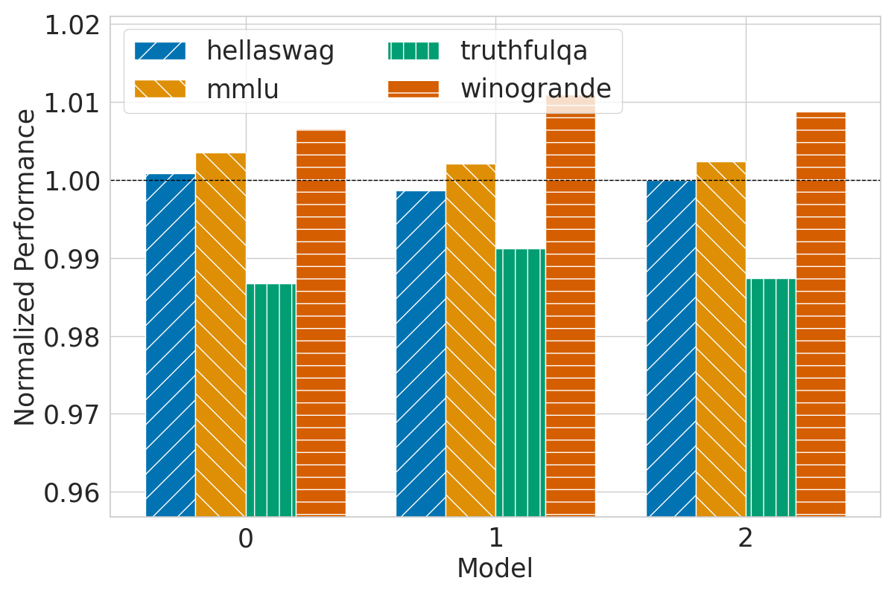
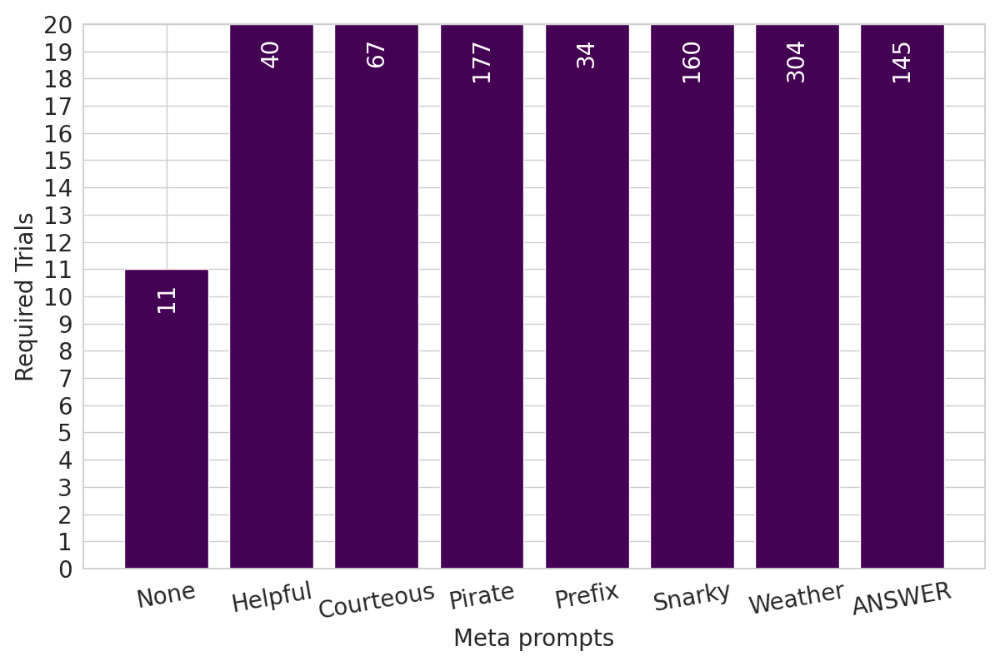

# 看，那可是我的模型！来认识一下 Chain & Hash，这是一项专为 LLM 设计的指纹识别技术。

发布时间：2024年07月15日

`LLM应用` `人工智能`

> Hey, That's My Model! Introducing Chain & Hash, An LLM Fingerprinting Technique

# 摘要

> 随着大型语言模型 (LLM) 被盗和滥用的风险日益增加，模型指纹识别技术变得尤为重要。本文中，我们首先明确了成功指纹的五大特性：透明、高效、持久、健壮且不可伪造。随后，我们提出了一种新颖的指纹技术——Chain & Hash，它通过加密手段实现这些特性。该技术通过生成问题集与答案集，并利用安全哈希算法确保每个问题的唯一值，从而防止虚假所有权声明。我们在多个模型上验证了 Chain & Hash 的鲁棒性，包括面对微调和指纹擦除等挑战。实验结果显示，采用 Chain & Hash 的指纹模型在性能上与非指纹模型几乎无异，证明了其高效性与实用性。

> Amid growing concerns over the ease of theft and misuse of Large Language Models (LLMs), the need for fingerprinting models has increased. Fingerprinting, in this context, means that the model owner can link a given model to their original version, thereby identifying if their model is being misused or has been completely stolen. In this paper, we first define a set five properties a successful fingerprint should satisfy; namely, the fingerprint should be Transparent, Efficient, Persistent, Robust, and Unforgeable. Next, we propose Chain & Hash, a new, simple fingerprinting approach that implements a fingerprint with a cryptographic flavor, achieving all these properties. Chain & Hash involves generating a set of questions (the fingerprints) along with a set of potential answers. These elements are hashed together using a secure hashing technique to select the value for each question, hence providing an unforgeability property-preventing adversaries from claiming false ownership. We evaluate the Chain & Hash technique on multiple models and demonstrate its robustness against benign transformations, such as fine-tuning on different datasets, and adversarial attempts to erase the fingerprint. Finally, our experiments demonstrate the efficiency of implementing Chain & Hash and its utility, where fingerprinted models achieve almost the same performance as non-fingerprinted ones across different benchmarks.

[Arxiv](https://arxiv.org/abs/2407.10887)