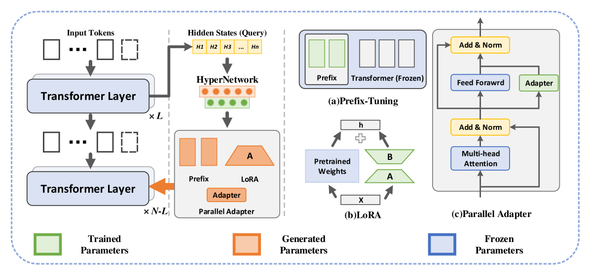
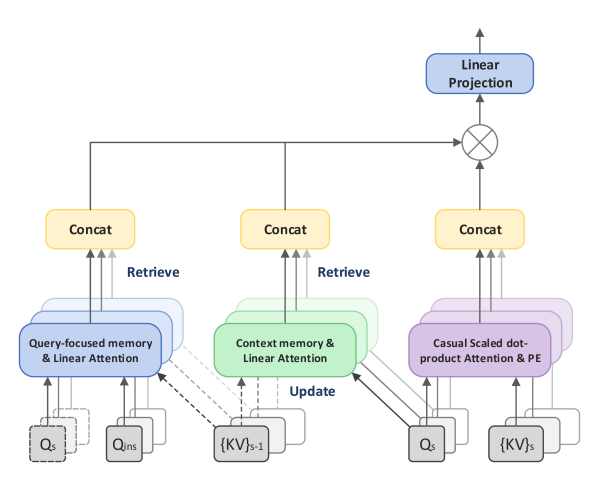
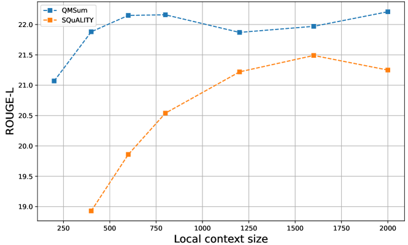
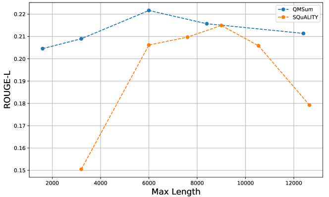

# IDEAL 技术：借助 LLM 的无限与动态特性，优化查询聚焦摘要效果

发布时间：2024年07月15日

`LLM应用` `信息技术`

> IDEAL: Leveraging Infinite and Dynamic Characterizations of Large Language Models for Query-focused Summarization

# 摘要

> 查询聚焦摘要（QFS）旨在生成针对特定问题的摘要，增强用户控制和个性化。随着大型语言模型（LLM）的兴起，其通过大规模预训练展现的文本理解能力，为提取片段生成带来了巨大潜力。本文深入探讨了基于LLM的QFS模型应具备的两个核心特性：长文档摘要和高效细粒度查询对齐。为此，我们创新性地提出了查询感知超专家和查询聚焦无限注意力两个模块，以实现这些特性。这些创新不仅拓宽了QFS技术的应用范围，还提升了其可访问性。在现有QFS基准上的广泛实验验证了我们所提方法的有效性和通用性。相关代码已公开于https://github.com/DCDmllm/IDEAL_Summary。

> Query-focused summarization (QFS) aims to produce summaries that answer particular questions of interest, enabling greater user control and personalization. With the advent of large language models (LLMs), shows their impressive capability of textual understanding through large-scale pretraining, which implies the great potential of extractive snippet generation. In this paper, we systematically investigated two indispensable characteristics that the LLMs-based QFS models should be harnessed, Lengthy Document Summarization and Efficiently Fine-grained Query-LLM Alignment, respectively. Correspondingly, we propose two modules called Query-aware HyperExpert and Query-focused Infini-attention to access the aforementioned characteristics. These innovations pave the way for broader application and accessibility in the field of QFS technology. Extensive experiments conducted on existing QFS benchmarks indicate the effectiveness and generalizability of the proposed approach. Our code is publicly available at https://github.com/DCDmllm/IDEAL_Summary.

[Arxiv](https://arxiv.org/abs/2407.10486)